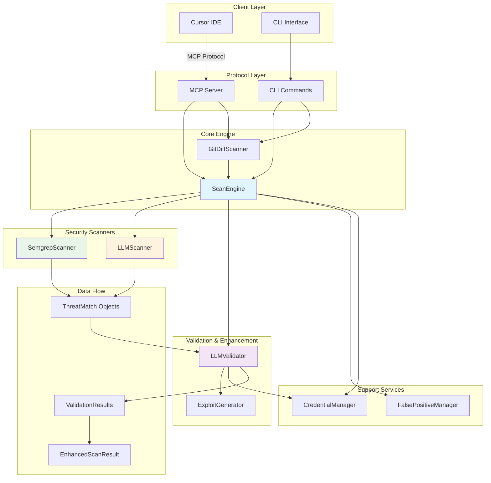

# CLAUDE.md

This file provides guidance to Claude Code (claude.ai/code) when working with code in this repository.

## Virtual Environment

**IMPORTANT**: This repository uses a virtual environment located at `.venv` in the repo root. Always activate it before running any commands:

```bash
source .venv/bin/activate
```

## Development Commands

### Testing
- `make test` - Run full test suite with coverage (must pass 75% threshold)
- `make test-fast` - Quick test run without coverage reporting
- `make test-unit` - Run only unit tests (exclude integration tests)
- `make test-integration` - Run only integration tests
- `make test-security` - Run security-specific tests
- `pytest tests/test_specific_module.py` - Run tests for specific module

### Code Quality
- `make lint` - Run all linting (ruff, mypy, black)
- `make format` - Auto-format code with black and isort
- `make mypy` - Type checking only
- `make ruff` - Linting only
- `make ruff-fix` - Auto-fix linting issues
- `make security-scan` - Run bandit and semgrep security analysis

### Development Setup
- `make dev-setup-uv` - Setup development environment with uv (recommended)
- `make dev-setup` - Setup development environment with pip
- `uv venv && source .venv/bin/activate` - Create and activate virtual environment
- `uv pip install -e ".[dev]"` - Install in development mode

### Building and Distribution
- `make build` - Build package for distribution
- `make clean` - Clean build artifacts and cache files

## Architecture Overview

This is a security analysis MCP (Model Context Protocol) server that provides vulnerability scanning capabilities through Cursor IDE integration. The system uses a **hybrid multi-engine approach** combining static analysis (Semgrep), AI-powered analysis (LLM), and intelligent validation for comprehensive security scanning.

## System Architecture



### Core Components

#### MCP Server (`server.py`)
- Main MCP server implementation providing `adv_*` tools for Cursor IDE
- Tools include: `adv_scan_code`, `adv_scan_file`, `adv_diff_scan`, `adv_generate_exploit`
- Handles tool registration, parameter validation, and error handling
- Supports both standard scanning and git diff-aware scanning

#### Enhanced Scanning Architecture

**ScanEngine** (`scan_engine.py`) - Central orchestration layer that:
- Manages **SemgrepScanner** and **LLMScanner** execution
- Integrates **LLMValidator** for false positive filtering
- Provides unified results through **EnhancedScanResult**
- Supports file, directory, and code snippet scanning
- Handles severity filtering and threat deduplication

**LLMValidator** (`llm_validator.py`) - **NEW** validation system that:
- Validates findings from all scanners to reduce false positives
- Generates confidence scores (0.0-1.0) for each finding
- Creates exploitation vectors for confirmed vulnerabilities
- Integrates with **ExploitGenerator** for proof-of-concept creation
- Provides client-based LLM prompts for validation analysis

#### Security Scanner Engines

**SemgrepScanner** (`semgrep_scanner.py`) - Static analysis engine:
- Industry-standard rule-based scanning
- Language-agnostic pattern matching
- High-performance subprocess execution
- Configurable rulesets and timeouts
- Automatic result categorization and severity assignment

**LLMScanner** (`llm_scanner.py`) - AI-powered analysis engine:
- Client-based LLM integration (no API keys needed)
- Context-aware vulnerability detection
- Business logic flaw identification
- Generates structured prompts for external LLM analysis
- Provides detailed explanations and remediation guidance

#### Specialized Components

**GitDiffScanner** (`diff_scanner.py`) - Git-aware scanning:
- Analyzes only newly added lines between branches
- Prevents false positives from existing code
- Ideal for CI/CD pipeline integration
- Supports branch comparison and commit analysis
- Maps findings back to original line numbers

**ExploitGenerator** (`exploit_generator.py`) - Educational exploit creation:
- Template-based exploit generation
- LLM-enhanced exploitation scenarios
- Safety warnings and educational context
- Multiple exploit variations per vulnerability
- Integration with validation workflow

**FalsePositiveManager** (`false_positive_manager.py`) - Noise reduction:
- UUID-based finding tracking
- Persistent SQLite storage
- Reviewer attribution system
- Batch operations support
- Cross-scanner false positive filtering

### Data Flow Architecture

#### Standard Scanning Workflow
1. **Input Processing**: Code/file received via MCP tool or CLI
2. **Parallel Analysis**: SemgrepScanner and LLMScanner execute concurrently
3. **Result Collection**: ThreatMatch objects collected from both scanners
4. **Validation Processing**: LLMValidator analyzes findings for legitimacy
5. **False Positive Filtering**: Validated results filtered by confidence threshold
6. **Exploit Generation**: Confirmed vulnerabilities enhanced with POCs
7. **Result Synthesis**: EnhancedScanResult with metadata and statistics
8. **Client Response**: Formatted results returned to Cursor IDE or CLI

#### Git Diff-Aware Scanning
1. **Branch Analysis**: GitDiffScanner extracts changed lines between branches
2. **Context Building**: Full file context built around changed lines
3. **Targeted Scanning**: Only new/modified code analyzed by scan engines
4. **Line Mapping**: Results mapped back to original file line numbers
5. **Validation & Enhancement**: Same validation workflow as standard scanning

#### LLM Validation Workflow
1. **Finding Collection**: Threats from all scanners aggregated
2. **Prompt Generation**: Structured validation prompts created
3. **Client Analysis**: Prompts sent to client-side LLM for analysis
4. **Result Parsing**: JSON responses parsed into ValidationResult objects
5. **Confidence Filtering**: Findings below threshold marked as false positives
6. **Enhancement**: Legitimate findings enhanced with exploitation details

### Key Features

#### Multi-Engine Analysis
- **Complementary Coverage**: Static analysis + AI reasoning + validation
- **Intelligent Deduplication**: Similar findings merged across engines
- **Confidence Scoring**: Each finding assigned reliability metrics
- **Smart Result Merging**: Best-of-breed approach for maximum accuracy

#### Advanced Validation System
- **False Positive Reduction**: LLMValidator filters noise with 70% default confidence threshold
- **Exploitation Analysis**: Confirmed vulnerabilities include attack vectors
- **Severity Adjustment**: Validator can modify threat severity based on context
- **Educational Enhancement**: Detailed remediation advice and exploit examples

#### Developer Experience
- **Real-Time Analysis**: Background scanning in Cursor IDE
- **Git Integration**: Diff-aware scanning for efficient CI/CD
- **CLI Flexibility**: Full command-line interface with validation controls
- **Rich Output**: Structured JSON results with comprehensive metadata

### Testing Strategy

- **Unit Tests**: Individual component testing with mocks
- **Integration Tests**: Full workflow testing with real files
- **Security Tests**: Validate detection accuracy and exploit safety
- **Validation Tests**: Comprehensive LLMValidator functionality testing
- **Coverage**: Maintain 75%+ test coverage requirement
- **Markers**: Tests marked as `unit`, `integration`, `security`, `slow`

### Development Guidelines

#### Code Organization
- All source code in `src/adversary_mcp_server/`
- Comprehensive type hints required (mypy strict mode)
- Follow black formatting and isort import organization
- Use pydantic for data validation and serialization

#### Security Considerations
- This is a **defensive security tool** only
- Exploit generation includes safety warnings and educational context
- All analysis focuses on vulnerability detection and remediation
- No malicious code generation or attack facilitation
- LLM validation runs client-side (no API keys transmitted)

#### Error Handling
- Use `AdversaryToolError` for tool-specific failures
- Comprehensive logging with structured messages
- Graceful degradation when LLM analysis unavailable
- Input validation using pydantic models
- Fail-safe validation (unknown findings kept when validation fails)

### MCP Integration

The server provides tools for Cursor IDE through the MCP protocol:
- Configure in `.cursor/mcp.json` with Python path and environment variables
- Tools accept structured parameters with validation
- Results include detailed findings, metadata, and remediation guidance
- Validation can be enabled/disabled per scan operation
- Hot-reload capability for real-time rule updates during development

### MCP Tool Design Patterns

**IMPORTANT**: Each MCP tool has a unique workflow and should NOT be implemented as abstractions of each other:

#### Directory Scan (`adv_scan_directory`)
- **Purpose**: Directory-level security analysis
- **Workflow**: Scan entire directory as single unit, return directory-level results
- **Implementation**: Uses `semgrep.scan_directory()` and `llm.analyze_directory()` directly
- **Output**: Single `EnhancedScanResult` with directory-level threats and metadata
- **DO NOT**: Process files individually within directory scan workflow

#### File Scan (`adv_scan_file`)
- **Purpose**: Individual file security analysis
- **Workflow**: Scan single file, return file-level results
- **Implementation**: Uses `semgrep.scan_file()` and `llm.analyze_file()` directly
- **Output**: Single `EnhancedScanResult` with file-level threats and metadata
- **DO NOT**: Iterate through directories within file scan workflow

#### Code Scan (`adv_scan_code`)
- **Purpose**: Code snippet security analysis
- **Workflow**: Scan code string, return code-level results
- **Implementation**: Uses `semgrep.scan_code()` and `llm.analyze_code()` directly
- **Output**: Single `EnhancedScanResult` with code-level threats and metadata
- **DO NOT**: Persist code to files or abstract to file/directory scanning

**Anti-Pattern**: Directory scan calling file scan repeatedly, or file scan abstracting to code scan. Each tool should have its own complete, optimized workflow for maximum performance and clarity.

### CLI Integration

Full command-line interface with validation support:
- `--use-validation/--no-validation` flags control LLM validation
- `--use-llm/--no-llm` and `--use-semgrep/--no-semgrep` control scan engines
- Status command shows validation availability and configuration
- Git diff scanning fully supported with validation
- JSON output includes validation statistics and metadata

- I want to define something called a symmetry test. I want the symmetry test, when I ask for it, to test both the MCP tool as well as the scan tool and ensure that both of the scan results with the same configuration come back symmetrical. This way we know that the CLI interface and the MCP tool interface are both getting the same results back to the user. I want to do this for the file tool and the scan file logic in the CLI, and I want to do it for the folder tool and the scan subcommand in the CLI pointing to that folder. Can you help remember so that when I say symmetry test, you know to perform these things?
- Make sure that when I call for a symmetry test, we target the examples/ subfolder in the project. Pick any file within that folder for your file testing.
- use your Bash and my MCP tools as part of the testing when I call for a symmetry test.

- Please do not use any inline import statement. All imports should go at the top of the file and be ordered with pythonic order.
