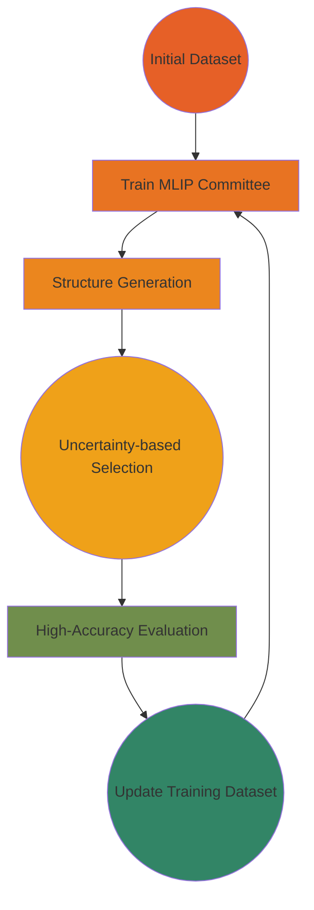

<div align="center">

</div>
<div align="center">

# `ALomancy` 🔮

**Modular Active Learning Workflows for Modern Computational Chemistry**


[](https://badge.fury.io/py/alomancy)
[](https://www.python.org/downloads/)
[](https://opensource.org/licenses/MIT)
[](https://github.com/julianholland/ALomancy/actions)
[](https://codecov.io/gh/julianholland/ALomancy)
[](https://github.com/astral-sh/ruff)
[](https://alomancy.readthedocs.io/en/latest/index.html)

[Installation](#installation) • [Quick Start](#quick-start) • [Documentation](https://alomancy.readthedocs.io/en/latest/index.html) • [Examples](#examples) • [Contributing](#contributing)

</div>

---

## 🎯 Overview

ALomnacy is a Python framework for running active learning (AL) workflows for training machine-learned inter-atomic potentials (MLIPs). This package focusses on customization and reproducibility to build robust training datasets and train MLIPs.

### Key Features

- 🚀 **Automated AL Workflows**: End-to-end active learning with minimal manual intervention
- 🔧 **HPC Integration**: Built-in support for remote job submission on HPC clusters
- ⚡ **Parallelization**: Ensures that jobs run concurrently where possible increasing speed to results
- 🔄 **Extensible Design**: Abstract base classes for easy customization and extension
- 📊 **Analysis Tools**: Built-in utilities for monitoring and analyzing AL progress

### Workflow Overview




## 🚀 Installation

### From PyPI (Recommended)

```bash
pip install alomancy
```

### From Source

```bash
git clone https://github.com/yourusername/ALomnacy.git
cd ALomnacy
pip install -e ".[dev]"
```

### Dependencies

- Python 3.9+
- [ASE](https://wiki.fysik.dtu.dk/ase/) - Atomic Simulation Environment
- [WFL](https://github.com/libAtoms/workflow) - Workflow for atomistic simulations
- [Expyre](https://github.com/libAtoms/ExPyRe) - Remote job execution

## ⚡ Quick Start

### 1. Basic Active Learning Workflow

```python
from alomancy.core import StandardActiveLearningWorkflow
from pathlib import Path

# Initialize workflow
workflow = StandardActiveLearningWorkflow(
    initial_train_file_path="train_set.xyz",
    initial_test_file_path="test_set.xyz",
    config_file_path="config.yaml",
    number_of_al_loops=5,
    verbose=1
)

# Run the active learning workflow
workflow.run()
```

### 2. Configuration File

Create a `config.yaml` file to specify your computational setup:

```yaml
mlip_committee:
  name: "mace_training"
  size_of_committee: 4
  epochs: 1000
  max_time: "24:00:00"
  hpc:
    hpc_name: "gpu_cluster"
    partitions: ["gpu"]
    pre_cmds: ["module load cuda", "source activate mace"]

structure_generation:
  name: "md_generation"
  number_of_concurrent_jobs: 8
  desired_number_of_structures: 100
  max_time: "12:00:00"
  hpc:
    hpc_name: "gpu_cluster"
    partitions: ["gpu"]
    pre_cmds: ["module load cuda", "source activate mace"]

high_accuracy_evaluation:
  name: "dft_evaluation"
  max_time: "48:00:00"
  hpc:
    hpc_name: "cpu_cluster"
    partitions: ["cpu"]
    pre_cmds: ["module load quantum-espresso"]
    node_info:
      ranks_per_system: 32
      ranks_per_node: 32
      threads_per_rank: 1
      max_mem_per_node: "128GB"
    pwx_path: "/path/to/pw.x"
    pp_path: "/path/to/pseudopotentials"
    pseudo_dict:
      H: "H.pbe-rrkjus_psl.1.0.0.UPF"
      O: "O.pbe-n-kjpaw_psl.1.0.0.UPF"
```

### 3. Custom Workflow Implementation

Extend the base class for specialized workflows:

```python
from alomancy.core import BaseActiveLearningWorkflow
from ase import Atoms
import pandas as pd

class CustomActiveLearningWorkflow(BaseActiveLearningWorkflow):

    def train_mlip(self, base_name: str, mlip_committee_job_dict: dict, **kwargs):
        """Custom MLIP training implementation"""
        # Your custom training logic here
        return "path/to/trained/model.pt"

    def evaluate_mlip(self, mlip_committee_job_dict: dict, **kwargs) -> pd.DataFrame:
        """Custom model evaluation"""
        # Your evaluation logic here
        return pd.DataFrame({"rmse": [0.1], "mae": [0.05]})

    def generate_structures(self, base_name: str, job_dict: dict,
                          train_data: list[Atoms], **kwargs) -> list[Atoms]:
        """Custom structure generation"""
        # Your structure generation logic here
        return generated_structures

    def high_accuracy_evaluation(self, base_name: str,
                               high_accuracy_eval_job_dict: dict,
                               structures: list[Atoms], **kwargs) -> list[Atoms]:
        """Custom high-accuracy evaluation"""
        # Your high-accuracy calculation logic here
        return evaluated_structures
```

## 📚 Examples

Check out the `examples/` directory for complete workflow examples:

- **Basic Usage**: Simple active learning workflow setup
- **Custom HPC Configuration**: Advanced cluster configuration
- **Analysis Scripts**: Post-processing and visualization tools

## 🏗️ Project Structure

```
alomancy/
├── analysis/           # Analysis and visualization tools
├── configs/           # Configuration management
├── core/              # Core active learning framework
├── high_accuracy_evaluation/  # DFT calculation modules
├── mlip/              # Machine learning potential training
├── structure_generation/      # MD and structure generation
└── utils/             # Utility functions and helpers
```

## 🔧 Key Components

### Core Framework
- **BaseActiveLearningWorkflow**: Abstract base class for AL workflows
- **StandardActiveLearningWorkflow**: Ready-to-use implementation

### MLIP Training
- **MACE Integration**: Committee training with uncertainty quantification
- **Remote Submission**: HPC job management for GPU-accelerated training

### Structure Generation
- **Molecular Dynamics**: ASE-based MD simulations with MACE potentials
- **Uncertainty Sampling**: Intelligent structure selection based on model disagreement

### High-Accuracy Evaluation
- **Quantum Espresso**: Automated DFT calculations for reference data
- **Job Management**: Parallel submission and monitoring of DFT jobs

<!-- ## 📊 Monitoring and Analysis -->

<!-- Monitor your AL progress with built-in analysis tools:

```python
from alomancy.analysis import MACEAnalysis

# Analyze model performance
analyzer = MACEAnalysis("results/")
analyzer.plot_learning_curves()
analyzer.analyze_uncertainty_evolution()
analyzer.generate_report()
``` -->

## 🤝 Contributing

We welcome contributions! Please see our [Contributing Guide](CONTRIBUTING.md) for details.

### Development Setup

```bash
# Clone the repository
git clone https://github.com/yourusername/ALomnacy.git
cd ALomnacy

# Install in development mode
pip install -e ".[dev]"

# Run tests
pytest

# Run linting
ruff check .
ruff format .
```

### Running Tests

```bash
# Run all tests
pytest

# Run specific test categories
pytest tests/core_tests/
pytest tests/mlip_train_tests/
pytest tests/high_acc_tests/

# Run with coverage
pytest --cov=alomancy
```

## 📝 Citation

If you use ALomnacy in your research, please cite:

```bibtex
@software{alomancy2025,
  title={ALomnacy: Modular Active Learning Workflows for Modern Computational Chemistry},
  author={Julian Holland},
  year={2025},
  url={https://github.com/yourusername/ALomnacy},
  version={0.1.0}
}
```

## 📄 License

This project is licensed under the MIT License - see the [LICENSE](LICENSE) file for details.

## 🙏 Acknowledgments

- The Fritz Haber Institute

## 📞 Support

- 📖 **Documentation**: [https://alomancy.readthedocs.io](https://alomancy.readthedocs.io)
- 🐛 **Bug Reports**: [GitHub Issues](https://github.com/yourusername/ALomnacy/issues)
- 💬 **Discussions**: [GitHub Discussions](https://github.com/yourusername/ALomnacy/discussions)
- 📧 **Email**: holland@fhi.mpg.de

---
