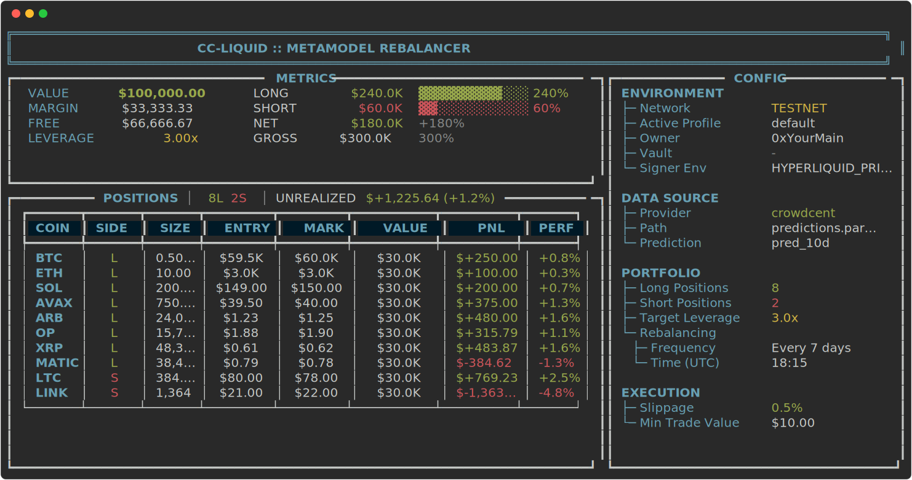
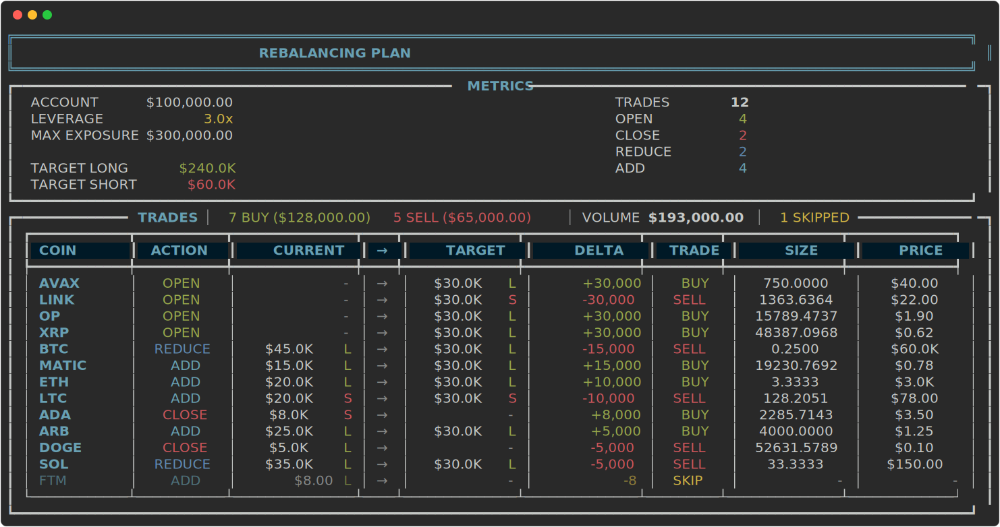
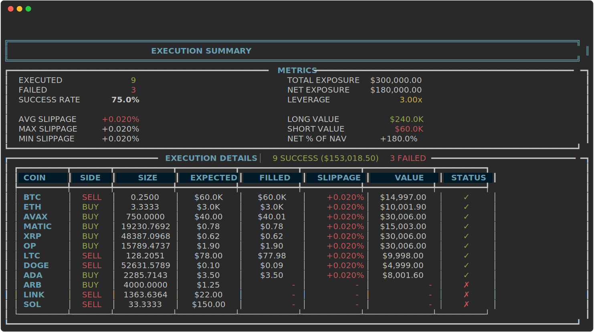
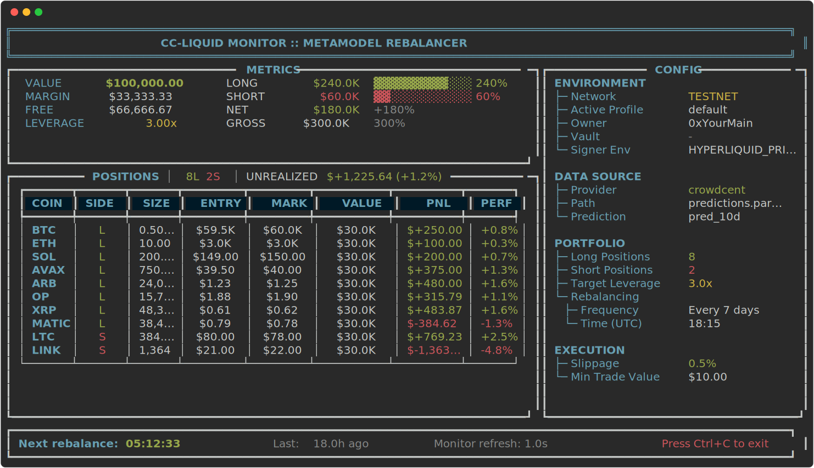

This walkthrough explains the core flow and safe first steps.

## 1) Install and configure

Follow [the installation guide](install-quickstart.md) to install and create `.env` and `cc-liquid-config.yaml`.

```bash
uv tool install cc-liquid
cc-liquit init
```

!!! tip "Tip: enable tab autocompletion for a smoother CLI experience"

    ```bash
    cc-liquid completion install
    ```

## 2) Confirm profile/config/data
```bash
cc-liquid config
```
See configuration for defaults and overrides: [Configuration → Data](configuration.md#data)

Set your data source in `cc-liquid-config.yaml` or via `--set data.source=[crowdcent|numerai]`:

- `crowdcent`: latest consolidated metamodel from CrowdCent
- `numerai`: Numerai Crypto metamodel
- `local`: your own parquet/csv file

## 3) Inspect account and positions

```bash
cc-liquid account
```

This shows your current portfolio state:



## 4) Plan and execute rebalancing

```bash
cc-liquid rebalance
```

The CLI will display a detailed plan showing:

- Current vs target positions
- Required trades to rebalance
- Portfolio metrics and leverage



After reviewing the plan, you'll be prompted to confirm execution. To skip the confirmation prompt:

```bash
cc-liquid rebalance --skip-confirm
```

You can adjust parameters on the fly:

```bash
cc-liquid rebalance --set portfolio.num_long=12 --set portfolio.num_short=8 --set portfolio.target_leverage=2.0
```

### How rebalancing works

1. **Load predictions**

   - Downloads latest metamodel from CrowdCent/Numerai (or loads local file)
   - Keeps most recent prediction per asset

2. **Select assets**

   - Top `num_long` assets for long positions (highest predictions)
   - Bottom `num_short` assets for short positions (lowest predictions)
   - Filters to only assets tradeable on Hyperliquid

3. **Size positions**

   - Equal-weight: `(account_value × target_leverage) / total_positions`
   - Warns if position sizes fall below `min_trade_value`

4. **Generate trades**

   - Calculates delta between current and target positions
   - Rounds sizes to exchange precision (`sz_decimals`)
   - Marks trades below minimum as "skipped"

5. **Execute orders**

   - Places market orders with configured `slippage_tolerance`
   - Reports fills, failures, and actual slippage

After execution completes:



### Flatten (close all positions)

```bash
cc-liquid close-all
```

In the event you want to return your entire portfolio/vault to cash, `close-all` plans and executes trades to close all trades to 0 notional value. Add `--skip-confirm` to skip confirmation messages.

## 5) Continuous mode (autopilot)

Schedules execution at `portfolio.rebalancing.at_time` every `every_n_days`. See [Autopilot & Scheduling](autopilot.md) for details.

```bash
cc-liquid run --skip-confirm   # executes automatically on schedule
```

Dashboard/monitor view:



## Safety notes

- Leverage increases liquidation risk; start with 1.0x
- Ensure `execution.min_trade_value` and slippage are appropriate
- Use Hyperliquid testnet first (`--set is_testnet=true`)


