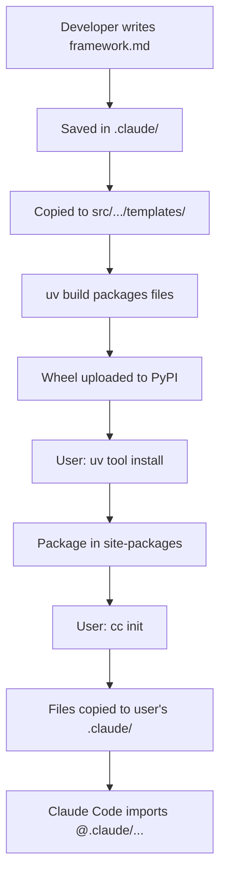

# ClaudeCraftsman Installation Architecture

## Overview: The Two `.claude/` Directories

There are actually TWO different `.claude/` directories in play, serving different purposes:

1. **Development `.claude/`** (in our repo root) - Where we're building the framework
2. **User's Project `.claude/`** (in their project) - Where the framework gets installed

## The Journey of Framework Files

### 1. Development Phase (Our Repository)
```
/workspace/                              # Our development repo
├── .claude/                            # OUR development .claude/
│   ├── framework.md                    # We're using the framework...
│   ├── agents/                         # ...to build the framework!
│   │   ├── product-architect.md        # (dogfooding)
│   │   └── design-architect.md
│   └── commands/
│       └── design.md
├── src/claudecraftsman/                # Python package source
│   └── templates/framework/            # COPIES of framework files
│       ├── framework.md                # These get packaged
│       ├── agents/                     # and distributed
│       │   ├── product-architect.md
│       │   └── design-architect.md
│       └── commands/
│           └── design.md
└── pyproject.toml                      # Build configuration
```

### 2. Build & Package Phase
When we run `uv build`, the build system (Hatchling):

1. **Reads `pyproject.toml`** which specifies:
   ```toml
   [tool.hatch.build]
   include = [
       "src/claudecraftsman/**/*.py",      # Python code
       "src/claudecraftsman/**/*.md",      # Framework markdown files
       "src/claudecraftsman/**/*.json",    # Config templates
   ]
   ```

2. **Creates a wheel file** containing:
   ```
   claudecraftsman-1.0.0-py3-none-any.whl
   ├── claudecraftsman/
   │   ├── cli/                    # Python CLI code
   │   ├── core/                   # Core functionality
   │   ├── templates/framework/    # Framework markdown files
   │   │   ├── framework.md
   │   │   ├── agents/*.md
   │   │   └── commands/*.md
   │   └── __init__.py
   └── metadata files
   ```

3. **The wheel is a ZIP file** that contains everything from `src/claudecraftsman/`

### 3. User Installation Phase
When a user runs `uv tool install claudecraftsman`:

1. **UV downloads the wheel** from PyPI (or builds from source)

2. **Installs to Python environment**:
   ```
   ~/.local/share/uv/tools/claudecraftsman/lib/python3.x/site-packages/
   └── claudecraftsman/
       ├── cli/                    # Python code is here
       ├── templates/framework/    # Framework files are here too!
       │   ├── framework.md
       │   ├── agents/*.md
       │   └── commands/*.md
       └── ...
   ```

3. **Creates executable**: `cc` command available globally

### 4. Framework Initialization Phase
When user runs `cc init` in their project:

1. **Python code locates package files**:
   ```python
   # In init.py
   package_root = Path(__file__).parent.parent.parent
   templates_dir = package_root / "templates" / "framework"
   ```

2. **Copies framework files to user's project**:
   ```
   user-project/
   ├── .claude/                    # USER'S project .claude/
   │   ├── framework.md           # Copied from package
   │   ├── agents/                # Copied from package
   │   └── commands/              # Copied from package
   ├── CLAUDE.md                  # Created with @.claude/... imports
   └── hooks.json                 # Copied from package
   ```

3. **Claude Code can now import** the local files:
   ```markdown
   # In CLAUDE.md
   @.claude/framework.md
   @.claude/agents/product-architect.md
   ```

## Why This Architecture?

### The Problem
- Claude Code can only import markdown files from the local filesystem
- It uses `@path/to/file.md` syntax which requires actual files
- Python packages install to site-packages, not accessible to Claude Code

### The Solution
1. **Package includes markdown files** in `templates/framework/`
2. **`cc init` extracts them** to the user's project `.claude/`
3. **Claude Code imports** from the local `.claude/` directory

### The Dual .claude/ Directories

| Directory | Purpose | Contents | Used By |
|-----------|---------|----------|---------|
| **Our repo's `.claude/`** | Dogfooding - using framework to build itself | Active framework files we're developing with | Us during development |
| **Package's `templates/framework/`** | Distribution copies | Copies of framework files for packaging | Build system |
| **User's project `.claude/`** | Framework installation | Framework files copied by `cc init` | End users |

## File Duplication Explained

Yes, we have the same files in multiple places:

1. **`.claude/`** (repo root) - Our working copies for dogfooding
2. **`src/claudecraftsman/templates/framework/`** - Copies for distribution
3. **User's `.claude/`** - Final destination after `cc init`

This is intentional because:
- We need working copies to develop the framework (dogfooding)
- We need distributable copies in the Python package
- Users need local copies for Claude Code to import

## The Complete Installation Flow



## Summary

1. **Our `.claude/`** is for development (dogfooding)
2. **`src/.../templates/framework/`** is for distribution
3. **Build system** packages everything in `src/`
4. **`cc init`** extracts framework files to user's project
5. **User's `.claude/`** contains the framework for their use

The Python package is essentially a delivery mechanism that:
- Packages the framework files
- Provides the `cc` CLI tool
- Extracts framework files where Claude Code can use them

This architecture solves the fundamental problem of distributing markdown files that Claude Code needs to import locally!
