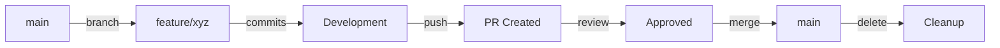

# Git Workflow Standards
*Version control as a first-class citizen in ClaudeCraftsman*

## Philosophy

Git is not just a tool but the backbone of our development workflow. Every action in the framework should result in meaningful Git history that tells the story of the project's evolution with craftsman-level clarity.

## Branch Strategy

### Branch Naming Conventions

```
feature/[type]-[description]    # New features
fix/[issue]-[description]        # Bug fixes
refactor/[area]-[description]    # Code improvements
docs/[topic]-[description]       # Documentation updates
test/[scope]-[description]       # Test additions/improvements
chore/[task]-[description]       # Maintenance tasks
```

**Examples:**
- `feature/agent-payment-processor`
- `fix/issue-42-validation-error`
- `refactor/git-service-optimization`
- `docs/api-authentication-guide`

### Branch Lifecycle



**Rules:**
1. Always branch from `main` (or `master`)
2. Keep branches focused on single features/fixes
3. Regular commits with meaningful messages
4. Push early and often for backup
5. Delete branches after merge

## Commit Message Standards

### Semantic Commit Format

```
<type>(<scope>): <subject>

[optional body]

[optional footer]

Framework: ClaudeCraftsman v1.0
Agent: <agent-name>
Phase: <workflow-phase>
Quality: ✓ Passed gates
```

### Commit Types

| Type | Description | Example |
|------|-------------|---------|
| `feat` | New feature | `feat(agent): add security-architect agent` |
| `fix` | Bug fix | `fix(command): resolve plan parsing error` |
| `docs` | Documentation | `docs(api): update authentication guide` |
| `style` | Formatting | `style(framework): consistent file naming` |
| `refactor` | Code restructuring | `refactor(service): optimize git operations` |
| `test` | Test additions | `test(agent): add integration tests` |
| `chore` | Maintenance | `chore(deps): update MCP tools version` |

### Commit Scopes

Common scopes in ClaudeCraftsman:
- `agent` - Agent-related changes
- `command` - Command modifications
- `framework` - Core framework updates
- `service` - Service layer changes
- `docs` - Documentation updates
- `test` - Testing infrastructure
- `config` - Configuration changes

### Commit Message Examples

**Good Examples:**
```
feat(agent): add ml-architect agent with pytorch integration

- Comprehensive ML pipeline design capabilities
- Integration with data-architect for data flow
- MLOps best practices embedded
- Quality gates for model validation

Framework: ClaudeCraftsman v1.0
Agent: product-architect
Phase: implementation
Quality: ✓ Passed gates
```

```
fix(command): resolve implement command phase parsing

- Fixed regex pattern for phase extraction
- Added validation for malformed plans
- Improved error messages

Framework: ClaudeCraftsman v1.0
Agent: workflow-coordinator
Phase: debugging
Quality: ✓ Passed gates
```

**Bad Examples:**
- `update stuff` ❌ (vague, no type/scope)
- `Fixed bug` ❌ (no specifics, wrong format)
- `WIP` ❌ (meaningless, no context)

## Pull Request Standards

### PR Title Format
```
[Type] Scope: Description
```

Examples:
- `[Feature] Agent: Add payment processing capabilities`
- `[Fix] Command: Resolve plan execution timeout`
- `[Refactor] Service: Optimize Git operations performance`

### PR Template

```markdown
## Description
Brief description of what this PR accomplishes

## Type of Change
- [ ] Bug fix (non-breaking change fixing an issue)
- [ ] New feature (non-breaking change adding functionality)
- [ ] Breaking change (fix or feature causing existing functionality to change)
- [ ] Documentation update
- [ ] Performance improvement
- [ ] Code refactoring

## Implementation Details
- Key technical decisions made
- Architectural considerations
- Performance implications

## Testing
- [ ] Unit tests pass
- [ ] Integration tests pass
- [ ] Manual testing completed
- [ ] Documentation updated

## Quality Checklist
- [ ] Code follows ClaudeCraftsman standards
- [ ] Self-review completed
- [ ] Comments added for complex logic
- [ ] No console.logs or debug code
- [ ] All commits follow semantic format

## Related Issues
Fixes #(issue number)

## Screenshots (if applicable)
Add screenshots for UI changes

## Framework Metadata
- **Agents Involved**: [List agents used]
- **Commands Affected**: [List commands modified]
- **Quality Gates**: All passed ✓
```

## GitHub Flow Process

### Standard Feature Development

1. **Start Feature**
   ```bash
   git checkout main
   git pull origin main
   git checkout -b feature/agent-payment-processor
   ```

2. **Development**
   ```bash
   # Regular commits during development
   git add .
   git commit -m "feat(agent): add payment processor structure

   Framework: ClaudeCraftsman v1.0
   Agent: workflow-coordinator
   Phase: development
   Quality: ✓ Passed gates"
   ```

3. **Push and Create PR**
   ```bash
   git push -u origin feature/agent-payment-processor
   # Create PR via GitHub/GitLab UI or CLI
   ```

4. **Review and Merge**
   - Code review by team
   - Address feedback
   - Squash and merge when approved

5. **Cleanup**
   ```bash
   git checkout main
   git pull origin main
   git branch -d feature/agent-payment-processor
   ```

## Git Hooks

### Pre-Commit Hook
```bash
#!/bin/bash
# .claude/git-hooks/pre-commit

# Check commit message format
commit_regex='^(feat|fix|docs|style|refactor|test|chore)(\(.+\))?: .+'
if ! grep -qE "$commit_regex" "$1"; then
    echo "Error: Commit message does not follow semantic format"
    exit 1
fi

# Run quality checks
npm run lint
npm test
```

### Commit-Msg Hook
```bash
#!/bin/bash
# .claude/git-hooks/commit-msg

# Append framework metadata if not present
if ! grep -q "Framework: ClaudeCraftsman" "$1"; then
    echo "" >> "$1"
    echo "Framework: ClaudeCraftsman v1.0" >> "$1"
    echo "Quality: ✓ Passed gates" >> "$1"
fi
```

## Quality Gates for Git Operations

### Before Committing
- [ ] All tests pass
- [ ] Code follows framework standards
- [ ] Documentation updated if needed
- [ ] No debugging artifacts left
- [ ] Commit message follows semantic format

### Before Creating PR
- [ ] Branch is up to date with main
- [ ] All commits are meaningful (squash if needed)
- [ ] PR description is comprehensive
- [ ] Related issues are linked
- [ ] CI/CD checks pass

### Before Merging
- [ ] Code review approved
- [ ] All discussions resolved
- [ ] Tests pass in CI/CD
- [ ] Documentation complete
- [ ] No merge conflicts

## Automated Git Operations

### Framework-Triggered Commits

Commands and agents automatically create commits:

```typescript
// When using /add command
"feat(agent): add payment-processor agent [add-command]"

// During /implement execution
"feat(implementation): complete phase 1 of user-auth [implement-command]"

// From agent work
"docs(api): update authentication documentation [product-architect]"
```

### Smart Commit Grouping

The framework intelligently groups related changes:
- Atomic commits for logical units of work
- Phase-based commits during implementation
- Aggregated commits for multi-file changes

## Git Integration with Framework

### Command Integration

| Command | Git Behavior |
|---------|-------------|
| `/add` | Creates feature branch, commits component |
| `/plan` | Commits plan document, suggests branch |
| `/design` | Creates epic branch, commits specs |
| `/implement` | Makes phase-based commits |
| `/test` | Commits test results and coverage |
| `/deploy` | Creates release tag |

### Agent Awareness

Every agent maintains Git context:
- Current branch awareness
- Commit history for handoffs
- Conflict detection and resolution
- Automated commit creation

## Troubleshooting

### Common Issues

**Issue**: Merge conflicts during implementation
**Solution**: Use `git-service` conflict resolution with agent assistance

**Issue**: Large binary files in commits
**Solution**: Use `.gitignore` and Git LFS for appropriate files

**Issue**: Commits not following standards
**Solution**: Pre-commit hooks enforce standards automatically

## Best Practices

1. **Commit Early and Often**: Small, focused commits are better
2. **Write Meaningful Messages**: Future you will thank present you
3. **Keep Branches Short-Lived**: Merge frequently to avoid conflicts
4. **Review Your Own PRs**: Self-review before requesting others
5. **Document Decisions**: Use commit messages to explain "why"

## Migration Guide

For existing projects adopting ClaudeCraftsman:

1. Install Git hooks from `.claude/git-hooks/`
2. Configure Git service in framework
3. Update team on new standards
4. Gradually adopt semantic commits
5. Implement PR templates

---
*Standards Version: 1.0*
*Created: 2025-08-04*
*Framework: ClaudeCraftsman*
*Making every commit count*
