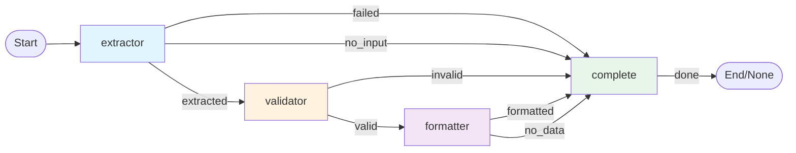

# Structured Output Example

Extract structured data from unstructured text using OpenAI's Pydantic integration.

## Features

- **Type-safe extraction** using Pydantic models
- **Explicit routing** with clear outcomes
- **Validation** of extracted data
- **Formatted output** for display

## Setup

```bash
pip install -r requirements.txt
export OPENAI_API_KEY="your-key"
```

## Usage

```bash
python main.py
```

The example will:

1. Load resume text from `data.txt`
2. Extract structured information (name, email, experience, skills)
3. Validate the data meets requirements
4. Display formatted results

## Customization

Edit `data.txt` to test with different resumes. Adjust validation rules in `nodes.py`.

## Flow Structure



ClearFlow enforces single termination - all paths converge to `complete` node.

**Node Outcomes:**

- `extractor`: extracted/failed/no_input
- `validator`: valid/invalid  
- `formatter`: formatted/no_data
- `complete`: done (→ None)
