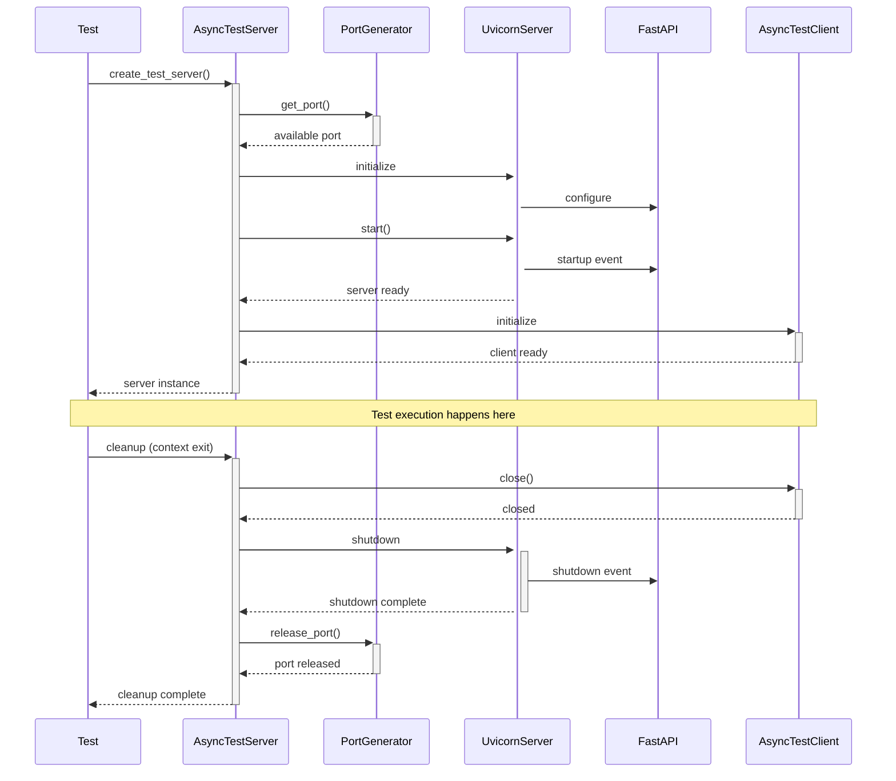

# FastAPI Testing

[](https://github.com/descoped/fastapi-testing/actions/workflows/build-test-native.yml)
[](https://codecov.io/gh/descoped/fastapi-testing)
[](https://www.python.org/downloads/)
[](https://opensource.org/licenses/MIT)
[](https://github.com/descoped/fastapi-testing/releases)

A lightweight, async-first testing framework designed specifically for FastAPI applications. This library provides a simple way to write integration tests for FastAPI applications with proper lifecycle management and async support.

## Features

- Async-first design for modern Python applications
- Automatic port management for test servers
- Clean lifecycle management with context managers
- Built-in HTTP and WebSocket client support
- Proper cleanup of resources after tests
- Support for FastAPI's lifespan events
- Type-safe with full typing support

## Installation

```bash
uv add fastapi-testing
```

Or with pip:
```bash
pip install fastapi-testing
```

## Quick Start

Here's a simple example of how to test a FastAPI endpoint:

```python
import pytest
from fastapi import FastAPI
from fastapi_testing import create_test_server

@pytest.mark.asyncio
async def test_hello_world():
    async with create_test_server() as server:
        @server.app.get("/hello")
        async def hello():
            return {"message": "Hello, World!"}
            
        response = await server.client.get("/hello")
        await response.expect_status(200)
        data = await response.json()
        assert data["message"] == "Hello, World!"
```

## Architecture

The following sequence diagram illustrates the lifecycle of a test using this framework:



## Key Components

### AsyncTestServer

The `AsyncTestServer` class is the core component that manages the lifecycle of your test FastAPI application:

```python
from fastapi_testing import AsyncTestServer

server = AsyncTestServer()
await server.start()
# Use server.app to define routes
# Use server.client to make requests
await server.stop()
```

### Context Manager

The recommended way to use the test server is with the async context manager:

```python
from fastapi_testing import create_test_server

async with create_test_server() as server:
    # Your test code here
    pass  # Server automatically starts and stops
```

### AsyncTestClient

The `AsyncTestClient` provides methods for making HTTP requests to your test server:

```python
# Available HTTP methods
await server.client.get("/path")
await server.client.post("/path", json=data)
await server.client.put("/path", json=data)
await server.client.delete("/path")
await server.client.patch("/path", json=data)
```

### Response Assertions

The `AsyncTestResponse` class provides convenient methods for assertions:

```python
response = await server.client.get("/path")
await response.expect_status(200)  # Assert status code
data = await response.json()       # Get JSON response
text = await response.text()       # Get text response
```

### WebSocket Testing

Test WebSocket endpoints with full protocol support:

```python
@pytest.mark.asyncio
async def test_mixed_protocols(test_server):
    # Define HTTP endpoint
    @test_server.app.get("/api/data")
    async def get_data():
        return {"status": "ok"}

    # Define WebSocket endpoint
    @test_server.app.websocket("/ws/echo")
    async def websocket_endpoint(websocket: WebSocket):
        await websocket.accept(subprotocol="test-protocol")
        while True:
            try:
                message = await websocket.receive()
                if "text" in message:
                    data = json.loads(message["text"])
                    await websocket.send_json(data)
                elif "bytes" in message:
                    await websocket.send_bytes(message["bytes"])
            except WebSocketDisconnect:
                return

    # Test HTTP endpoint
    http_response = await test_server.client.get("/api/data")
    assert http_response.status_code == 200

    # Configure WebSocket
    config = WebSocketConfig(
        subprotocols=["test-protocol"],
        ping_interval=20.0,
        ping_timeout=20.0
    )

    # Test WebSocket endpoint
    ws_response = await test_server.client.websocket("/ws/echo", config)
    try:
        # Test JSON messages
        test_json = {"message": "test"}
        await test_server.client.ws.send_json(ws_response, test_json)
        response = await test_server.client.ws.receive_json(ws_response)
        assert response == test_json

        # Test binary messages
        test_data = b"binary test"
        await test_server.client.ws.send_binary(ws_response, test_data)
        response = await test_server.client.ws.receive_binary(ws_response)
        assert response == test_data
    finally:
        await ws_response.websocket().close()
```

#### WebSocket Message Operations

The WebSocketHelper provides comprehensive message handling:

```python
# Send Operations
await client.ws.send_text(ws_response, "message")
await client.ws.send_json(ws_response, {"key": "value"})
await client.ws.send_binary(ws_response, b"data")

# Receive Operations
text = await client.ws.receive_text(ws_response)
json_data = await client.ws.receive_json(ws_response)
binary = await client.ws.receive_binary(ws_response)

# Message Expectations
await client.ws.expect_message(
    ws_response,
    expected="message",
    timeout=1.0
)

# Collect Multiple Messages
messages = await client.ws.drain_messages(
    ws_response,
    timeout=1.0
)
```

#### WebSocket Configuration

Configure connections with various options:

```python
ws_config = WebSocketConfig(
    subprotocols=["protocol"],  # Supported subprotocols
    compression=None,           # Compression algorithm
    extra_headers={},          # Additional headers
    ping_interval=20.0,        # Keep-alive interval
    ping_timeout=20.0,         # Ping timeout
    max_size=2 ** 20,         # Max message size (1MB)
    max_queue=32,             # Max queued messages
    timeout=30.0              # Connection timeout
)
```

## Advanced Usage

### Advanced Server Configuration

You can customize the server lifecycle using a reusable test fixture:

```python
@pytest.fixture
async def test_server(
    test_settings: Settings,
    transaction_manager: TransactionManager
) -> AsyncGenerator[AsyncTestServer, None]:
    """Create test server with overridden settings and database connection"""

    async def custom_lifespan(app: AppType) -> AsyncGenerator[None, Any]:
        # Wire up test-specific dependencies
        app.dependency_overrides.update({
            get_settings: lambda: test_settings,
            get_transaction_manager: lambda: transaction_manager,
            get_db_pool: lambda: transaction_manager.pool
        })

        yield  # Server handles requests during this period

        # Cleanup after tests complete
        await db.cleanup()

    async with create_test_server(lifespan=custom_lifespan) as server:
        yield server
```

### Testing Routes and Routers

You can test entire routers and complex route configurations:

```python
@pytest.mark.asyncio
async def test_api(test_server: AsyncTestServer):
    # Register routes/routers
    test_server.app.include_router(your_router)

    # Make requests
    response = await test_server.client.get("/your-endpoint")
    await response.expect_status(200)
    
    # Test concurrent requests
    responses = await asyncio.gather(*[
        test_server.client.get("/endpoint")
        for _ in range(5)
    ])
    
    for response in responses:
        await response.expect_status(200)
```

### Lifecycle Management

You can define setup and cleanup operations using FastAPI's lifespan:

```python
from contextlib import asynccontextmanager
from fastapi import FastAPI

@asynccontextmanager
async def lifespan(app: FastAPI):
    # Setup
    print("Starting server")
    yield
    # Cleanup
    print("Shutting down server")

async with create_test_server(lifespan=lifespan) as server:
    # Your test code here
    pass
```

### Concurrent Requests

The framework supports testing concurrent requests:

```python
import asyncio

async with create_test_server() as server:
    @server.app.get("/ping")
    async def ping():
        return {"status": "ok"}

    responses = await asyncio.gather(*[
        server.client.get("/ping")
        for _ in range(5)
    ])
```

## Configuration

You can customize the server behavior:

```python
server = AsyncTestServer(
    startup_timeout=30.0,    # Seconds to wait for server startup
    shutdown_timeout=10.0,   # Seconds to wait for server shutdown
)
```

## Best Practices

1. Always use the async context manager (`create_test_server`) when possible
2. Clean up resources in your tests, especially when managing state
3. Use pytest.mark.asyncio for your test functions
4. Handle exceptions appropriately in your tests
5. Use type hints to catch potential issues early

## Testing

The framework itself is thoroughly tested with >88% code coverage, ensuring reliability for production use.

### Running Tests

```bash
# Run all tests
uv run pytest

# Run with coverage report
uv run pytest --cov=src/fastapi_testing --cov-report=term-missing

# Run specific test categories
uv run pytest tests/test_server.py          # Server functionality
uv run pytest tests/test_websockets.py     # WebSocket support
uv run pytest tests/test_config.py         # Configuration tests
```

### Test Structure

The test suite includes:

- **Integration tests** - Real FastAPI applications with actual network connections
- **Configuration tests** - Environment variable loading and validation
- **Error handling tests** - Edge cases and failure scenarios
- **WebSocket tests** - Real-time bidirectional communication
- **Lifecycle tests** - Server startup, shutdown, and resource management
- **Concurrent request tests** - Multiple simultaneous connections

All tests follow modern async/await patterns and avoid mocks to ensure real-world reliability.

## Error Handling

The framework provides clear error messages for common issues:

- Server startup timeout
- Port allocation failures
- Connection errors
- Invalid request formats

## Limitations

- Only supports async test cases
- Requires Python 3.11+
- Designed specifically for FastAPI applications

## Contributing

Contributions are welcome! Please feel free to submit a Pull Request.
