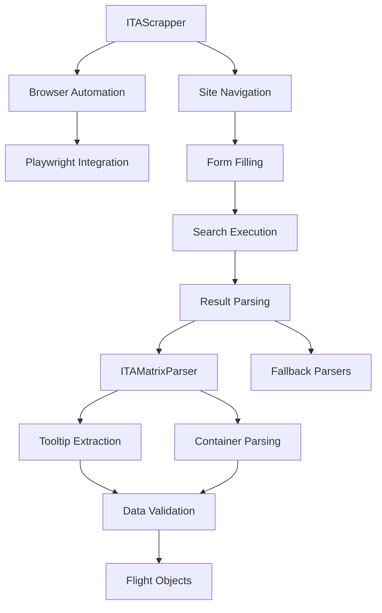
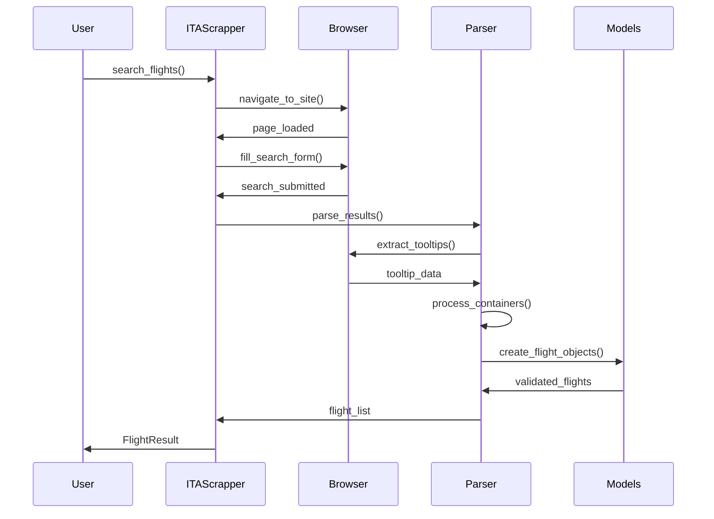

# ITA Scrapper Developer Guide

## Architecture Overview

The ITA Scrapper uses a sophisticated multi-layered architecture designed to handle the complexity of modern travel booking websites. This guide explains the internal architecture, parsing strategies, and extension points for developers.

## Table of Contents

- [Core Architecture](#core-architecture)
- [Browser Automation](#browser-automation)
- [Parser Architecture](#parser-architecture)
- [Data Flow](#data-flow)
- [Extension Points](#extension-points)
- [Debugging Guide](#debugging-guide)
- [Performance Optimization](#performance-optimization)

## Core Architecture

### Component Overview



### Class Hierarchy

```python
ITAScrapper                 # Main orchestrator
├── Browser Management
│   ├── Playwright Integration
│   ├── Anti-Detection
│   └── Context Management
├── Site Interaction
│   ├── Navigation
│   ├── Form Filling
│   └── Search Execution
└── Result Processing
    ├── ITAMatrixParser
    ├── Fallback Parsers
    └── Data Validation

Models                      # Data structures
├── Flight
├── FlightSegment
├── SearchParams
└── FlightResult

Utilities                   # Helper functions
├── FlightDataParser
├── Text Processing
└── Validation
```

## Browser Automation

### Playwright Integration

The scrapper uses Playwright for browser automation with carefully configured anti-detection measures:

```python
# Browser Launch Configuration
browser = await playwright.chromium.launch(
    headless=self.headless,
    args=[
        "--no-sandbox",                              # Bypass sandbox restrictions
        "--disable-blink-features=AutomationControlled",  # Hide automation signals
        "--disable-web-security",                    # Allow cross-origin requests
        "--disable-features=VizDisplayCompositor"    # Reduce detection vectors
    ]
)

# Context Configuration
context = await browser.new_context(
    viewport={"width": 1920, "height": 1080},       # Standard desktop resolution
    user_agent=custom_user_agent,                   # Mimic real browsers
    extra_http_headers={                            # Additional stealth headers
        "Accept-Language": "en-US,en;q=0.9"
    }
)
```

### Anti-Detection Strategies

1. **User Agent Spoofing**: Uses realistic browser user agents
2. **Viewport Configuration**: Standard desktop resolutions
3. **Request Timing**: Human-like delays between actions
4. **JavaScript Execution**: Disables automation detection scripts
5. **Header Manipulation**: Adds standard browser headers

### Navigation Flow

```python
async def _navigate_to_flights(self):
    """Multi-stage navigation with error handling."""
    
    # 1. Initial navigation
    response = await self._page.goto(
        self.base_url, 
        wait_until="domcontentloaded",
        timeout=30000
    )
    
    # 2. Check for blocking
    if response.status >= 400:
        raise NavigationError(f"HTTP {response.status}")
    
    # 3. Wait for JavaScript
    await self._page.wait_for_timeout(5000)
    
    # 4. Verify page state
    title = await self._page.title()
    if "blocked" in title.lower():
        raise NavigationError("Site blocking detected")
```

## Parser Architecture

### Multi-Strategy Parsing

The parser uses a layered approach with multiple fallback strategies:

#### Layer 1: Tooltip-Based Parsing (Primary)

ITA Matrix stores detailed flight information in Angular Material tooltips:

```python
async def _extract_tooltip_data(self, page: Page) -> dict[str, str]:
    """Extract comprehensive flight data from tooltips."""
    
    # Strategy 1: Standard tooltips
    tooltips = await page.query_selector_all('[role="tooltip"]')
    
    # Strategy 2: CDK tooltips  
    cdk_tooltips = await page.query_selector_all('[id*="cdk-describedby-message"]')
    
    # Strategy 3: Hidden tooltip content
    all_tooltips = await page.query_selector_all('[id*="tooltip"], [class*="tooltip"]')
    
    # Combine all strategies
    return self._consolidate_tooltip_data(tooltips, cdk_tooltips, all_tooltips)
```

#### Layer 2: Container-Based Parsing

Extract data from flight result containers:

```python
async def _find_flight_containers(self, page: Page) -> list[ElementHandle]:
    """Find flight containers using multiple selectors."""
    
    selectors = [
        'tr[class*="itinerary"]',    # ITA Matrix specific
        'tr[class*="result"]',       # Generic result rows
        '.flight-result',            # Class-based selectors
        '[data-testid*="flight"]',   # Test ID selectors
        'tr[role="row"]'             # ARIA role selectors
    ]
    
    for selector in selectors:
        containers = await page.query_selector_all(selector)
        if containers:
            return containers
    
    # Fallback: heuristic-based detection
    return await self._heuristic_container_detection(page)
```

#### Layer 3: Text-Based Extraction

Parse flight information from text content:

```python
def _extract_airlines_from_text(self, text: str) -> list[str]:
    """Extract airline names using pattern matching."""
    
    # Known airline patterns
    airline_patterns = [
        r"Virgin Atlantic", r"Delta", r"American", r"United",
        r"British Airways", r"Emirates", r"Lufthansa"
    ]
    
    airlines = []
    for pattern in airline_patterns:
        if re.search(pattern, text, re.IGNORECASE):
            airlines.append(pattern)
    
    # Comma-separated detection
    if "," in text and not any(time_indicator in text for time_indicator in ["AM", "PM"]):
        potential_airlines = [part.strip() for part in text.split(",")]
        airlines.extend([a for a in potential_airlines if self._is_airline_name(a)])
    
    return airlines
```

### Data Extraction Patterns

#### Time Parsing

Complex time extraction from tooltip content:

```python
def _extract_times_from_text(self, text: str) -> list[dict]:
    """Extract flight times with context."""
    
    # Pattern: "LHR time: 6:25 AM Sat July 12"
    time_pattern = r"(\w{3})\s+time:\s+(\d{1,2}:\d{2}\s+[AP]M)\s+(\w+\s+\w+\s+\d+)"
    
    matches = re.findall(time_pattern, text)
    times = []
    
    for airport_code, time_str, date_str in matches:
        times.append({
            "airport": airport_code,
            "time": time_str,
            "date": date_str,
            "raw_text": text,
            "parsed_datetime": self._parse_datetime(f"{time_str} {date_str}")
        })
    
    return times
```

#### Price Extraction

Multi-format price parsing:

```python
def _extract_price_from_text(self, text: str) -> Optional[Decimal]:
    """Extract prices handling international formats."""
    
    price_patterns = [
        r"\$(\d+(?:,\d{3})*(?:\.\d{2})?)",          # US format: $1,234.56
        r"(\d+(?:,\d{3})*(?:\.\d{2})?)\s*USD",      # Currency suffix
        r"USD\s*(\d+(?:,\d{3})*(?:\.\d{2})?)",      # Currency prefix
        r"€(\d+(?:\.\d{3})*(?:,\d{2})?)",           # European format
    ]
    
    for pattern in price_patterns:
        matches = re.findall(pattern, text)
        if matches:
            try:
                # Handle different decimal separators
                clean_price = self._normalize_price_format(matches[0])
                return Decimal(clean_price)
            except InvalidOperation:
                continue
    
    return None
```

## Data Flow

### Complete Processing Pipeline



### Error Handling Flow

```python
async def _parse_single_flight(self, container, tooltip_data, page):
    """Parse flight with comprehensive error handling."""
    
    try:
        # Primary parsing strategy
        flight_info = await self._parse_primary_strategy(container, tooltip_data)
        
        if self._is_valid_flight_info(flight_info):
            return self._create_flight_object(flight_info)
            
    except Exception as e:
        logger.warning(f"Primary parsing failed: {e}")
    
    try:
        # Fallback parsing strategy
        flight_info = await self._parse_fallback_strategy(container)
        return self._create_flight_object(flight_info)
        
    except Exception as e:
        logger.warning(f"Fallback parsing failed: {e}")
    
    # Final fallback: basic flight object
    return self._create_default_flight()
```

## Extension Points

### Adding New Parsers

To add support for additional travel sites:

```python
class GoogleFlightsParser:
    """Parser for Google Flights interface."""
    
    def __init__(self):
        self.data_parser = FlightDataParser()
    
    async def parse_flight_results(self, page: Page, max_results: int) -> list[Flight]:
        """Implement site-specific parsing logic."""
        
        # 1. Wait for site-specific elements
        await self._wait_for_google_flights_results(page)
        
        # 2. Extract data using site-specific selectors
        flight_cards = await page.query_selector_all('[data-testid="flight-card"]')
        
        # 3. Parse each flight card
        flights = []
        for card in flight_cards[:max_results]:
            flight = await self._parse_google_flight_card(card)
            if flight:
                flights.append(flight)
        
        return flights
    
    async def _parse_google_flight_card(self, card: ElementHandle) -> Optional[Flight]:
        """Parse individual Google Flights result card."""
        # Implementation specific to Google Flights structure
        pass
```

### Custom Data Models

Extend the base models for additional data:

```python
class EnhancedFlight(Flight):
    """Extended flight model with additional fields."""
    
    carbon_footprint: Optional[Decimal] = None
    wifi_available: bool = False
    meal_service: Optional[str] = None
    seat_pitch: Optional[int] = None
    
    @property
    def environmental_score(self) -> str:
        """Calculate environmental impact rating."""
        if self.carbon_footprint:
            if self.carbon_footprint < 100:
                return "Low"
            elif self.carbon_footprint < 200:
                return "Medium"
            else:
                return "High"
        return "Unknown"
```

### Custom Validators

Add specialized validation logic:

```python
def validate_business_travel_params(params: SearchParams) -> SearchParams:
    """Apply business travel specific validation."""
    
    # Business travel typically books closer to departure
    if (params.departure_date - date.today()).days > 90:
        logger.warning("Business travel typically books within 90 days")
    
    # Prefer business class for long flights
    if params.cabin_class == CabinClass.ECONOMY:
        # Detect long-haul routes and suggest upgrade
        if is_long_haul_route(params.origin, params.destination):
            logger.info("Consider business class for long-haul flights")
    
    return params
```

## Debugging Guide

### Enable Debug Mode

```python
# Enable verbose logging
import logging
logging.basicConfig(level=logging.DEBUG)

# Run with visible browser
scrapper = ITAScrapper(headless=False, timeout=60000)

# Take screenshots for debugging
await page.screenshot(path="debug_page_state.png")
```

### Common Debugging Scenarios

#### 1. Navigation Issues

```python
async def debug_navigation(self):
    """Debug navigation problems."""
    
    try:
        response = await self._page.goto(self.base_url)
        
        # Check response status
        print(f"Response status: {response.status}")
        
        # Check for redirects
        print(f"Final URL: {self._page.url}")
        
        # Check page content
        content = await self._page.content()
        if "blocked" in content.lower():
            print("Detected blocking mechanisms")
        
        # Take screenshot
        await self._page.screenshot(path="navigation_debug.png")
        
    except Exception as e:
        print(f"Navigation failed: {e}")
```

#### 2. Parsing Issues

```python
async def debug_parsing(self, page: Page):
    """Debug parsing problems."""
    
    # Check for expected elements
    tooltips = await page.query_selector_all('[role="tooltip"]')
    print(f"Found {len(tooltips)} tooltips")
    
    # Extract and log tooltip content
    for i, tooltip in enumerate(tooltips[:5]):
        content = await tooltip.inner_text()
        print(f"Tooltip {i}: {content[:100]}...")
    
    # Check for flight containers
    containers = await page.query_selector_all('tr[class*="result"]')
    print(f"Found {len(containers)} result containers")
    
    # Log page structure
    all_elements = await page.query_selector_all('*')
    print(f"Total page elements: {len(all_elements)}")
```

#### 3. Data Quality Issues

```python
def debug_flight_data(self, flights: list[Flight]):
    """Analyze flight data quality."""
    
    print(f"Parsed {len(flights)} flights")
    
    for i, flight in enumerate(flights):
        print(f"\nFlight {i + 1}:")
        print(f"  Price: ${flight.price}")
        print(f"  Duration: {flight.total_duration_minutes} minutes")
        print(f"  Segments: {len(flight.segments)}")
        print(f"  Airlines: {flight.airlines}")
        
        # Check for data completeness
        issues = []
        if flight.price <= 0:
            issues.append("Invalid price")
        if flight.total_duration_minutes <= 0:
            issues.append("Invalid duration")
        if not flight.segments:
            issues.append("No segments")
        
        if issues:
            print(f"  Issues: {', '.join(issues)}")
```

### Debugging Tools

#### 1. Browser Developer Tools

```python
# Enable developer tools in non-headless mode
scrapper = ITAScrapper(headless=False)

# Add breakpoints in browser
await page.evaluate("debugger;")

# Inspect elements interactively
element = await page.query_selector("#target-element")
await page.evaluate("console.log(arguments[0])", element)
```

#### 2. Network Monitoring

```python
# Monitor network requests
async def log_requests(request):
    print(f"Request: {request.method} {request.url}")

page.on("request", log_requests)

# Monitor responses
async def log_responses(response):
    print(f"Response: {response.status} {response.url}")

page.on("response", log_responses)
```

## Performance Optimization

### Browser Optimization

```python
# Optimize for performance
scrapper = ITAScrapper(
    headless=True,                    # Faster execution
    viewport_size=(1280, 720),        # Smaller viewport
    timeout=30000                     # Reasonable timeout
)

# Disable images and CSS for faster loading
context = await browser.new_context(
    viewport={"width": 1280, "height": 720},
    ignore_https_errors=True,
    java_script_enabled=True,
    # Disable resource loading for speed
    resource_exclusions=["image", "stylesheet", "font"]
)
```

### Parsing Optimization

```python
# Limit result scope
result = await scrapper.search_flights(
    origin="JFK",
    destination="LAX",
    departure_date=date.today(),
    max_results=5  # Process fewer results
)

# Use parallel processing for multiple searches
import asyncio

async def parallel_searches():
    """Execute multiple searches in parallel."""
    
    tasks = [
        scrapper.search_flights("JFK", "LAX", date.today()),
        scrapper.search_flights("JFK", "SFO", date.today()),
        scrapper.search_flights("JFK", "SEA", date.today())
    ]
    
    results = await asyncio.gather(*tasks, return_exceptions=True)
    return [r for r in results if not isinstance(r, Exception)]
```

### Memory Management

```python
# Proper resource cleanup
async def efficient_scraping():
    """Demonstrate efficient resource usage."""
    
    results = []
    
    # Process multiple searches with single browser instance
    async with ITAScrapper() as scrapper:
        for route in routes:
            try:
                result = await scrapper.search_flights(**route)
                results.append(result)
                
                # Optional: clear browser cache between searches
                await scrapper._page.evaluate("() => { localStorage.clear(); sessionStorage.clear(); }")
                
            except Exception as e:
                logger.error(f"Failed to process route {route}: {e}")
                continue
    
    return results
```

### Caching Strategy

```python
import hashlib
import json
from functools import wraps

def cache_results(cache_duration_hours=1):
    """Cache search results to avoid repeated scraping."""
    
    def decorator(func):
        @wraps(func)
        async def wrapper(*args, **kwargs):
            # Generate cache key
            cache_key = hashlib.md5(
                json.dumps({"args": args, "kwargs": kwargs}, sort_keys=True).encode()
            ).hexdigest()
            
            # Check cache
            cached_result = get_from_cache(cache_key)
            if cached_result and not is_expired(cached_result, cache_duration_hours):
                return cached_result["data"]
            
            # Execute function
            result = await func(*args, **kwargs)
            
            # Store in cache
            store_in_cache(cache_key, result)
            
            return result
        
        return wrapper
    return decorator

# Usage
@cache_results(cache_duration_hours=2)
async def cached_flight_search(origin, destination, date):
    async with ITAScrapper() as scrapper:
        return await scrapper.search_flights(origin, destination, date)
```

This developer guide provides the foundation for understanding, extending, and debugging the ITA Scrapper architecture. The modular design allows for easy customization while maintaining robust error handling and performance optimization.