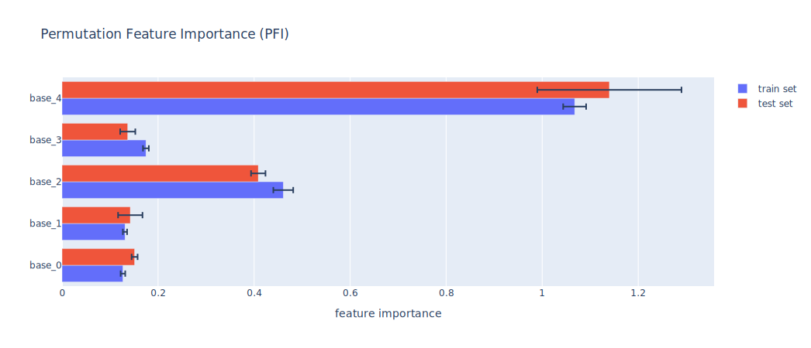
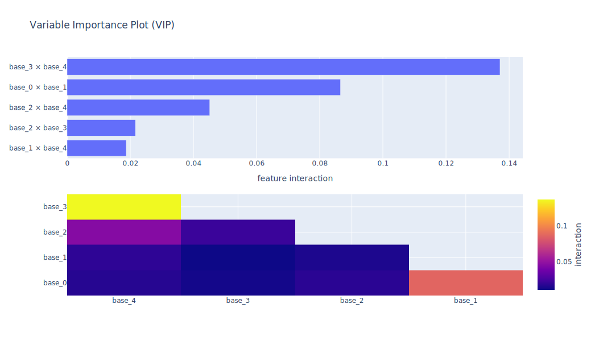

# Model Agnostic Toolkit

---
**NOTE**

Supports Python Version 3.9 and 3.10

The toolkit is under development and is being continuously improved

---

The Model Agnostic Toolkit is a package for determining the effect of individual features and their interplay toward a target variable for tabular datasets. It includes a multitude of tools for two main applications:
- **individual feature importances** (how does a single feature affect the target?) and
- **feature pair interactions** (what effects toward the target exist between features?)

## Documentation

To get up and running quickly, follow the instructions for [installing](docs/installation.md) this package and have a look into the [quick start](docs/getting_started.md#quick-start) document.
For more in-depth [examples](docs/getting_started.md#examples), learning how to use custom datasets or models and for anything else, take a deeper look into the [documentation](docs/README.md).

**→ [Visit the user documentation](docs/README.md)!**

### Overview

1. [Installation](docs/installation.md)
2. [Getting Started](docs/getting_started.md)
3. [Datasets](docs/datasets.md)
4. [Models](docs/models.md)
5. [Tools](docs/tools.md)
6. [Analyzers](docs/analyzers.md)
7. [Plotting](docs/plotting.md)

## Features

Find out about all features' importances in your data and/or how they interact with each other. Make use of powerful tools for computing and analyzing and get the raw result values as well as interactive plots.

### Importance

Analyze which features have a relevant contribution toward the target variable, learn what the relationship looks like, and more (see examples below)!

> 
> 
> 
>
> •••

### Interaction

Analyze which features interact which each other, what their first an second order interactions look like, and more (see examples below)!

> 
> 
> 
>
> •••

## Contact

If you have any questions or feedback, feel free to contact us via [email](mailto:tobias.schulze@wzl-iqs.rwth-aachen.de) or open an issue on repository.

## Authors

This project is developed by
- **Tobias Schulze** - Project administration, Conceptualization, Implementation, Documentation
- **Chrismarie Enslin** - Conceptualization, Implementation, Documentation
- **Daniel Buschmann** - Conceptualization, Validadation
- **Marcos Padrón Hinrichs** - Review, Supervision, Funding Acquisitionion
- **Felix Sohnius** - Review, Supervision, Funding Acquisitionion
- **Robert H. Schmitt** - Review, Supervision, Funding Acquisition, Resources

**Affiliation:** Laboratory for Machine Tools and Production Engineering, WZL of RWTH Aachen University (Chair for Intelligence in Quality Sensing)

## Acknowledgement

Funded by the Deutsche Forschungsgemeinschaft (DFG, German Research Foundation) under Germany’s Excellence Strategy – EXC-2023 Internet of Production – 390621612.

# License

Distributed under the MIT License. See `LICENSE.md` for more information.
