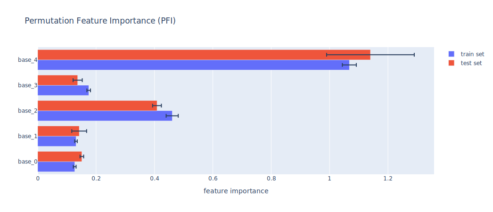
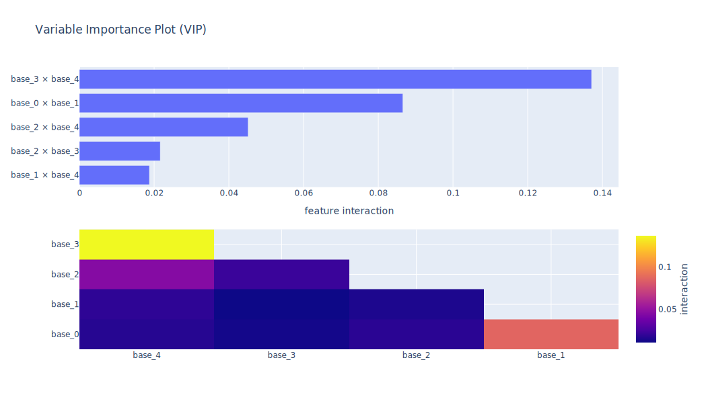

# Model Agnostic Toolkit

---
**NOTE**

Supports Python Version 3.9 and 3.10

---

The Model Agnostic Toolkit is a package for determining the effect of individual features and their interplay toward a target variable for tabular datasets. It includes a multitude of tools for two main applications:
- **individual feature importances** (how does a single feature affect the target?),
- **feature pair interactions** (what effects toward the target exist between features?) and

## Documentation

To get up and running quickly, follow the instructions for [installing](docs/installation.md) this package and have a look into the [quick start](docs/getting_started.md#quick-start) document.
For more in-depth [examples](docs/getting_started.md#examples), learning how to use custom datasets or models and for anything else, take a deeper look into the [documentation](docs/README.md).

**→ [Visit the user documentation](docs/README.md)!**

### Overview

1. [Installation](docs/installation.md)
2. [Getting Started](docs/getting_started.md)
3. [Datasets](docs/datasets.md)
4. [Models](docs/models.md)
5. [Tools](docs/tools.md)
6. [Analyzers](docs/analyzers.md)
7. [Plotting](docs/plotting.md)

## Features

Find out about all features' importances in your data, how they are interaction with each other. Make use of powerful tools for computing and analyzing and get the raw result values as well as interactive plots.

### Importance

Analyze which features have a relevant contribution toward the target variable, learn what the relationship looks like and more!

> 
> 
> 
>
> •••

### Interaction

Analyze which features interact which each other, what their first an second order interactions look like and more!

> 
> 
> 
>
> •••

