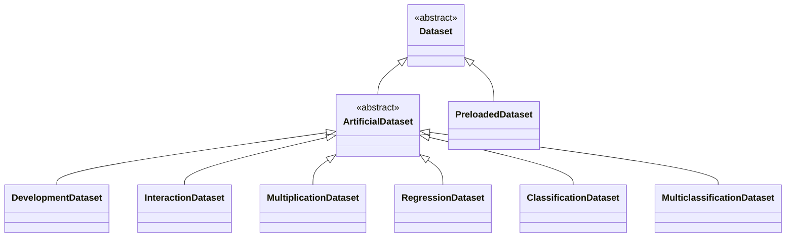

**[Model Agnostic Toolkit](../README.md) → [Documentation](README.md)**

# Datasets

> **Hint**: All components use docstrings and type hints that describe what classes and methods do, which parameters are expected and what attributes are available.
> Follow the embedded links (e.g. [`Dataset`]) to take a look.

All datasets, whether built-in or loaded externally as a [`PreloadedDataset`], inherit from the [`Dataset`] class. An object of this class is passed to an [analyzer](analyzers.md) and from there used for fitting and evaluating [models](models.md) as well as computing results for [tools](tools.md).

**→ [Find a short intro on datasets here](getting_started.md#dataset).**

In the following, see how to [work with datasets](#working-with-datasets) directly and find out how to [load existing or custom datasets](#loading-datasets).

## Working with Datasets

### Loading datasets

There are two possibilities to load a dataset and create a [`Dataset`] object. You can either [load a predefined dataset](#loading-predefined-datasets) (one that is defined inside this package) or [load your custom data](#loading-custom-dataset) externally and create a [`PreloadedDataset`] object from it.

#### Loading predefined datasets

To load one of the predefined datasets (usually used for testing purposes only) you create an object of any of the [predefined dataset classes](#predefined-datasets), e.g. a [`MultiplicationTwoDataset`]. You may want to specify a file path where to store the data (or where to load it from).
```python
data = MultiplicationTwoDataset(file='./data/multiplication_two_dataset.hdf5')
```

When loading a predefined dataset for the first time, it is initially generated and stored at the specified location. For it's generation, you can make use of all additional parameters its constructor takes, e.g. the number of samples `n` or the proportion of data to use as a test set `test_size`.

Once the dataset has been generated and you load the existing file, all parameters except for `name` and `file` are ignored. You can force to overwrite an existing file and generate a new dataset by setting `force=True`.

#### Loading custom dataset

To work with your custom data, load it outside of the toolkit as you normally would. Check that it has the [expected format](#dataset-format). If it is not already the case, you have to [split your data into a training and a testing part](#traintest-split). Additionally, make sure that your samples (X, for both train and test set) are stored in a pandas DataFrame [`pd.DataFrame`] object and that your target values (Y, for both train and test) are stored in a [`pd.Series`] object.

With [`pd.DataFrame`] objects `x_train` and `x_test` as well as [`pd.Series`] objects `y_train` and `y_test`, you can now use the [class for custom datasets](#custom-datasets) and create a single [`PreloadedDataset`] instance. In addition to the data itself, you have to specify you dataset's [data type](#data-types) (regression or classification) by passing a [`DataType`] object.
```python
data = PreloadedDataset(x_train, y_train, x_test, y_test, data_type=DataType.REGRESSION, name='My Dataset')
```

For classification datasets, you should also specify the number of different classes `n_classes`. And in either case, you may want to specify a `name` for your dataset.

### Dataset format

Datasets are expected to have a tabular form with multiple numeric features and a single output variable with either numeric values or classification names, depending on the [data type](#data-types). Such a datasets is meant to be fitted in a supervised learning manner. An exemplary table with dataset samples for four features is illustrated here.

| *#* | feature_one | feature_two | feature_three | feature_four |
| :-: | :---------: | :---------: | :-----------: | :----------: |
| *1* | 8.488       | 2.047       | 0.472         | -1.244       |
| *2* | 1.435       | 2.321       | 0.010         | -1.810       |
| *3* | 7.029       | 2.156       | 0.297         | -1.052       |
| *4* | 1.494       | 1.755       | 0.288         | -1.237       |
| *5* | 1.323       | 1.412       | 0.334         | -1.299       |
| *…* | ...         | ...         | ...           | ...          |

> **Note**: Categorical features are not fully supported by the [Model Agnostic Toolkit].

#### Data types

Each [`Dataset`] instance has a [`DataType`] enum instance, indicating whether it describes a regression task (`DataType.REGRESSION`) or a classification task (`DataType.CLASSIFICATION`). For a regression dataset, the target variable is also expected to have numeric values, as in the following table.

| *#* | target |
| :-: | :----: |
| *1* | 5.431  |
| *2* | 1.431  |
| *3* | 3.720  |
| *4* | 1.566  |
| *5* | 1.204  |
| *…* | ...    |

In the case of a classification dataset, the target variable values should be the integer indices of each sample's class or the actual class names, as in the following table.

| *#* | target |
| :-: | :----: |
| *1* | 0      |
| *2* | 1      |
| *3* | 0      |
| *4* | 1      |
| *5* | 2      |
| *…* | ...    |

#### Train/Test split

For use in the [Model Agnostic Toolkit], all available data samples should be split into a training dataset and a testing dataset. The latter is not used for fitting any models or computing any tools, but only for evaluation. Both parts should be sampled randomly and have a large enough number of samples to be representative for the whole dataset.

If you are [loading a custom dataset](#loading-custom-dataset) and need to perform this train/test split, you may want to use the [`train_test_split`] method from [scikit-learn].

### Accessing data

Having [loaded a dataset](#loading-datasets) and created a [`Dataset`] object, if you pass this to an [analyzers](analyzers.md), the [Model Agnostic Toolkit] takes care of passing it to [models](models.md) and [tools](tools.md) and accessing the correct dataset part ([train or test](#traintest-split)).

Additionally, the [`Dataset`] instance can be used to access training and testing samples as a [`pd.DataFrame`] and targets as a [`pd.Series`] directly through the [`get_train()`] and [`get_test()`] methods, e.g. with you dataset stored in `data`.
```python
x_train, y_train = data.get_train()
x_test, y_test = data.get_test()
```

To access the complete dataset, irrespective of the train/test split, you can use the [`get_all()`] method
```python
x_all, y_all = data.get_all()
```

### Relevant example notebooks

The following [Jupyter] notebooks demonstrate the topics covered here and can be found in the [examples directory](../examples/).

- [`quick_start.ipynb`](../examples/quick_start.ipynb)
- [`custom_dataset.ipynb`](../examples/custom_dataset.ipynb)

### Available member methods

The following methods are available for all objects of the [`Dataset`] class and [inheriting classes](#available-datasets).

- [`get_train()`]
- [`get_test()`]
- [`get_all()`]

## Available Datasets



> **Hint**: All of the following datasets can be imported like this:
> ```python
> from model_agnostic_toolkit.datasets import MultiplicationTwoDataset, DevelopmentDataset, PreloadedDataset
> ```

### Predefined datasets

#### Multiplication datasets

> **Hint**: A graphical overview of the generating graph structure can be found [here](assets/datasets/multiplication_datasets.pdf).

- [`MultiplicationOneDataset`]
- [`MultiplicationTwoDataset`]
- [`MultiplicationThreeDataset`]
- [`MultiplicationFourDataset`]

#### Interaction datasets

> **Hint**: A graphical overview of the generating graph structure can be found [here](assets/datasets/interaction_datasets.pdf).

- [`InteractionOneDataset`]
- [`InteractionTwoDataset`]
- [`InteractionThreeDataset`]
- [`InteractionFourDataset`]

#### Regression datasets

- [`RegressionOneDataset`]
- [`RegressionTwoDataset`]
- [`RegressionThreeDataset`]
- [`RegressionFourDataset`]

#### Classification datasets

- [`ClassificationOneDataset`]
- [`ClassificationTwoDataset`]
- [`ClassificationThreeDataset`]
- [`ClassificationFourDataset`]

#### MultiClassification datasets

- [`MultiClassificationOneDataset`]
- [`MultiClassificationTwoDataset`]
- [`MultiClassificationThreeDataset`]
- [`MultiClassificationFourDataset`]

#### Development datasets

- [`DevelopmentDataset`]
- [`DevelopmentBaseDataset`]

### Custom datasets

- [`PreloadedDataset`]


<!-- internal links -->
[Model Agnostic Toolkit]: ../README.md

<!-- external links -->
[Jupyter]: https://jupyter.org
[pandas]: https://pandas.pydata.org
[scikit-learn]: https://scikit-learn.org

<!-- external code references -->
[`pd.DataFrame`]: https://pandas.pydata.org/pandas-docs/stable/reference/api/pandas.DataFrame.html
[`pd.Series`]: https://pandas.pydata.org/pandas-docs/stable/reference/api/pandas.Series.html
[`train_test_split`]: https://scikit-learn.org/stable/modules/generated/sklearn.model_selection.train_test_split.html

<!-- internal class references -->
[`ArtificialDataset`]: ../model_agnostic_toolkit/datasets/dataset.py#L108
[`Dataset`]: ../model_agnostic_toolkit/datasets/dataset.py#L12
[`DataType`]: ../model_agnostic_toolkit/types.py#L4
[`DevelopmentDataset`]: ../model_agnostic_toolkit/datasets/development_datasets.py#L8
[`DevelopmentBaseDataset`]: ../model_agnostic_toolkit/datasets/development_datasets.py#L95
[`InteractionFourDataset`]: ../model_agnostic_toolkit/datasets/interaction_datasets.py#L307
[`InteractionOneDataset`]: ../model_agnostic_toolkit/datasets/interaction_datasets.py#L8
[`InteractionTwoDataset`]: ../model_agnostic_toolkit/datasets/interaction_datasets.py#L103
[`InteractionThreeDataset`]: ../model_agnostic_toolkit/datasets/interaction_datasets.py#L205
[`MultiplicationFourDataset`]: ../model_agnostic_toolkit/datasets/multiplication_datasets.py#L272
[`MultiplicationOneDataset`]: ../model_agnostic_toolkit/datasets/multiplication_datasets.py#L8
[`MultiplicationTwoDataset`]: ../model_agnostic_toolkit/datasets/multiplication_datasets.py#L92
[`MultiplicationThreeDataset`]: ../model_agnostic_toolkit/datasets/multiplication_datasets.py#L182
[`RegressionOneDataset`]: ../model_agnostic_toolkit/datasets/regression_datasets.py#L8
[`RegressionTwoDataset`]: ../model_agnostic_toolkit/datasets/regression_datasets.py#L111
[`RegressionThreeDataset`]: ../model_agnostic_toolkit/datasets/regression_datasets.py#L287
[`RegressionFourDataset`]: ../model_agnostic_toolkit/datasets/regression_datasets.py#L431
[`ClassificationOneDataset`]: ../model_agnostic_toolkit/datasets/classification_datasets.py#L8
[`ClassificationTwoDataset`]: ../model_agnostic_toolkit/datasets/classification_datasets.py#L115
[`ClassificationThreeDataset`]: ../model_agnostic_toolkit/datasets/classification_datasets.py#L298
[`ClassificationFourDataset`]: ../model_agnostic_toolkit/datasets/classification_datasets.py#L448
[`MultiClassificationOneDataset`]: ../model_agnostic_toolkit/datasets/multiclassification_datasets.py#L9
[`MultiClassificationTwoDataset`]: ../model_agnostic_toolkit/datasets/multiclassification_datasets.py#L117
[`MultiClassificationThreeDataset`]: ../model_agnostic_toolkit/datasets/multiclassification_datasets.py#L299
[`MultiClassificationFourDataset`]: ../model_agnostic_toolkit/datasets/multiclassification_datasets.py#L450
[`PreloadedDataset`]: ../model_agnostic_toolkit/datasets/preloaded_dataset.py#L7

<!-- internal function references -->
[`get_all()`]: ../model_agnostic_toolkit/datasets/dataset.py#L58
[`get_test()`]: ../model_agnostic_toolkit/datasets/dataset.py#L47
[`get_train()`]: ../model_agnostic_toolkit/datasets/dataset.py#L36
