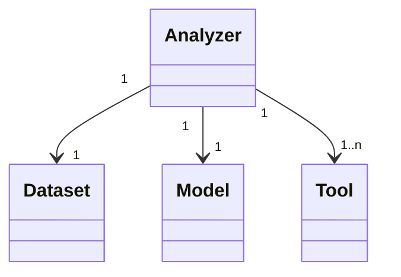
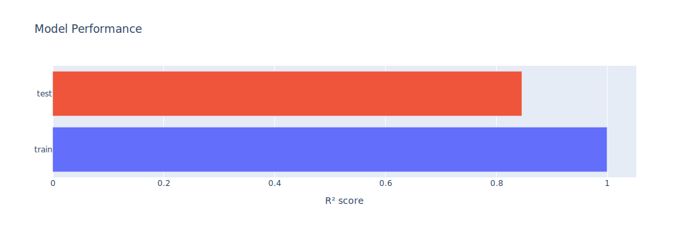
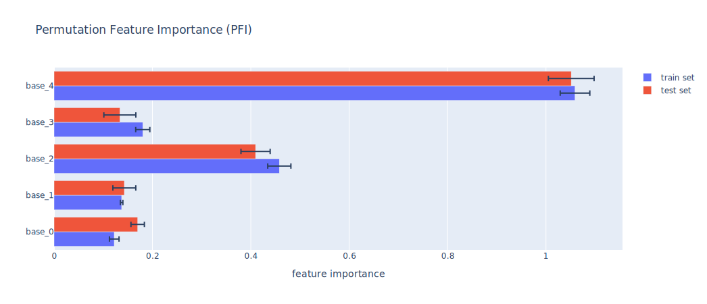

**[Model Agnostic Toolkit](../README.md) → [Documentation](README.md)**

# Getting Started

This chapter shows you how to get started using the `Model Agnostic Toolkit`. It introduces the [basic components](#basic-components) of this package, includes an example of the bare minimum for a [quick start](#quick-start), and references further [examples](#examples) of how to utilize this package.

For more in-depth explanations (including how to handle classification tasks) and information about different components, look into the respective documentation chapters for [datasets](datasets.md), [models](models.md), [tools](tools.md), [analyzers](analyzers.md) and [plotting](plotting.md).

## Basic Components

The basic components needed for an analysis are a [dataset](#dataset), a [model](#model) and one or multiple [tools](#tools), all associated with an [analyzer](#analyzer). The dataset and model need to share the same data type (regression or classification), while the tools and analyzers need to share their tool type (importance or interaction).

Setting this up can be done in the following way (illustratively) and yields the depicted relationships:
```python
dataset = SomeDataset()
model = Model(data_type=data.data_type)
tools = [Tool1Importance(), Tool2Importance(), ...]
analyzer = ImportanceAnalyzer(model=model, dataset=dataset, tools=tools)
```



A short introduction to each component can be found below. For more in-depth information about them, visit the respective [documentation](README.md) chapters. Relevant sections are linked throughout this introduction.

### Dataset

> **Hint**: Read more about datasets in the [chapter on datasets](datasets.md).

The [Model Agnostic Toolkit] is built around tabular datasets for supervised learning tasks. Each column depicts a numeric feature while each row corresponds to one sample point. A single numeric target feature is expected in regression case. In classification case, a single target feature containing the corresponding class name of the instances is expected. For example, data may look like this:

| *#* | feature_one | feature_two | feature_three | feature_four |     | target |
| :-: | :---------: | :---------: | :-----------: | :----------: | --- | :----: |
| *1* | 8.488       | 2.047       | 0.472         | -1.244       |     | 5.431  |
| *2* | 1.435       | 2.321       | 0.010         | -1.810       |     | 1.431  |
| *3* | 7.029       | 2.156       | 0.297         | -1.052       |     | 3.720  |
| *4* | 1.494       | 1.755       | 0.288         | -1.237       |     | 1.566  |
| *5* | 1.323       | 1.412       | 0.334         | -1.299       |     | 1.204  |
| *…* | ...         | ...         | ...           | ...          |     | ...    |

Each dataset has a [data type](datasets.md#data-type), depending on what the target variable represents. This indicates whether it is a regression or a classification dataset.

> **Note**: While categorical or discrete features are possible, this package currently does not fully support them. It works for some tools but not for all of them.

Each instance of the Dataset class or any inherited class internally manages a [split between training data and testing data](datasets.md#traintest-split). Models, tools and analyzers then automatically choose the correct subset of data samples for the task at hand.

When loading data, you can either choose any of the [predefined datasets](datasets.md#predefined-datasets) (usually artificially generated data) or you can use a [custom dataset](datasets.md#custom-datasets) by instantiating the [`PreloadedDataset`] class.

### Model

> **Hint**: Read more about models in the [chapter on models](models.md).

The application of almost all tools requires a model fitted on training data (and tested on test data) that can be used for further prediction. When creating a model, a [data type](models.md#data-type) must be specified, indicating whether it is a regesssion or classification model. This has to match the data type of the dataset it is supposed to be fitted on.

Fitting and evaluating on the dataset provided via an analyzer is performed automatically. For this and for the tools to work, the utilized model must provide `fit(x, y)`, `predict(x)` and `score(x, y)` methods.

When creating a model, you can either choose the [default models](models.md#creating-default-models) for regression or classification respectively, [select a model class](models.md#creating-sklearn-based-models) (usually a [scikit-learn] model) or you can use a [custom model](models.md#creating-custom-models) by instantiating the [`PreloadedModel`] class.

### Tools

> **Hint**: Read more about tools (including a short description what each tool does) in the [chapter on tools](tools.md).

The different tools are at the core of the [Model Agnostic Toolkit]'s functionality. All available tools are split into [importance tools](tools.md#importance-tools), [interaction tools](tools.md#interaction-tools) and [individual tools](tools.md#individual-tools).

Tools can be passed to an analyzer and are run through it. Each tool has a [tool type](tools.md#tool-types), indicating whether it is an importance, interaction or individual tool. This type has to coincide with the associated analyzer's tool type.

The analyzer gathers the tools' results after running and stores them for reading and plotting. All tools return [Python] dictionaries but their structure varies between tools as several different [result types](tools.md#result-types)/formats exist.

### Analyzer

> **Hint**: Read more about analyzers in the [chapter on analyzers](analyzers.md).

The analyzer coordinates the interplay between a dataset, a model and the tools. There are [importance analyzers](analyzers.md#importance-analyzer) and [interaction analyzers](analyzers.md#interaction-analyzer) depending on the analyzer's [tool type](analyzers.md#tool-types), indicating what tools it works with.

Next to running all specified tools, the analyzer takes care of fitting and evaluating the model on the dataset, managing all tools' result dictionaries (storing and checking their format) and calling their respective plotting functions.

Since some tools depend on the results of other tools, the analyzers support [reusing results](analyzers.md#reusing-results) between tools to avoid unnecessary recomputations. Since the result dependency stretches across tool types, [reuse analyzers](analyzers.md#reusing-results) can be specified for an analyzer to share results across analyzers.

## Quick Start

A minimal working example requires a [dataset](datasets.md), a [model](models.md), [tools](tools.md) and an [analyzer](analyzers.md). This guide will start with a feature importance analysis. Begin by creating and opening an empty [Python] file `quick_start.py` or [Jupyter] notebook `quick_start.ipynb`.

> **Hint**: A [Jupyter] notebook with this quick start guide can be found in the [examples directory](../examples/) as [`quick_start.ipynb`](../examples/quick_start.ipynb).

Make sure the repository root is in your path and import the required package components:
```python
import sys
sys.path.append('<path/to/model-agnostic-toolkit>')

from model_agnostic_toolkit import Model, ImportanceAnalyzer
from model_agnostic_toolkit.datasets import MultiplicationTwoDataset
from model_agnostic_toolkit.tools import PFIImportance, PDPImportance
```

Continue with creating a dataset at your specified location, in this case the [`MultiplicationTwoDataset`], and retrieving its feature names. Additionally, create the default XGBRegressor [`Model`] for the corresponding data type:
```python
data = MultiplicationTwoDataset(file='<path/to/data_folder/multiplication_two.hdf5>')
features = data.features

model = Model(data_type=data.data_type)
```

Next, create a list of tool instances, here we use the [`PFIImportance`] and [`PDPImportance`] tools, and initialize an [`ImportanceAnalyzer`] with your model, dataset and tools:
```python
tools = [PFIImportance(), PDPImportance()]
ana = ImportanceAnalyzer(model=model, dataset=data, tools=tools)
```

Finally, run the feature importance analysis for the given set of features and show the results with [Plotly]:
```python
ana.run_analysis(features=features)
ana.plot_results()
```

You should obtain the following output, including plots for your model performance, the PFI results for feature importance and the PDP results for feature effects:

> 
> 
> 


### Result interpretation

The model performace plot provides a visual summary of the model performance on the train and test dataset, in this case using the R² score.

**Permutation Feature Importance (PFI)** shows how much each feature contributes to a model’s predictive power by measuring the drop in performance when the feature’s values are shuffled. The plot highlights which features the model relies on most. Separate results for training and test data help reveal overfitting or feature instability, while uncertainty bars indicate how consistent the importance is across different runs or data samples

**Partial Dependence Plots (PDPs)** visualize the relationship between input features and the predicted outcome of a machine learning model, while averaging out the effects of all other features. This helps to understand how a feature influences predictions across its range of values.
The Individual Conditional Expectation (ICE) lines, the plot also shows how predictions change for individual instances, revealing interactions (lines crossing each other) and heterogeneity that may be hidden in the average trend.


## Examples

A few examplary use cases for the [Model Agnostic Toolkit] are listed below. If you are wondering how to achieve something specific, see if any of those examples helps. Otherwise, take a closer look into relevant parts of the [documentation](README.md).

> **Note**: [Jupyter] notebooks for all examples listed below can be found in this repository's [examples directory](../examples/). They partially build upon each other, so if you're missing information, take a look into earlier examples or the [documentation](README.md).

### Feature importance analysis

[`feature_importance_analysis.ipynb`](../examples/feature_importance_analysis.ipynb) demonstrates a few steps for conducting a feature importance analysis. Results indicate which variables significantly influence and which effect they have on the target value.

It includes creating importance tool instances, running the analysis, saving results and accessing single tools' results, adding and running individual tools later on, plotting importance results, and more.

### Feature interaction analysis

[`feature_interaction_analysis.ipynb`](../examples/feature_interaction_analysis.ipynb) demonstrates a few steps for conducting a feature interaction analysis. Results indicate which two variables interact in a nonlinear fashion affecting the target value and how this effect plays out.

It includes creating interaction tool instances, running the analysis, reusing results among tools, and more.

## Classification analysis

[`classification_analysis.ipynb`](../examples/classification_analysis.ipynb) demonstrates a few steps around conducting a feature importance analysis for a classification problem. Results indicate which variables significantly influence and which effect they have on the prediction of the instances to belong to a certain class.

It includes creating importance tool instances, running the analysis and selecting the results for a certain class.

Interaction analysis can be performed for classification problems as well and follows the same logic.

### Custom dataset

[`custom_dataset.ipynb`](../examples/custom_dataset.ipynb) demonstrates how to construct a custom dataset from previously loaded data. Custom data is loaded in the usual way, transformed into pandas data frames and split into training and testing set. A preloaded dataset object stores all data references.

### Custom model (scikit-learn)

[`custom_model_sklearn.ipynb`](../examples/custom_model_sklearn.ipynb) demonstrates how to use a custom [scikit-learn] (or sklearn-based) model. The desired model class is specified for model initialization, including keyworded arguments. The [scikit-learn] object can be accessed as an attribute of the model.

### Custom model (PyTorch)

[`custom_model_torch.ipynb`](../examples/custom_model_torch.ipynb) demonstrates how to use a custom [PyTorch] (or any other) model. A custom model class, that has to provide three extra methods, is built and initialized. From this, a Model Agnostic Toolkit compatible model is created, where the [PyTorch] object can be accessed as an attribute of the model.

### Reusing results

[`reusing_results.ipynb`](../examples/reusing_results.ipynb) demonstrates how to reuse previously computed results across tools and across analyzers. Tools are automatically reused across tools within an analyzer. Analyzers can be specified as reuse analyzers for other analyzers to share results across analyzers. The order tools are run in typically does not matter.

### Plotting results

[`plotting_results.ipynb`](../examples/plotting_results.ipynb) demonstrates how plot individual results and make use of different plot types. In addition to the default plotting functionality, plots for individual tools and features are created. They are customized with different parameters as well as stored and displayed with custom configurations in [Plotly] afterwards.


<!-- internal links -->
[Model Agnostic Toolkit]: ../README.md

<!-- external links -->
[Jupyter]: https://jupyter.org
[Plotly]: https://plotly.com/python
[Python]: https://www.python.org
[PyTorch]: https://pytorch.org
[scikit-learn]: https://scikit-learn.org

<!-- internal class references -->
[`ImportanceAnalyzer`]: ../model_agnostic_toolkit/analyzer.py#L539
[`Model`]: ../model_agnostic_toolkit/model.py#L14
[`MultiplicationTwoDataset`]: ../model_agnostic_toolkit/datasets/multiplication_datasets.py#L90
[`PDPImportance`]: ../model_agnostic_toolkit/tools/pdp/pdp_importance.py#L17
[`PFIImportance`]: ../model_agnostic_toolkit/tools/pfi/pfi_importance.py#L15
[`PreloadedDataset`]: ../model_agnostic_toolkit/datasets/preloaded_dataset.py#L10
[`PreloadedModel`]: ../model_agnostic_toolkit/model.py#L207
