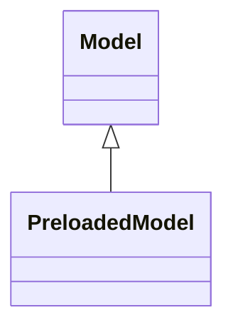

**[Model Agnostic Toolkit](../README.md) → [Documentation](README.md)**

# Models

> **Hint**: All components make use of docstrings and type hints that describe what classes and methods do, which parameters are expected and what attributes are available.
> Follow the embedded links (e.g. [`Model`]) to take a look.

All models, either the default ones or custom ones, belong to or inherit from the [`Model`] class. An object from this class is passed to an [analyzer](analyzers.md) and from there on used for learning on [datasets](datasets.md) as well as computing results for [tools](tools.md).

**→ [Find a short intro on models here](getting_started.md#model).**

In the following, see how to [work with models](#working-with-models) directly and find out how to [create default or custom models](#creating-models).

## Working with Models

### Creating models

There are three possibilities to create a [`Model`] object. You can either [create a default model](#creating-default-models), use [scikit-learn] and [create an sklearn model](#creating-sklearn-based-models) or use a custom implementation and [create a custom model](#creating-custom-models) by instantiating a [`PreloadedModel`] object with it.

The [`Model`] class acts as a wrapper around the actual model and works as the [Model Agnostic Toolkit] interface. For an existing [`Model`] instance `model`, the actual underlying model object can be accessed via `model.model`.

#### Creating default models

The default model for regression case is a gradient-boosted [`xgb.XGBRegressor`] tree from [XGBoost]. In classification case the default model is a [scikit-learn] [`RandomForestClassifier`] random forest. It can be instantiated simply by creating an object of the [`Model`] class and specifying the [data type](#data-types) (regression or classification) by passing a [`DataType`] object.
```python
model = Model(data_type=DataType.REGRESSION)
```

You may also use the [data type of an existing dataset](datasets.md#data-types) `data` that you want to fit the model to here.
```python
model = Model(data_type=data.data_type)
```

#### Creating sklearn-based models

If you want to use different models than the [default ones](#creating-default-models), you can easily use any model class from [scikit-learn] or similar frameworks based on it (models have to be sklearn-compatible). For this, pass the desired model class (the class itself, not an object!) to the [`Model`] constructor. Any additional keyworded arguments are passed to the underlying model's constructor.
```python
from sklearn.svm import SVR  # support vector regressor

model = Model(data_type=DataType.REGRESSION, model_class=SVR, kernel='poly')
```

#### Creating custom models

It is also possible to use custom models or models from other packages that are not inherently sklearn-compatible. When creating such a model's class, there are three methods that it has to provide to work with the [Model Agnostic Toolkit]: a `fit(x, y)` method, a `predict(x)` or `predict_proba(x)` depending on the [`DataType`] method, and a `score(x, y)` method. These should be able to handle [pandas] [`pd.DataFrame`] and [`pd.Series`] objects as input and return array-like objects themselves (or a `float` for `score(x, y)`) in the same format as scikit-learn models do.
```python
class CustomModel():

    def __init__(self, ...):
        ...

    def fit(self, x, y, ...):
        ...
    
    # necessary for regression models
    def predict(self, x, ...):
        ...
    
    # necessary for classification models
    def predict_proba(self, x, ...):
        ...
    
    def score(self, x, y, ...):
        ...
```

You can then create a [Model Agnostic Toolkit]-compatible model by first creating an instance of your `CustomModel` class and then wrapping it in a [`PreloadedModel`] object. Next to your custom model instance, you need to pass the corresponding [data type](#data-types) and specify whether the custom model instance has already been fitted to a [dataset](datasets.md) or not.
```python
custom_model = CustomModel()
model = PreloadedModel(data_type=DataType.REGRESSION, model=custom_model, fitted=False)
```

### Properties

#### Data types

Each [`Model`] instance has a [`DataType`] enum instance, indicating whether it is a regression model (`DataType.REGRESSION`) or a classification model (`DataType.CLASSIFICATION`). If this does not match for the custom model with the model's actual specifications, this can lead to unexpected results.

#### Fitted or unfitted

Internally, the [`Model`] instance keeps track of whether it has already been fitted to a [dataset](datasets.md) or not. Depending on this, an [analyzer](analyzers.md) takes care of fitting the model prior to any tool computations. Especially for more complex [custom models](#creating-custom-models) that take a long time to fit, make sure you set the `fitted` parameter correctly during [`PreloadedModel`] initialization.

#### Metrics

When [creating models](#creating-models), you can pass a `metrics` parameter with a list of callable metric functions an [analyzer](analyzers.md) should use for evaluation. For example, any [scikit-learn] metrics from [`sklearn.metrics`] can be used.

The model result dictionary is obtained when [evaluating models](#fitting-and-evaluating) has the following form for some metrics.
```json
{
    'r2_score': {
        'train': 0.99956,
        'test': 0.84571
    },
    'mean_absolute_error': {
        'train': 0.00954,
        'test': 0.18205
    }
}
```

### Fitting and evaluating

Having [created a model](#creating-models), if you pass the [`Model`] object to an [analyzer](analyzers.md), the [Model Agnostic Toolkit] takes care of fitting and evaluation. Apart from that, you can call the respective model methods yourself.

> **Important:** Due to requirements of different tools, this predict function behaves differently depending on whether the model is a regression or classification model.

Use [`fit(...)`] to start a supervised training on passed data, [`predict(...)`] to make predictions with a fitted model, and [`score(...)`] to see how your model performs in the default scoring metric on passed data.
[`predict(...)`] calls the predict function of the underlying model in regression case. Else it tries to call the predict_proba or predict function depending on the model agnostic method (more details in the function's docstring).
```python
model.fit(x_train, y_train)
model.predict(x_test)
model.score(x_test, y_test)
```

For further evaluation, call the [`evaluate(...)`] method with a [dataset](datasets.md) to measure the model's performance in all specified [metrics](#metrics). Store the returned dictionary and pass it to the [`plot(...)`] method to render barplots for every metric.
```python
results = model.evaluate(data)
model.plot(results)
```

### Relevant example notebooks

The following [Jupyter] notebooks demonstrate the topics covered here and can be found in the [examples directory](../examples/).

- [`quick_start.ipynb`](../examples/quick_start.ipynb)
- [`custom_model_sklearn.ipynb`](../examples/custom_model_sklearn.ipynb)
- [`custom_model_torch.ipynb`](../examples/custom_model_torch.ipynb)

### Available member methods

The following methods are available for all objects of the [`Model`] class and [inheriting classes](#available-models).

- [`fit(...)`]
- [`predict(...)`]
- [`score(...)`]
- [`is_fitted()`]
- [`evaluate(...)`]
- [`plot(...)`]

## Available Models



> **Hint**: Both of the following model classes can be imported like this:
> ```python
> from model_agnostic_toolkit import Model, PreloadedModel
> ```

### Default or sklearn-based models

- [`Model`]

### Custom models

- [`PreloadedModel`]


<!-- internal links -->
[Model Agnostic Toolkit]: ../README.md

<!-- external links -->
[Jupyter]: https://jupyter.org
[pandas]: https://pandas.pydata.org
[scikit-learn]: https://scikit-learn.org
[XGBoost]: https://xgboost.readthedocs.io/en/stable/python/index.html

<!-- external code references -->
[`pd.DataFrame`]: https://pandas.pydata.org/pandas-docs/stable/reference/api/pandas.DataFrame.html
[`pd.Series`]: https://pandas.pydata.org/pandas-docs/stable/reference/api/pandas.Series.html
[`sklearn.metrics`]: https://scikit-learn.org/stable/modules/classes.html#module-sklearn.metrics
[`xgb.XGBRegressor`]: https://xgboost.readthedocs.io/en/latest/python/python_api.html#xgboost.XGBRegressor
[`RandomForestClassifier`]: https://scikit-learn.org/stable/modules/generated/sklearn.ensemble.RandomForestClassifier.html
<!-- internal class references -->
[`DataType`]: ../model_agnostic_toolkit/types.py#L4
[`Model`]: ../model_agnostic_toolkit/model.py#L14
[`PreloadedModel`]: ../model_agnostic_toolkit/model.py#L241

<!-- internal function references -->
[`evaluate(...)`]: ../model_agnostic_toolkit/model.py#L202
[`fit(...)`]: ../model_agnostic_toolkit/model.py#L108
[`is_fitted()`]: ../model_agnostic_toolkit/model.py#L189
[`plot(...)`]: ../model_agnostic_toolkit/model.py#L229
[`predict(...)`]: ../model_agnostic_toolkit/model.py#L130
[`score(...)`]: ../model_agnostic_toolkit/model.py#L176
