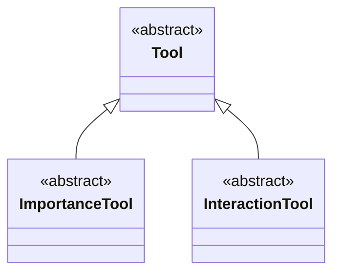
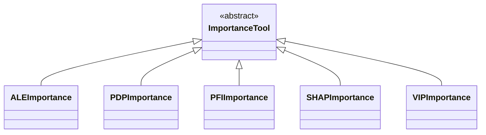
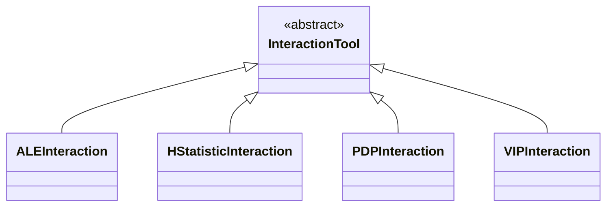

**[Model Agnostic Toolkit](../README.md) → [Documentation](README.md)**

# Tools

> **Hint**: All components use docstrings and type hints that describe what classes and methods do, which parameters are expected and what attributes are available.
> Follow the embedded links (e.g. [`Tool`]) to take a look.

All tools inherit from the [`Tool`] class. One or more objects of this class are passed to an [analyzer](analyzers.md) and from there on used for computing feature importance or interaction results with different [datasets](datasets.md) and [models](models.md).

**→ [Find a short intro on tools here](getting_started.md#tools).**

In the following, see how to [work with tools](#working-with-tools) directly and find out about [all available tools](#available-tools).

## Working with Tools

### Creating Tools

To create a [`Tool`] object, you just have to instantiate any of the derived [specific tool implementations](#available-tools).
```python
pfi_tool = PFIImportance()
```

> **Hint**: The classes [`Tool`] and [`ImportanceTool`], [`InteractionTool`] themselves are abstract classed and can not be instantiated directly.

You can additionally pass keyworded parameters to the tool classes' initializers, e.g. a `name` or, depending on the tool, specific settings for how this tool should behave when executed.
```python
pdp_tool = PDPInteraction(name='PDP (w/o first order)', second_order_only=True, percentiles=(0.1, 0.9))
```

> **Hint**: Take a look into the respective docstrings to find out what parameters are supported by a tool.

Multiple tools are usually passed as a list to an [analyzer](analyzers.md) upon its initialization and managed through it from there on. See how to [create analyzers](analyzers.md#creating-analyzers) for more information on this.

### Properties

#### Tool types

Each [`Tool`] instance has a [`ToolType`] enum instance, indicating whether it is an importance tool (`ToolType.IMPORTANCE`) or an interaction tool (`ToolType.INTERACTION`). This tool type is automatically set when instantiating a tool and later used by analyzers to check for the correct [`ToolType`].

#### Result types

Each [`Tool`] instance has a [`ResultType`] enum instance, indicating which shape the result dictionary has, returned after a tool has been run. There are several different options: one-dimensional results (`ResultType.DIM1`), two-dimensional results (`ResultType.DIM2`) and three-dimensional results (`ResultType.DIM3`), each indicating the output dimensionality for a single feature's or feature pair's importance or interaction results.

The expected result formats are outlined in the [`run(...)`] method's docstring. Results always have a dictionary form and may include 'misc' keys for some secondary result information. Exemplary result dictionaries for each [`ResultType`] are listed in the following.

##### One-dimensional results

```json
{
    'feature_one': 0.12203,
    'feature_two': 0.12075,
    'feature_three': 0.24165,
    'misc': { ... }
}
```

```json
{
    ('feature_one', 'feature_two'): 0.08656,
    ('feature_one', 'feature_three'): 0.01769,
    ('feature_two', 'feature_three'): 0.01453,
    'misc': { ... }
}
```

##### Two-dimensional results

```json
{
    'feature_one': {
        'feature_one': array([-0.22345, 0.11709, 0.45764, 0.79819, 1.13874]),
        'scores': array([1.27927, 1.31665, 1.50272, 1.63462, 1.69782]),
        'misc': { ... }
    },
    'feature_two': {
        'feature_two': array([-0.26938, 0.08969, 0.44878, 0.80787, 1.16696]),
        'scores': array([1.30961, 1.35216, 1.46090, 1.67034, 1.73391]),
        'misc': { ... }
    }
    'feature_three': {
        'feature_three': array([-0.25198, 0.12863, 0.50925, 0.88986, 1.27048]),
        'scores': array([0.96715, 1.15112, 1.50616, 1.85802, 2.03417]),
        'misc': { ... }
    }
}
```

##### Three-dimensional results

```json
{
    ('feature_one', 'feature_two'): {
        'feature_one': array([-0.22345, 0.11709, 0.45764, 0.79819, 1.13874]),
        'feature_two': array([-0.26938, 0.08969, 0.44878, 0.80787, 1.16696]),
        'scores': array([[1.21635, 1.23874, 1.27064, 1.30720, 1.32218],
                         [1.25455, 1.27399, 1.30482, 1.34324, 1.34988],
                         [1.30364, 1.33751, 1.46766, 1.63820, 1.71286],
                         [1.34241, 1.38631, 1.53312, 1.87866, 1.97830],
                         [1.34436, 1.45652, 1.60867, 1.95869, 2.04161]]),
        'misc': { ... }
    },
    ('feature_one', 'feature_three'): {
        'feature_one': array([-0.22345, 0.11709, 0.45764, 0.79819, 1.13874]),
        'feature_three': array([-0.25198, 0.12863, 0.50925, 0.88986, 1.27048]),
        'scores': array([[0.76784, 0.95048, 1.24636, 1.61929, 1.73347],
                         [0.75178, 0.94666, 1.31182, 1.65672, 1.77222],
                         [0.97511, 1.15532, 1.50641, 1.86364, 2.00699],
                         [1.07478, 1.26638, 1.63044, 1.94469, 2.15132],
                         [1.13086, 1.32722, 1.67414, 2.04488, 2.22990]]),
        'misc': { ... }
    },
    ('feature_two', 'feature_three'): {
        'feature_two': array([-0.26938, 0.08969, 0.44878, 0.80787, 1.16696]),
        'feature_three': array([-0.25198, 0.12863, 0.50925, 0.88986, 1.27048]),
        'scores': array([[0.79794, 0.95278, 1.30294, 1.67009, 1.84005],
                         [0.81078, 1.00681, 1.33600, 1.72244, 1.87827],
                         [0.92840, 1.12448, 1.44944, 1.78867, 1.96917],
                         [1.10774, 1.28104, 1.68273, 1.99364, 2.20439],
                         [1.14026, 1.30986, 1.75821, 2.09456, 2.24360]]),
        'misc': { ... }
    }
}
```

##### Classification

```json
{
  <class_index>: {'class_label':  <class_label>, 'result':  <one to three dimensional result>},
  <class_index>: {'class_label':  <class_label>, 'result':  <one to three dimensional result>},
  
}
```

### Running and plotting

[`Tool`] objects are usually passed to an [analyzer](analyzers.md) during [its initialization](analyzers.md#creating-analyzers) and run through it when [running an analysis](analyzers.md#running-analyses). It also provides functionality for [plotting results](analyzers.md#plotting-results). Outside of an analyzer, however, a tool's running and plotting methods can be accessed as well.

To compute a `tool`'s results for a given [dataset](datasets.md) `data`, [model](models.md) `model` and specified `features`, call its [`run(...)`] method. This returns the corresponding [result dictionary](#result-types).
```python
results = tool.run(model=model, dataset=data, features=features)
```

Using these `results`, you can call the `tool`'s [`plot(...)`] method to show its default for these results.
```python
tool.plot(results)
```

> **Hint**: Learn about more available plots and customization in the [chapter on plotting](plotting.md). 

### Relevant example notebooks

The following [Jupyter] notebooks demonstrate the topics covered here and can be found in the [examples directory](../examples/).

- [`quick_start.ipynb`](../examples/quick_start.ipynb)
- [`feature_importance_analysis.ipynb`](../examples/feature_importance_analysis.ipynb)
- [`feature_interaction_analysis.ipynb`](../examples/feature_interaction_analysis.ipynb)
- [`classification_analysis.ipynb`](../examples/individual_analysis.ipynb)

### Available member methods

The following methods are available for all objects of the [`Tool`] class and [inheriting classes](#available-tools).

- [`run(...)`]
- [`plot(...)`]

## Available Tools



> **Hint**: All of the following tools can be imported like this:
> ```python
> from model_agnostic_toolkit.tools import PDPImportance, HStatisticInteraction
> ```

### Importance tools



#### 1D importance results

- [`PFIImportance`]
Permutation Feature Importance (PFI) is a method used to estimate the importance of each feature in a machine learning model by measuring how much the model’s performance decreases when the values of a single feature are randomly shuffled. To calculate PFI, first the model is evaluated on a test data set, then each feature’s values are reshuffled and the model is re-evaluated. The difference in performance indicates the feature's importance: the larger the drop, the more important the feature.
- [`SHAPImportance`]
SHAP (Shapley Additive Explanations) is a method for explaining individual predictions of machine learning models by calculating the contribution of each feature to the prediction. It is based on Shapley values from cooperative game theory, where each feature is treated as a "player" and its contribution to the prediction is calculated by considering all possible combinations of features. SHAP provides consistent and interpretable values, ensuring that the sum of all feature contributions equals the model’s output. To evaluate the entire dataset, SHAP aggregates these individual feature contributions across all data points, providing a global view of feature importance. This allows you to understand not just which features are most important overall, but also how each feature impacts predictions in both positive and negative directions, giving insights into the model’s behavior across the whole dataset.
- [`VIPImportance`]
Variable Importance Plots (VIP) are used to assess the importance of each feature in a machine learning model by measuring its contribution to the model’s predictive power. VIP is based on how much each feature influences the model’s performance by looking at changes in prediction accuracy or model error when the feature is altered or removed. These plots provide a ranking of features, where features with higher importance scores are ranked higher. 

#### 2D importance results

- [`ALEImportance`]
Accumulated Local Effects (ALE) is a method used to show the impact of individual features on model predictions across multiple data points. ALE is presented as plots that display how the value of a feature influences the model’s output, averaged over multiple predictions. These plots show the accumulated effect of changing the feature across its range, providing a clearer view of the feature's importance across a dataset. ALE helps in understanding how a feature’s values impact the model's predictions on average. It shows the marginal effect of each feature, allowing you to see whether an increase in a feature's value generally increases or decreases the model’s output. Unlike PDP, ALE adjusts for the effect of other features, providing a more accurate view of how a feature independently contributes to the model’s output.
- [`PDPImportance`]
Partial Dependence Plots (PDP) for importance shows how a single feature influences the model's predictions across its entire range, while keeping other features constant. It visualizes the marginal effect of the feature on the predicted outcome, helping to understand how changes in that feature alone affect the model's output. It is presented in the same way as ALE.


### Interaction tools



#### 1D interaction results

- [`HStatisticInteraction`]
The H-Statistic is a way to measure how much two features interact in a machine learning model using variance decomposition. Specifically, it gives information how much the effect of one feature on the prediction changes depending on the value of another feature. The H-Statistic gives a score between 0 (features work independently)and 1 (the effect of one feature depends on the other). So, if two features have a high H-statistic, it means you can’t fully understand their influence on the model unless you look at them together.
- [`VIPInteraction`]
VIP Interaction, in this context, extends standard variable importance by showing how much pairs of features contribute together to the model’s predictions.

#### 3D interaction results
- [`ALEInteraction`]
Accumulated Local Effects (ALE) for interactions extends the concept of ALE for feature importance by considering how pairs or groups of features interact to influence the model’s predictions. ALE for interactions is typically visualized using 2D plots or contour plots that show how the combined values of two or more features affect the model’s output, adjusting for the effect of other features. These plots highlight how the relationship between features changes and accumulates across different data points.
- [`PDPInteraction`]
Partial Dependence Plots (PDP) for Interactions captures how combinations of two or more features together influence the model's predictions, considering their joint effect rather than individual contributions. The results are presented in the same format as for ALEInteraction.

<!-- external links -->
[Jupyter]: https://jupyter.org

<!-- internal class references -->
[`ALEImportance`]: ../model_agnostic_toolkit/tools/ale/ale_importance.py
[`ALEInteraction`]: ../model_agnostic_toolkit/tools/ale/ale_interaction.py
[`HStatisticInteraction`]: ../model_agnostic_toolkit/tools/h_statistic/h_statistic_interaction.py
[`ImportanceTool`]: ../model_agnostic_toolkit/tools/tool.py#L486
[`InteractionTool`]: ../model_agnostic_toolkit/tools/tool.py#L501
[`PDPImportance`]: ../model_agnostic_toolkit/tools/pdp/pdp_importance.py
[`PDPInteraction`]: ../model_agnostic_toolkit/tools/pdp/pdp_interaction.py
[`PFIImportance`]: ../model_agnostic_toolkit/tools/pfi/pfi_importance.py
[`ResultType`]: ../model_agnostic_toolkit/types.py#L20
[`SHAPImportance`]: ../model_agnostic_toolkit/tools/shap/shap_importance.py
[`Tool`]: ../model_agnostic_toolkit/tools/tool.py#L12
[`ToolType`]: ../model_agnostic_toolkit/types.py#L12
[`VIPImportance`]: ../model_agnostic_toolkit/tools/vip/vip_importance.py
[`VIPInteraction`]: ../model_agnostic_toolkit/tools/vip/vip_interaction.py

<!-- internal function references -->
[`plot(...)`]: ../model_agnostic_toolkit/tools/tool.py#L92
[`run(...)`]: ../model_agnostic_toolkit/tools/tool.py#L41
