# Rune Code

Rune's a terminal first coding agent, it's my personal forever ongoing personal project.

It builds on the excellent [Pydantic-AI](https://github.com/pydantic/pydantic-ai) which among many things lets you easily switch between different models (Claude vs Gemini) as well as providers (Claude on Bedrock, Gemini on Vertex AI, etc.)


---

## Table of Contents

1.  [Features](#features)
2.  [Prerequisites](#prerequisites)
3.  [Installation & Configuration](#installation--configuration)
4.  [Quick Start: Your First Session](#quick-start-your-first-session)
5.  [Usage Cheatsheet](#usage-cheatsheet)
6.  [Core Capabilities](#core-capabilities)
7.  [For Developers](#for-developers)
8.  [License](#license)

---

## Features

| Capability | Description |
|---|---|
| **Interactive Chat** | Multi-line editing, history, and command completion via `prompt-toolkit`. |
| **Advanced Tooling** | Edit files with fuzzy diffs, `grep` the codebase, run shell commands, and execute Python in a persistent Jupyter kernel. |
| **Rich TUI** | A clean, colorful terminal UI powered by **Rich**, with syntax highlighting, tables, and live-streaming output. |
| **Session Management** | Conversations and session context are automatically saved, allowing you to resume a session exactly where you left off. For example todos are automatically saved and loaded along with messages. |
| **Task Planning** | Rune can manage a TODO list to break down complex tasks, track progress, and ensure it completes all steps. |
| **Extensible** | Easily add new tools by dropping a function into the `src/rune/tools/` directory. |

---

## Prerequisites

- Python 3.10 or higher.
- An API key for a supported LLM provider (e.g., OpenAI, Google, Anthropic).

---

## Installation & Configuration

### 1. Installation

Install Rune - I'd recommend `uv` nowadays.

```bash
# Recommended
uv add rune-code

# Alternatively, using pip
pip install rune-code
```

### 2. Configuration

Rune builds on top of Pydantic-AI - make sure to setup auth/config correctly. See [here](https://ai.pydantic.dev/models/).

```bash
# Example for OpenAI
export OPENAI_API_KEY="sk-..."

# Example for Google
export GOOGLE_API_KEY="..."
```

You can also specify which model to use. If not set, Rune defaults to a safe but capable model. Model list [here](https://ai.pydantic.dev/api/models/base/).

```bash
# Optional: Specify a model
export RUNE_MODEL="google-gla:gemini-2.5-pro"

# Google Vertex Example

export RUNE_MODEL="google-vertex:gemini-2.5-pro"

# OpenAI Example
export RUNE_MODEL="openai:gpt-4"

# Anthropic Example
export RUNE_MODEL="anthropic:claude-sonnet-4-20250514"

# Bedrock Example
export RUNE_MODEL="bedrock:us.anthropic.claude-sonnet-4-20250514-v1:0"
```

Within the chat you can also use the slash command `/model <model_name>` to switch models. It'll allow you to tab complete the model name.

---

## Quick Start: Your First Session

Let's run a simple task to see Rune in action: listing the files in the current directory.

**Step 1: Start Rune**

Run the `rune` command in your terminal.

```bash
rune
```

You will be prompted to start a new session.

**Step 2: Ask Rune to List Files**

At the prompt, ask Rune to list the files.

```
> Use the list_files tool to show me the files in the current directory.
```

**Step 3: See the Result**

Rune will execute the `list_files` tool and display the output in a clean, tree-like format.

This simple interaction demonstrates the core loop: you give Rune a goal, and it uses its tools to accomplish it.

---

## Usage Cheatsheet

| Action | Command | Notes |
|---|---|---|
| Start a new chat | `rune` | Choose "Start new session" from the menu. |
| Resume a session | `rune` | Pick a recent session from the list. |
| Exit the chat | `/exit` or `Ctrl-D` | |
| Interrupt a task | `Ctrl-C` | Stops the current operation. |
| Save a snapshot | `/save [name]` | Saves the current session state to `.rune/snapshots/`. |
| Change model | `/model <name>` | e.g., `/model google:gemini-1.5-pro`. Use Tab to complete. |
| List models | `rune models list`| Lists all supported models grouped by provider. |
| Change directory | `run_command("cd path/to/dir")` | Changes the agent's working directory for tool use. |

---

## Core Capabilities

Rune's power comes from its built-in tools. Here are a few examples of what you can ask it to do.

- **Grep the codebase:**
  > "Find all occurrences of the `run_command` function."

- **Edit a file with a precise diff:**
  > "In `src/rune/main.py`, find the `run_agent_turn` function and add a print statement at the beginning that says 'Starting turn'."

- **Run a shell command and analyze its output:**
  > "Run `ls -l` and tell me which file was modified most recently."

- **Manage a task list for a complex change:**
  > "I need to add a new feature. First, create a new file called `features.py`. Second, add a function to it called `new_feature`. Finally, add a test for it in `tests/test_features.py`."

---

## For Developers

The following sections are for those interested in contributing to or learning about the architecture of Rune.

### Architecture Overview

```mermaid
flowchart TD
    subgraph CLI
        A["chat.py
        prompt-toolkit"]
    end
    subgraph Agent
        B["pydantic_ai.Agent"] --> C["rich_tool wrapper"]
    end
    subgraph Tools
        D["edit_file
        run_python
        grep
        …"]
    end
    subgraph UI
        E["render.py
        Rich console
        LiveDisplayManager"]
    end
    subgraph Persistence
        F[".rune/sessions/*.json"]
    end

    A -->|prompt| B
    B -->|XML tool call| C
    C -->|exec| D
    D -->|ToolResult| C
    C -->|renderable| E
    B -->|assistant text| E
    A <--> F
```



### Core Libraries

| Domain | Library |
|---|---|
| LLM Orchestration | **pydantic-ai** |
| Terminal UI | **Rich** |
| CLI Framework | **Typer** + **prompt-toolkit** |
| Diff/Patch Engine | Custom `DiffApplyer` + `difflib` |
| HTTP & Markdown | `httpx`, `html-to-markdown` |
| Interactive Python | `jupyter_client`, `ipykernel` |
| Git-style Ignores | `pathspec` |

### Testing & Linting

We use `pytest` for testing, `ruff` for linting and formatting, and `mypy` for type checking.

```bash
# Run all unit tests
pytest

# Check for linting errors and format code
ruff check .
ruff format .

# Run static type checking
mypy src
```

### Contributing

Contributions are welcome! Please follow these steps:
1.  Fork the repository and create a feature branch.
2.  Follow the style conventions enforced by `ruff`.
3.  Add unit tests for any new functionality.
4.  Ensure all checks (`pytest`, `ruff`, `mypy`) pass.
5.  Submit a pull request.

---

## License

Rune is licensed under the **Apache 2.0 License**.
