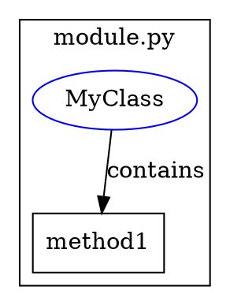

# Phase 12: Graph & Database Export

Phase 12 introduces comprehensive export capabilities for visualizing and analyzing code structure through graph and database formats. This enables powerful code analysis, visualization, and querying capabilities.

## Overview

The Phase 12 export system provides five specialized exporters:
- **GraphML**: For graph visualization in yEd and similar tools
- **Neo4j**: For graph database import and analysis
- **DOT**: For Graphviz visualization
- **SQLite**: For local SQL-based analysis
- **PostgreSQL**: For enterprise-scale code analysis

## Graph Exporters

### GraphML Export

The GraphML exporter produces XML-based graph files compatible with yEd and other graph visualization tools.

**Features:**
- Full GraphML 1.0 compliance
- yEd-specific extensions for enhanced visualization
- Hierarchical node styling based on chunk type
- Complete metadata preservation
- Relationship type visualization

**Usage:**
```python
from chunker.export import GraphMLExporter

exporter = GraphMLExporter()
exporter.add_chunks(chunks)
exporter.export(Path("output.graphml"))
```

**Output Example:**
```xml
<graphml xmlns="http://graphml.graphdrawing.org/xmlns">
  <key id="label" for="node" attr.name="label" attr.type="string"/>
  <key id="node_type" for="node" attr.name="node_type" attr.type="string"/>
  <graph id="G" edgedefault="directed">
    <node id="chunk_001">
      <data key="label">MyClass</data>
      <data key="node_type">class_definition</data>
    </node>
  </graph>
</graphml>
```

### Neo4j Export

The Neo4j exporter supports both CSV and Cypher formats for importing code structure into Neo4j.

**Features:**
- CSV format for neo4j-admin bulk import
- Cypher statements for direct execution
- Automatic label generation from chunk types
- Constraint and index creation
- Batch operation support

**CSV Export:**
```python
from chunker.export import Neo4jExporter

exporter = Neo4jExporter()
exporter.add_chunks(chunks)
exporter.export(Path("output"), format="csv")
```

This creates:
- `output_nodes.csv` - Node data
- `output_relationships.csv` - Relationship data
- `output_import.sh` - Import script

**Cypher Export:**
```python
exporter.export(Path("output.cypher"), format="cypher")
```

**Output Example:**
```cypher
CREATE CONSTRAINT codechunk_unique_id IF NOT EXISTS
  FOR (n:CodeChunk) REQUIRE n.nodeId IS UNIQUE;

CREATE (n:CodeChunk:ClassDefinition {
  nodeId: 'chunk_001',
  file_path: '/src/main.py',
  content: '...',
  start_line: 10,
  end_line: 50
});
```

### DOT Export

The DOT exporter creates Graphviz-compatible files for generating code structure diagrams.

**Features:**
- Directed graph representation
- Subgraph clustering by module/package
- Customizable node shapes and colors
- Edge labels for relationship types
- Rank-based layout support

**Usage:**
```python
from chunker.export import DOTExporter

exporter = DOTExporter()
exporter.add_chunks(chunks)
exporter.export(Path("output.dot"))
```

**Output Example:**


## Database Exporters

### SQLite Export

The SQLite exporter creates a normalized relational database with full-text search capabilities.

**Features:**
- Normalized schema (files, chunks, relationships)
- FTS5 full-text search with Porter stemming
- Comprehensive indexes for performance
- Pre-built views for common queries
- Transaction safety with WAL mode

**Schema Overview:**
```sql
-- Core tables
CREATE TABLE files (
  id INTEGER PRIMARY KEY,
  path TEXT UNIQUE NOT NULL,
  language TEXT,
  size INTEGER
);

CREATE TABLE chunks (
  id INTEGER PRIMARY KEY,
  chunk_id TEXT UNIQUE NOT NULL,
  file_id INTEGER REFERENCES files(id),
  content TEXT NOT NULL,
  node_type TEXT,
  start_line INTEGER,
  end_line INTEGER
);

CREATE TABLE relationships (
  source_id TEXT,
  target_id TEXT,
  relationship_type TEXT,
  metadata TEXT
);

-- Full-text search
CREATE VIRTUAL TABLE chunks_fts USING fts5(
  content, node_type, file_path,
  content=chunks
);
```

**Usage:**
```python
from chunker.export import SQLiteExporter

exporter = SQLiteExporter()
exporter.add_chunks(chunks)
exporter.export(Path("codebase.db"))
```

### PostgreSQL Export

The PostgreSQL exporter provides enterprise-scale features for large codebases.

**Features:**
- JSONB columns for flexible metadata
- Table partitioning by language
- Materialized views for analytics
- Full-text search with ts_vector
- Trigram similarity search
- Custom analysis functions

**Advanced Schema:**
```sql
-- Partitioned chunks table
CREATE TABLE chunks (
  id BIGSERIAL,
  chunk_id TEXT NOT NULL,
  content TEXT NOT NULL,
  metadata JSONB,
  search_vector tsvector,
  PRIMARY KEY (id, language)
) PARTITION BY LIST (language);

-- Materialized view for analysis
CREATE MATERIALIZED VIEW chunk_graph AS
SELECT 
  chunk_id,
  COUNT(DISTINCT r1.target_id) as outgoing_connections,
  COUNT(DISTINCT r2.source_id) as incoming_connections
FROM chunks c
LEFT JOIN relationships r1 ON c.chunk_id = r1.source_id
LEFT JOIN relationships r2 ON c.chunk_id = r2.target_id
GROUP BY chunk_id;
```

**Usage:**
```python
from chunker.export import PostgreSQLExporter

exporter = PostgreSQLExporter(
    host="localhost",
    database="codeanalysis",
    user="analyst"
)
exporter.add_chunks(chunks)
exporter.export()
```

## Relationship Types

All exporters support the following relationship types:

- **CONTAINS**: Parent-child relationships (class → method)
- **IMPORTS**: Import/dependency relationships
- **CALLS**: Function/method call relationships
- **INHERITS**: Inheritance relationships
- **USES**: General usage relationships

## Query Examples

### Neo4j Queries
```cypher
// Find all methods in a class
MATCH (c:ClassDefinition {name: "MyClass"})-[:CONTAINS]->(m:MethodDefinition)
RETURN m.name, m.start_line

// Find call dependencies
MATCH (m1:MethodDefinition)-[:CALLS]->(m2:MethodDefinition)
RETURN m1.name as caller, m2.name as callee
```

### SQL Queries
```sql
-- Find large functions
SELECT file_path, node_type, end_line - start_line as size
FROM chunks
WHERE node_type = 'function_definition'
  AND end_line - start_line > 50
ORDER BY size DESC;

-- Search for TODO comments
SELECT file_path, start_line, snippet(chunks_fts, 0, '<b>', '</b>')
FROM chunks_fts
WHERE chunks_fts MATCH 'TODO'
ORDER BY rank;
```

## Best Practices

1. **Choose the Right Format**:
   - GraphML/DOT for visualization
   - Neo4j for graph analysis
   - SQLite for local analysis
   - PostgreSQL for large-scale analysis

2. **Chunk Relationships**:
   - Ensure chunks have proper parent relationships
   - Extract call relationships for dependency analysis

3. **Performance**:
   - Use batch operations for large codebases
   - Enable indexes before querying
   - Use materialized views for complex queries

4. **Integration**:
   - Combine with Phase 11 processors for comprehensive analysis
   - Use token limits for LLM-compatible chunks
   - Export incrementally for large projects

## See Also

- [Export Formats](export-formats.md) - JSON/JSONL/Parquet formats
- [API Reference](api-reference.md) - Detailed API documentation
- [Performance Guide](performance-guide.md) - Optimization strategies