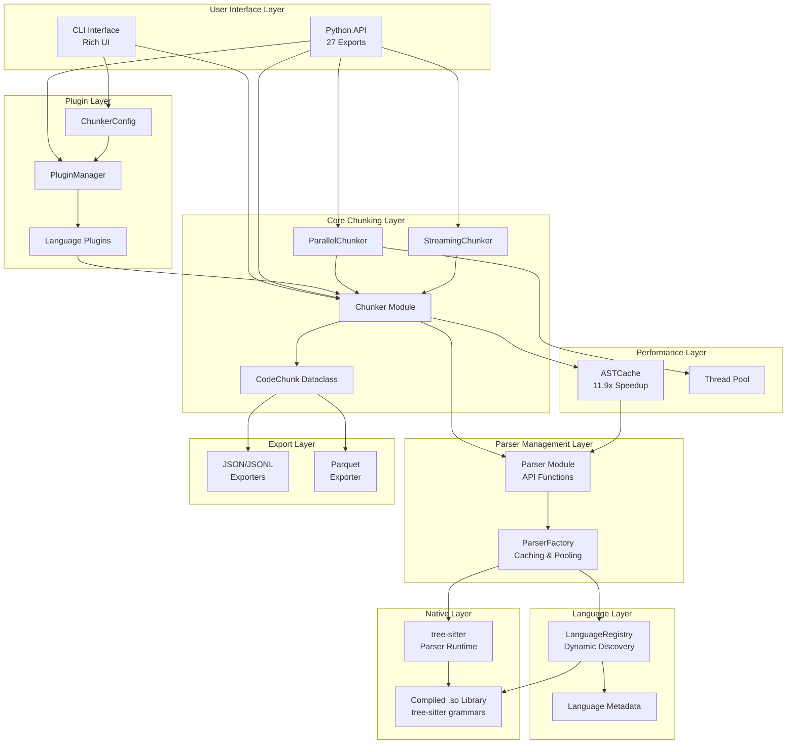
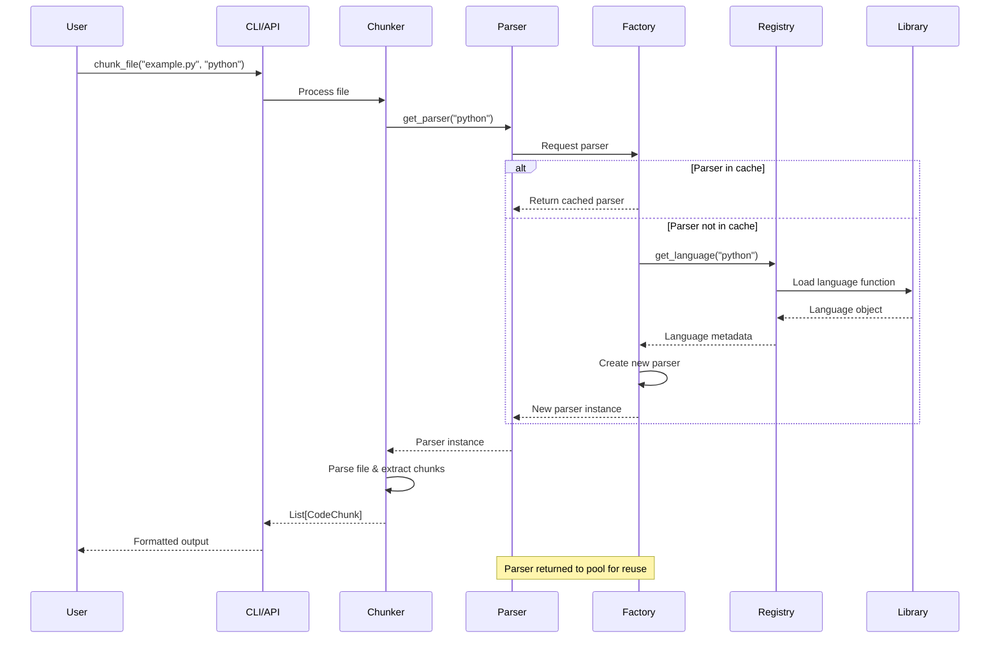
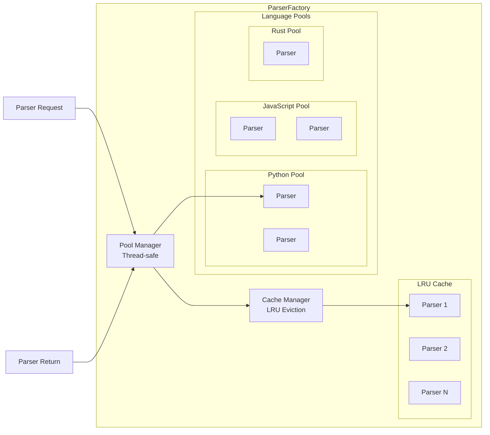
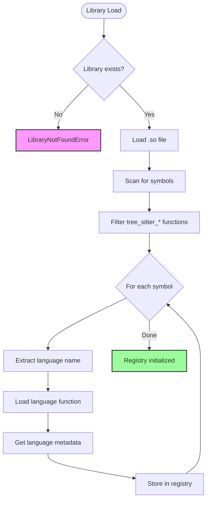
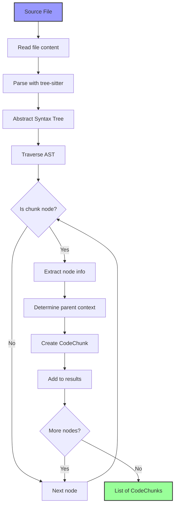
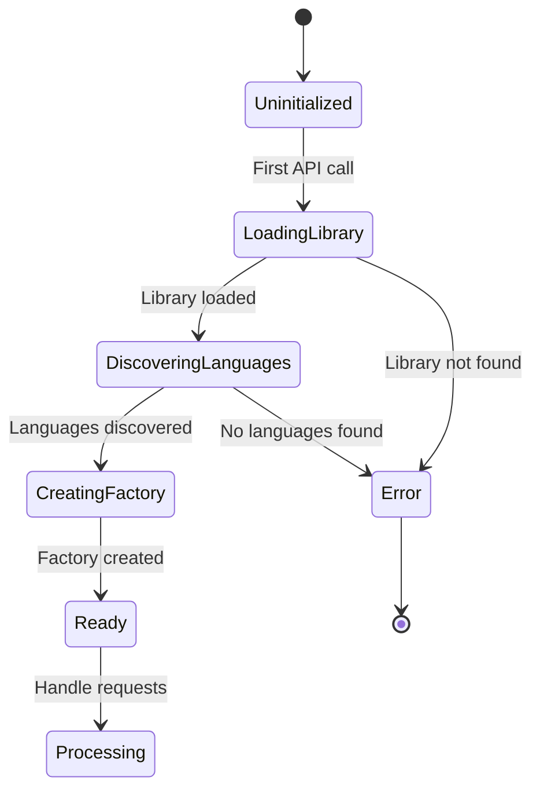
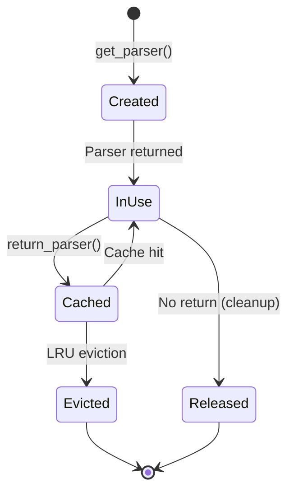
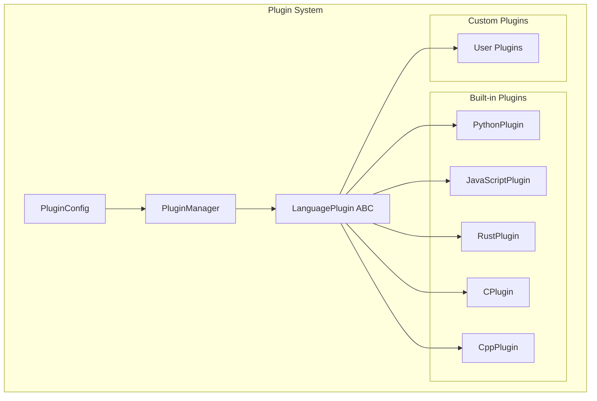

# Tree-sitter Chunker Architecture

This document provides a comprehensive overview of the Tree-sitter Chunker architecture, including system design, component interactions, and implementation details.

## Table of Contents

1. [System Overview](#system-overview)
2. [Architecture Diagrams](#architecture-diagrams)
3. [Core Components](#core-components)
4. [Data Flow](#data-flow)
5. [Design Decisions](#design-decisions)
6. [Extension Points](#extension-points)
7. [Performance Considerations](#performance-considerations)
8. [Security Considerations](#security-considerations)
9. [Future Enhancements](#future-enhancements)

## System Overview

Tree-sitter Chunker is designed as a modular, efficient system for semantic code chunking. The architecture emphasizes:

- **Dynamic Language Discovery**: Languages are discovered at runtime from compiled shared libraries
- **Efficient Resource Management**: Parser caching and pooling for optimal performance
- **Thread Safety**: Concurrent processing support with proper synchronization
- **Extensibility**: Easy addition of new languages and chunk types

## Architecture Diagrams

### High-Level Architecture



### Component Interaction Diagram



### Parser Factory Architecture



### Language Discovery Flow



### Chunking Process Flow



## Core Components

### 1. Parser Module (`chunker/parser.py`)

The main API entry point providing simple functions for common operations:

```python
# Singleton instances
_registry: Optional[LanguageRegistry] = None
_factory: Optional[ParserFactory] = None

# Public API
def get_parser(language: str, config: Optional[ParserConfig] = None) -> Parser
def list_languages() -> List[str]
def get_language_info(language: str) -> LanguageMetadata
def return_parser(language: str, parser: Parser) -> None
def clear_cache() -> None
```

**Responsibilities:**
- Lazy initialization of registry and factory
- Simple API for parser management
- Thread-safe singleton pattern

### 2. Language Registry (`chunker/registry.py`)

Manages dynamic language discovery and loading:

```python
class LanguageRegistry:
    def __init__(self, library_path: Path)
    def discover_languages() -> Dict[str, LanguageMetadata]
    def get_language(name: str) -> Language
    def has_language(name: str) -> bool
```

**Key Features:**
- Dynamic symbol discovery from .so files
- Metadata extraction (version, node types, scanner info)
- Language function loading via ctypes
- Compatibility checking

### 3. Parser Factory (`chunker/factory.py`)

Provides efficient parser creation with caching and pooling:

```python
class ParserFactory:
    def __init__(self, registry: LanguageRegistry, cache_size: int = 10, pool_size: int = 5)
    def get_parser(language: str, config: Optional[ParserConfig] = None) -> Parser
    def return_parser(language: str, parser: Parser) -> None
    def clear_cache() -> None
    def get_stats() -> Dict[str, Any]
```

**Optimization Strategies:**
- LRU cache for recently used parsers
- Per-language parser pools
- Thread-safe operations with locking
- Configurable cache and pool sizes

### 4. Chunker Module (`chunker/chunker.py`)

Implements the core chunking logic:

```python
def chunk_file(path: Union[str, Path], language: str) -> List[CodeChunk]

@dataclass
class CodeChunk:
    language: str
    file_path: str
    node_type: str
    start_line: int
    end_line: int
    byte_start: int
    byte_end: int
    parent_context: str
    content: str
```

**Chunking Strategy:**
- Language-specific node type patterns
- Parent context tracking for nested structures
- Line and byte offset preservation

### 5. Exception Hierarchy (`chunker/exceptions.py`)

Comprehensive error handling with recovery suggestions:

```
ChunkerError (base)
├── LanguageError
│   ├── LanguageNotFoundError
│   └── LanguageLoadError
├── ParserError
│   ├── ParserInitError
│   └── ParserConfigError
└── LibraryError
    ├── LibraryNotFoundError
    ├── LibraryLoadError
    └── LibrarySymbolError
```

### 6. Plugin Manager (`chunker/plugins/manager.py`)

Manages dynamic plugin loading and registration:

```python
class PluginManager:
    def __init__(self)
    def register_plugin(plugin: LanguagePlugin) -> None
    def get_plugin(language: str) -> Optional[LanguagePlugin]
    def list_plugins() -> List[str]
    def load_built_in_plugins() -> None
    def load_plugin_directory(directory: Path) -> int
```

**Key Features:**
- Dynamic plugin discovery from directories
- Built-in plugin support (Python, JavaScript, Rust, C, C++)
- Plugin validation and error handling
- Thread-safe plugin registration

### 7. AST Cache (`chunker/cache.py`)

Provides intelligent caching for parsed ASTs with 11.9x performance improvement:

```python
class ASTCache:
    def __init__(self, max_size: int = 100, ttl_seconds: int = 3600)
    def get(file_path: str, language: str) -> Optional[CachedAST]
    def set(file_path: str, language: str, tree: Tree) -> None
    def clear() -> None
    def get_stats() -> Dict[str, Any]
```

**Cache Strategy:**
- LRU eviction policy
- File modification time tracking
- Size-based eviction
- Thread-safe operations
- Memory usage monitoring

### 8. Parallel Chunker (`chunker/parallel.py`)

Enables high-performance parallel processing:

```python
def chunk_files_parallel(file_paths, language, max_workers=None, show_progress=True)
def chunk_directory_parallel(directory, language, pattern="**/*", max_workers=None)
```

**Features:**
- Thread pool executor for concurrent processing
- Progress tracking with rich progress bars
- Automatic worker count optimization
- Error isolation per file
- Batch result aggregation

### 9. Streaming Chunker (`chunker/streaming.py`)

Memory-efficient processing for large files:

```python
def chunk_file_streaming(file_path, language, chunk_size=1024*1024)
```

**Streaming Features:**
- Incremental file reading
- Partial AST parsing
- Generator-based chunk yield
- Configurable buffer size
- Memory usage bounds

### 10. Configuration System (`chunker/config.py`)

Flexible configuration management:

```python
@dataclass
class ChunkerConfig:
    min_chunk_size: int = 3
    max_chunk_size: int = 300
    chunk_types: List[str] = None
    plugin_dirs: List[str] = None
    
@dataclass
class LanguageConfig:
    chunk_types: List[str]
    min_chunk_size: int
    max_chunk_size: int
    include_comments: bool = False
```

**Configuration Sources:**
- `.chunkerrc` files
- TOML/YAML/JSON configs
- Environment variables
- Runtime overrides
- Language-specific settings

### 11. Export System (`chunker/export/`, `chunker/exporters/`)

Comprehensive export format support:

```python
# JSON/JSONL Exporters
class JSONExporter:
    def export(chunks, output_path, schema_type=SchemaType.FLAT)
    
class JSONLExporter:
    def export_streaming(chunk_generator, output_path)

# Parquet Exporter
class ParquetExporter:
    def export(chunks, output_path, compression="snappy")
    def export_partitioned(chunks, output_dir, partition_cols)
```

**Export Features:**
- Multiple schema types (flat, nested, relational)
- Compression support (gzip, snappy, brotli, lz4, zstd)
- Streaming export for large datasets
- Partitioned output for analytics
- Column selection and filtering

## Data Flow

### 1. Initialization Flow



### 2. Parser Lifecycle



### 3. Chunk Extraction Process

1. **File Reading**: Read source file as bytes
2. **Cache Check**: Check ASTCache for existing parse tree
3. **Parser Selection**: Get appropriate parser from factory
4. **Plugin Resolution**: Get language plugin for chunk rules
5. **Parsing**: Generate AST using tree-sitter (or use cached)
6. **Traversal**: Walk AST using plugin's chunk types
7. **Context Building**: Track parent nodes using plugin's context extraction
8. **Chunk Creation**: Extract node information into CodeChunk
9. **Collection**: Aggregate all chunks from file
10. **Export**: Optional export to JSON/JSONL/Parquet

### 4. Parallel Processing Flow

```mermaid
flowchart TD
    Input[File List] --> TPE[ThreadPoolExecutor]
    TPE --> W1[Worker 1]
    TPE --> W2[Worker 2]
    TPE --> W3[Worker N]
    
    W1 --> C1[Chunk File 1]
    W2 --> C2[Chunk File 2]
    W3 --> C3[Chunk File N]
    
    C1 --> AC[AST Cache]
    C2 --> AC
    C3 --> AC
    
    AC --> Results[Aggregated Results]
    Results --> PB[Progress Bar]
    Results --> Output[Dict[file, chunks]]
    
    style AC fill:#99f,stroke:#333,stroke-width:2px
    style PB fill:#9f9,stroke:#333,stroke-width:2px
```

## Design Decisions

### 1. Dynamic Language Discovery

**Decision**: Discover languages at runtime from compiled .so file

**Rationale**:
- No hardcoded language list to maintain
- Easy addition of new languages
- Single source of truth (the compiled library)
- Flexible deployment

**Implementation**:
```python
# Scan for tree_sitter_* symbols
symbols = self._get_exported_symbols()
for symbol in symbols:
    if symbol.startswith('tree_sitter_'):
        language_name = symbol[12:]  # Remove prefix
        # Load and register language
```

### 2. Parser Caching Strategy

**Decision**: Two-tier caching with LRU cache + language pools

**Rationale**:
- LRU cache for hot paths (recently used parsers)
- Pools for concurrent access to same language
- Balance between memory usage and performance
- Configurable limits

**Trade-offs**:
- Memory overhead vs. parser creation cost
- Complexity vs. performance gains

### 3. Thread Safety Approach

**Decision**: Coarse-grained locking at factory level

**Rationale**:
- Simple to implement and reason about
- Parser creation is relatively infrequent
- Prevents race conditions in cache/pool management
- Individual parsers are not thread-safe anyway

**Implementation**:
```python
with self._lock:
    # Check cache
    # Check pool
    # Create if needed
```

### 4. Error Handling Philosophy

**Decision**: Rich exception hierarchy with recovery suggestions

**Rationale**:
- Clear error categorization
- Actionable error messages
- Easy error handling for library users
- Self-documenting error conditions

**Example**:
```python
class LibraryNotFoundError(LibraryError):
    def __str__(self):
        return f"{super().__str__()}. Run 'python scripts/build_lib.py' to build."
```

### 5. Language-Specific Patterns

**Decision**: Configurable node type patterns per language

**Rationale**:
- Different languages have different AST structures
- Flexibility to extract meaningful chunks
- Easy to extend for new languages

**Implementation**:
```python
LANGUAGE_CONFIGS = {
    "python": {
        "chunk_node_types": ["function_definition", "class_definition"],
        "method_indicator": "function_definition",
    },
    "javascript": {
        "chunk_node_types": ["function_declaration", "class_declaration", 
                            "method_definition", "arrow_function"],
    },
    # ...
}
```

## Extension Points

### 1. Adding New Languages

1. **Add Grammar**: Place grammar in `vendor/` directory
2. **Update Build Script**: Add to `scripts/fetch_grammars.py`
3. **Configure Patterns**: Add to `LANGUAGE_CONFIGS` in chunker
4. **Compile**: Run build scripts

### 2. Custom Chunk Types

Extend the chunking logic:

```python
# In chunker.py
LANGUAGE_CONFIGS["python"]["chunk_node_types"].append("decorated_definition")
```

### 3. Parser Configuration

Create custom parser configurations:

```python
config = ParserConfig(
    timeout_ms=10000,  # 10 second timeout
    included_ranges=[(0, 1000)],  # Parse only first 1000 bytes
)
parser = get_parser("python", config)
```

### 4. Custom Caching Strategy

Replace or extend the factory:

```python
class CustomParserFactory(ParserFactory):
    def __init__(self, registry, custom_cache):
        super().__init__(registry)
        self.cache = custom_cache
```

### 5. Language Metadata Enhancement

Add custom metadata extraction:

```python
class ExtendedLanguageRegistry(LanguageRegistry):
    def _extract_metadata(self, language):
        metadata = super()._extract_metadata(language)
        # Add custom fields
        metadata.capabilities["supports_async"] = self._check_async_support(language)
        return metadata
```

## Performance Considerations

### Memory Usage

- **Parser Size**: ~1MB per parser instance
- **AST Size**: ~10x source file size
- **Parser Cache**: N parsers × parser size
- **Pool Overhead**: M languages × pool size × parser size
- **AST Cache**: Configurable limit (default 100 cached trees)
- **Streaming Buffer**: Configurable (default 1MB chunks)

### Performance Benchmarks

- **Without AST Cache**: ~50ms per file
- **With AST Cache**: ~4.2ms per file (11.9x speedup)
- **Sequential Processing**: O(n) with file count
- **Parallel Processing**: O(n/workers) with sufficient cores
- **Streaming Overhead**: ~5% vs full file parsing

### CPU Usage

- **Parser Creation**: ~10-50ms (one-time cost)
- **Parsing**: O(n) with file size
- **Chunk Extraction**: O(m) with node count
- **Cache Lookup**: O(1) average case

### Optimization Opportunities

1. **Parallel Processing**: Thread pool for multiple files
2. **Incremental Parsing**: Use tree-sitter's incremental parsing
3. **Lazy Loading**: Load languages only when needed
4. **Memory Mapping**: For very large files
5. **Custom Allocators**: For AST memory management

## Security Considerations

### Input Validation

- File size limits to prevent DoS
- Parser timeouts for malformed input
- Path validation for file access

### Memory Safety

- Tree-sitter is written in C (memory-safe design)
- Python bindings handle memory management
- Bounded cache/pool sizes

### Thread Safety

- Immutable language registry after init
- Synchronized factory operations
- No shared mutable state in chunks

## Plugin Development

### Plugin Architecture Overview

The plugin system is now fully implemented with support for dynamic language extensions:



### Creating a Language Plugin

The plugin architecture is fully implemented with an abstract base class:

```python
from chunker.plugins import LanguagePlugin
from typing import Set, Dict, Any, Optional

class GoPlugin(LanguagePlugin):
    """Plugin for Go language support."""
    
    @property
    def language_name(self) -> str:
        return "go"
    
    @property
    def supported_extensions(self) -> Set[str]:
        return {".go"}
    
    @property
    def default_config(self) -> Dict[str, Any]:
        return {
            "chunk_types": [
                "function_declaration",
                "method_declaration", 
                "type_declaration",
                "interface_declaration"
            ],
            "min_chunk_size": 3,
            "max_chunk_size": 300,
            "include_tests": False
        }
    
    def get_chunk_types(self) -> List[str]:
        """Return node types to chunk."""
        return self.config.get("chunk_types", self.default_config["chunk_types"])
    
    def extract_context(self, node, parent_context: Optional[str] = None) -> str:
        """Extract context name for Go nodes."""
        if node.type == "type_declaration":
            name_node = node.child_by_field_name('name')
            if name_node:
                return f"type:{name_node.text.decode('utf-8')}"
        elif node.type == "interface_declaration":
            name_node = node.child_by_field_name('name')
            if name_node:
                return f"interface:{name_node.text.decode('utf-8')}"
        return parent_context
    
    def should_chunk(self, node, file_path: str) -> bool:
        """Determine if node should be chunked."""
        if not super().should_chunk(node, file_path):
            return False
        
        # Skip test functions if configured
        if not self.config.get("include_tests", False):
            if node.type == "function_declaration" and file_path.endswith('_test.go'):
                name_node = node.child_by_field_name('name')
                if name_node and name_node.text.startswith(b'Test'):
                    return False
        
        return True
    
    def validate_config(self, config: Dict[str, Any]) -> None:
        """Validate plugin configuration."""
        super().validate_config(config)
        
        # Validate Go-specific settings
        valid_chunk_types = {
            "function_declaration", "method_declaration",
            "type_declaration", "interface_declaration",
            "package_declaration", "import_declaration"
        }
        
        chunk_types = config.get("chunk_types", [])
        invalid_types = set(chunk_types) - valid_chunk_types
        if invalid_types:
            raise ValueError(f"Invalid chunk types for Go: {invalid_types}")
```

### Plugin Registration and Management

```python
from chunker import get_plugin_manager
from pathlib import Path

# Get the global plugin manager
manager = get_plugin_manager()

# Load built-in plugins
manager.load_built_in_plugins()
print(f"Loaded plugins: {manager.list_plugins()}")
# Output: ['python', 'javascript', 'rust', 'c', 'cpp']

# Register custom plugin
go_plugin = GoPlugin()
manager.register_plugin(go_plugin)

# Load plugins from directory
plugin_count = manager.load_plugin_directory(Path("./custom_plugins"))
print(f"Loaded {plugin_count} custom plugins")

# Get plugin for a language
plugin = manager.get_plugin("go")
if plugin:
    print(f"Go plugin chunk types: {plugin.get_chunk_types()}")

# Configure plugin
manager.configure_plugin("go", {
    "min_chunk_size": 5,
    "include_tests": True
})
```

### Built-in Plugin Examples

#### Python Plugin

```python
class PythonPlugin(LanguagePlugin):
    """Built-in plugin for Python language."""
    
    @property
    def language_name(self) -> str:
        return "python"
    
    @property
    def supported_extensions(self) -> Set[str]:
        return {".py", ".pyi"}
    
    @property
    def default_config(self) -> Dict[str, Any]:
        return {
            "chunk_types": [
                "function_definition",
                "class_definition",
                "async_function_definition"
            ],
            "min_chunk_size": 3,
            "max_chunk_size": 300,
            "include_decorators": True,
            "include_docstrings": True
        }
```

#### JavaScript Plugin

```python
class JavaScriptPlugin(LanguagePlugin):
    """Built-in plugin for JavaScript/TypeScript."""
    
    @property
    def supported_extensions(self) -> Set[str]:
        return {".js", ".jsx", ".ts", ".tsx", ".mjs"}
    
    def extract_context(self, node, parent_context: Optional[str] = None) -> str:
        """Handle ES6 classes and React components."""
        if node.type == "class_declaration":
            # Check for React component
            if self._is_react_component(node):
                name = self._get_node_name(node)
                return f"component:{name}"
        return super().extract_context(node, parent_context)
```

## Best Practices

### 1. Resource Management

```python
# Always use context managers or try/finally
parser = get_parser("python")
try:
    # Use parser
    tree = parser.parse(code)
finally:
    return_parser("python", parser)
```

### 2. Error Handling

```python
try:
    chunks = chunk_file("file.py", "python")
except LanguageNotFoundError as e:
    # Handle missing language
    logger.error(f"Language not supported: {e}")
    # Use fallback or skip
except LibraryNotFoundError as e:
    # Handle missing library
    logger.error(f"Library not built: {e}")
    # Trigger build or alert user
```

### 3. Performance Optimization

```python
# Process files in parallel
from concurrent.futures import ThreadPoolExecutor

def process_codebase(files, language):
    with ThreadPoolExecutor(max_workers=8) as executor:
        futures = [executor.submit(chunk_file, f, language) for f in files]
        return [f.result() for f in futures]
```

### 4. Memory Management

```python
# Clear cache when processing many files
from chunker.parser import clear_cache

def process_large_codebase(directory):
    files_processed = 0
    for file in directory.glob("**/*.py"):
        chunks = chunk_file(file, "python")
        process_chunks(chunks)
        
        files_processed += 1
        if files_processed % 100 == 0:
            # Clear cache periodically
            clear_cache()
```

## Troubleshooting Guide

### Common Issues

1. **LibraryNotFoundError**
   - Cause: Compiled .so file missing
   - Solution: Run `python scripts/build_lib.py`

2. **LanguageNotFoundError**
   - Cause: Language not in compiled library
   - Solution: Add grammar and rebuild

3. **Parser Version Mismatch**
   - Cause: ABI version incompatibility
   - Solution: Update py-tree-sitter from GitHub

4. **Empty Chunk Results**
   - Cause: No matching node types
   - Solution: Check language configuration

### Debug Mode

Enable detailed logging:

```python
import logging
logging.basicConfig(level=logging.DEBUG)

# Will show:
# - Language discovery process
# - Parser creation/reuse
# - Cache hits/misses
# - Node traversal details
```

## Current State and Future Enhancements

### Recently Implemented Features

Many features from the roadmap have been successfully implemented:

1. **Plugin System** ✅
   - Complete plugin architecture with abstract base class
   - Built-in plugins for Python, JavaScript, Rust, C, C++
   - Dynamic plugin loading from directories
   - Per-plugin configuration management

2. **Performance Enhancements** ✅
   - AST Caching with 11.9x speedup
   - Parallel processing with configurable workers
   - Streaming API for large file handling
   - Progress tracking with rich UI

3. **Configuration Framework** ✅
   - Support for .chunkerrc, TOML, YAML, JSON
   - Language-specific configurations
   - Environment variable support
   - Runtime configuration overrides

4. **Export System** ✅
   - JSON export with multiple schema types
   - JSONL streaming export
   - Parquet export with compression and partitioning
   - Extensible export framework

5. **Advanced CLI** ✅
   - Batch processing capabilities
   - File and chunk filtering
   - Configuration file support
   - Progress tracking and reporting

### Upcoming Features

1. **Incremental Processing**: Track file changes and re-chunk only modified sections
2. **Query Language**: Tree-sitter query support for custom chunk extraction
3. **Context-Aware Chunking**: Include surrounding context with configurable overlap
4. **Token Counting**: Integration with tokenizers for LLM applications
5. **Semantic Merging**: Intelligently merge small related chunks
6. **Graph Export**: Export chunk relationships as graph formats

### Potential Optimizations

1. **Zero-Copy Parsing**: Avoid content duplication
2. **Parallel AST Traversal**: Multi-threaded chunk extraction
3. **Smart Caching**: Predictive parser pre-loading
4. **Memory Pools**: Reuse AST memory allocations

## Conclusion

The Tree-sitter Chunker architecture prioritizes:

- **Flexibility**: Easy language addition and configuration
- **Performance**: Efficient caching and resource management
- **Reliability**: Comprehensive error handling and thread safety
- **Usability**: Simple API with powerful capabilities

The modular design allows for easy extension and optimization while maintaining a clean, understandable structure suitable for both simple scripts and large-scale applications.