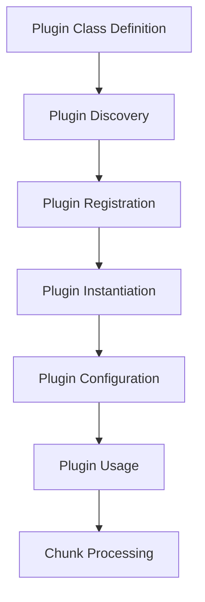

# Plugin Development Guide

This guide covers how to create custom language plugins for Tree-sitter Chunker. The plugin architecture allows you to add support for new languages or customize the chunking behavior for existing languages.

## Table of Contents

1. [Overview](#overview)
2. [Quick Start](#quick-start)
3. [Plugin Architecture](#plugin-architecture)
4. [Creating a Language Plugin](#creating-a-language-plugin)
5. [Plugin Configuration](#plugin-configuration)
6. [Advanced Features](#advanced-features)
7. [Testing Your Plugin](#testing-your-plugin)
8. [Distributing Plugins](#distributing-plugins)
9. [Built-in Plugin Examples](#built-in-plugin-examples)
10. [Best Practices](#best-practices)

## Overview

The Tree-sitter Chunker plugin system provides:

- **Extensibility**: Add support for new languages without modifying core code
- **Customization**: Override default chunking behavior for specific languages
- **Configuration**: Fine-tune plugin behavior through configuration files
- **Discovery**: Automatic plugin discovery from directories
- **Hot Loading**: Load plugins at runtime

## Quick Start

Here's a minimal example of a custom language plugin:

```python
from chunker.languages.plugin_base import LanguagePlugin
from typing import Set, Optional
from tree_sitter import Node

class GoPlugin(LanguagePlugin):
    """Plugin for Go language support."""
    
    @property
    def language_name(self) -> str:
        return "go"
    
    @property
    def supported_extensions(self) -> Set[str]:
        return {".go"}
    
    @property
    def default_chunk_types(self) -> Set[str]:
        return {
            "function_declaration",
            "method_declaration",
            "type_declaration",
            "interface_declaration"
        }
    
    def get_node_name(self, node: Node, source: bytes) -> Optional[str]:
        """Extract the name from a Go node."""
        for child in node.children:
            if child.type == "identifier":
                return source[child.start_byte:child.end_byte].decode('utf-8')
        return None
```

To use this plugin:

```python
from chunker import get_plugin_manager

manager = get_plugin_manager()
manager.register_plugin(GoPlugin)

# Now you can chunk Go files
chunks = chunk_file("main.go", "go")
```

## Plugin Architecture

### Core Components

1. **LanguagePlugin**: Abstract base class that all plugins must inherit from
2. **PluginManager**: Manages plugin discovery, loading, and lifecycle
3. **PluginRegistry**: Internal registry of available plugins
4. **PluginConfig**: Configuration for individual plugins

### Plugin Lifecycle



### Key Interfaces

```python
class LanguagePlugin(ABC):
    """Base class for all language plugins."""
    
    @property
    @abstractmethod
    def language_name(self) -> str:
        """Return the language identifier (e.g., 'python', 'rust')."""
        
    @property
    @abstractmethod
    def supported_extensions(self) -> Set[str]:
        """Return set of file extensions this plugin handles."""
        
    @property
    @abstractmethod
    def default_chunk_types(self) -> Set[str]:
        """Return default set of node types to chunk."""
    
    @abstractmethod
    def get_node_name(self, node: Node, source: bytes) -> Optional[str]:
        """Extract a human-readable name from a node."""
    
    # Optional methods to override
    def should_include_chunk(self, chunk: CodeChunk) -> bool:
        """Filter chunks based on custom criteria."""
        
    def process_node(self, node: Node, source: bytes, 
                    file_path: str, parent_context: Optional[str] = None) -> Optional[CodeChunk]:
        """Process a node and return a chunk if appropriate."""
    
    def get_context_for_children(self, node: Node, chunk: CodeChunk) -> str:
        """Build context string for nested definitions."""
```

## Creating a Language Plugin

### Step 1: Define Your Plugin Class

```python
from chunker.languages.plugin_base import LanguagePlugin
from chunker.languages.base import PluginConfig
from typing import Set, Optional, Dict, Any
from tree_sitter import Node
import re

class SwiftPlugin(LanguagePlugin):
    """Plugin for Swift language support."""
    
    def __init__(self, config: Optional[PluginConfig] = None):
        super().__init__(config)
        self._method_pattern = re.compile(r'func\s+(\w+)')
        self._class_pattern = re.compile(r'class\s+(\w+)')
    
    @property
    def language_name(self) -> str:
        return "swift"
    
    @property
    def supported_extensions(self) -> Set[str]:
        return {".swift"}
    
    @property
    def default_chunk_types(self) -> Set[str]:
        return {
            "function_declaration",
            "init_declaration",
            "class_declaration",
            "struct_declaration",
            "enum_declaration",
            "protocol_declaration",
            "extension_declaration"
        }
    
    @property
    def plugin_metadata(self) -> Dict[str, Any]:
        """Return plugin metadata."""
        return {
            "name": "Swift Language Plugin",
            "version": "1.0.0",
            "author": "Your Name",
            "description": "Provides Swift language support for chunking"
        }
```

### Step 2: Implement Name Extraction

```python
def get_node_name(self, node: Node, source: bytes) -> Optional[str]:
    """Extract the name from a Swift node."""
    # Different node types have different structures
    if node.type == "function_declaration":
        # Look for the identifier after 'func' keyword
        for child in node.children:
            if child.type == "simple_identifier":
                return source[child.start_byte:child.end_byte].decode('utf-8')
    
    elif node.type in ["class_declaration", "struct_declaration"]:
        # Look for type identifier
        for child in node.children:
            if child.type == "type_identifier":
                return source[child.start_byte:child.end_byte].decode('utf-8')
    
    # Fallback to regex pattern matching
    content = source[node.start_byte:node.end_byte].decode('utf-8')
    first_line = content.split('\n')[0]
    
    if "func" in first_line:
        match = self._method_pattern.search(first_line)
        if match:
            return match.group(1)
    elif "class" in first_line:
        match = self._class_pattern.search(first_line)
        if match:
            return match.group(1)
    
    return None
```

### Step 3: Implement Custom Chunk Processing

```python
def process_node(self, node: Node, source: bytes, 
                file_path: str, parent_context: Optional[str] = None) -> Optional[CodeChunk]:
    """Process Swift nodes with special handling."""
    
    # Skip private methods if configured
    if self.config.custom_options.get("skip_private", False):
        content = source[node.start_byte:node.end_byte].decode('utf-8')
        if content.strip().startswith("private "):
            return None
    
    # Handle computed properties specially
    if node.type == "computed_property":
        # Create a custom chunk for computed properties
        chunk = self.create_chunk(node, source, file_path, parent_context)
        if chunk:
            chunk.node_type = "computed_property"
            # Add metadata about getter/setter
            has_getter = "get {" in chunk.content
            has_setter = "set {" in chunk.content
            chunk.metadata = {
                "has_getter": has_getter,
                "has_setter": has_setter
            }
        return chunk
    
    # Default processing for other nodes
    return super().process_node(node, source, file_path, parent_context)
```

### Step 4: Add Custom Filtering

```python
def should_include_chunk(self, chunk: CodeChunk) -> bool:
    """Filter chunks based on Swift-specific criteria."""
    # Always include if no size constraints
    if not self.config:
        return True
    
    # Apply size constraints
    chunk_lines = chunk.end_line - chunk.start_line + 1
    if chunk_lines < self.config.min_chunk_size:
        return False
    if chunk_lines > self.config.max_chunk_size:
        return False
    
    # Skip test methods if configured
    if self.config.custom_options.get("skip_tests", False):
        if chunk.file_path.endswith("Tests.swift") or "test" in chunk.content.lower():
            return False
    
    # Skip generated code
    if "// Generated code - do not modify" in chunk.content:
        return False
    
    return True
```

### Step 5: Context Building

```python
def get_context_for_children(self, node: Node, chunk: CodeChunk) -> str:
    """Build context string for nested Swift definitions."""
    name = self.get_node_name(node, chunk.content.encode('utf-8'))
    
    if not name:
        return chunk.parent_context
    
    # Build hierarchical context
    context_parts = []
    if chunk.parent_context:
        context_parts.append(chunk.parent_context)
    
    # Add type information to context
    if node.type == "class_declaration":
        context_parts.append(f"class:{name}")
    elif node.type == "struct_declaration":
        context_parts.append(f"struct:{name}")
    elif node.type == "enum_declaration":
        context_parts.append(f"enum:{name}")
    elif node.type == "protocol_declaration":
        context_parts.append(f"protocol:{name}")
    elif node.type == "extension_declaration":
        context_parts.append(f"extension:{name}")
    else:
        context_parts.append(name)
    
    return ".".join(context_parts)
```

## Plugin Configuration

### Configuration Options

Plugins can be configured through:

1. **PluginConfig object**:
```python
from chunker.languages.base import PluginConfig

config = PluginConfig(
    enabled=True,
    chunk_types={"function_declaration", "class_declaration"},
    min_chunk_size=3,
    max_chunk_size=200,
    custom_options={
        "skip_private": True,
        "skip_tests": False,
        "include_comments": True
    }
)

plugin = SwiftPlugin(config)
```

2. **Configuration files** (TOML/YAML/JSON):

```toml
# chunker.config.toml
[plugins.swift]
enabled = true
chunk_types = ["function_declaration", "class_declaration", "struct_declaration"]
min_chunk_size = 3
max_chunk_size = 300

[plugins.swift.custom_options]
skip_private = true
skip_tests = false
include_comments = true
```

3. **Environment variables**:
```bash
export CHUNKER_SWIFT_ENABLED=true
export CHUNKER_SWIFT_MIN_SIZE=5
```

### Using Configuration in Plugins

```python
def __init__(self, config: Optional[PluginConfig] = None):
    super().__init__(config)
    
    # Access configuration
    if self.config:
        self.skip_private = self.config.custom_options.get("skip_private", False)
        self.include_comments = self.config.custom_options.get("include_comments", True)
    else:
        # Default values
        self.skip_private = False
        self.include_comments = True
```

## Advanced Features

### 1. Language Detection

Implement custom language detection based on file content:

```python
def detect_language(self, file_path: str, content: bytes) -> bool:
    """Detect if file is Swift based on content."""
    # Check extension first
    if any(file_path.endswith(ext) for ext in self.supported_extensions):
        return True
    
    # Check shebang
    if content.startswith(b"#!/usr/bin/swift"):
        return True
    
    # Check for Swift-specific keywords
    content_str = content[:1000].decode('utf-8', errors='ignore')
    swift_keywords = ['import Foundation', 'import UIKit', 'func ', 'var ', 'let ']
    return any(keyword in content_str for keyword in swift_keywords)
```

### 2. Custom Node Types

Define language-specific node types:

```python
@property
def custom_node_mappings(self) -> Dict[str, str]:
    """Map tree-sitter node types to semantic types."""
    return {
        "computed_property": "property",
        "init_declaration": "constructor",
        "deinit_declaration": "destructor",
        "operator_declaration": "operator"
    }
```

### 3. Metadata Extraction

Extract additional metadata from chunks:

```python
def extract_metadata(self, chunk: CodeChunk) -> Dict[str, Any]:
    """Extract Swift-specific metadata."""
    metadata = {}
    
    # Extract access level
    access_levels = ["public", "internal", "fileprivate", "private", "open"]
    for level in access_levels:
        if chunk.content.strip().startswith(f"{level} "):
            metadata["access_level"] = level
            break
    
    # Extract attributes
    import re
    attributes = re.findall(r'@(\w+)', chunk.content.split('\n')[0])
    if attributes:
        metadata["attributes"] = attributes
    
    # Check if async
    if "async" in chunk.content.split('\n')[0]:
        metadata["is_async"] = True
    
    # Check if throws
    if "throws" in chunk.content.split('\n')[0]:
        metadata["throws"] = True
    
    return metadata
```

### 4. Relationship Detection

Detect relationships between chunks:

```python
def detect_relationships(self, chunks: List[CodeChunk]) -> Dict[str, List[str]]:
    """Detect relationships between Swift code chunks."""
    relationships = {}
    
    for chunk in chunks:
        chunk_id = chunk.chunk_id
        relationships[chunk_id] = []
        
        # Find protocol conformances
        if chunk.node_type == "class_declaration":
            # Extract protocols from class declaration
            match = re.search(r'class\s+\w+\s*:\s*([\w\s,]+)', chunk.content)
            if match:
                protocols = [p.strip() for p in match.group(1).split(',')]
                for protocol in protocols:
                    # Find protocol chunks
                    protocol_chunks = [c for c in chunks 
                                     if c.node_type == "protocol_declaration" 
                                     and protocol in c.content]
                    for pc in protocol_chunks:
                        relationships[chunk_id].append(pc.chunk_id)
        
        # Find method calls
        method_calls = re.findall(r'(\w+)\(', chunk.content)
        for method_name in method_calls:
            # Find method definitions
            method_chunks = [c for c in chunks 
                           if c.node_type == "function_declaration"
                           and method_name in c.content]
            for mc in method_chunks:
                if mc.chunk_id != chunk_id:
                    relationships[chunk_id].append(mc.chunk_id)
    
    return relationships
```

## Testing Your Plugin

### Unit Tests

```python
import pytest
from chunker import chunk_file, get_plugin_manager
from your_plugin import SwiftPlugin

def test_swift_plugin_registration():
    """Test plugin registration."""
    manager = get_plugin_manager()
    manager.register_plugin(SwiftPlugin)
    
    assert "swift" in manager.list_plugins()
    plugin = manager.get_plugin("swift")
    assert isinstance(plugin, SwiftPlugin)

def test_swift_chunking():
    """Test Swift file chunking."""
    manager = get_plugin_manager()
    manager.register_plugin(SwiftPlugin)
    
    # Create test file
    swift_code = '''
    class MyClass {
        func myMethod() {
            print("Hello")
        }
        
        private func privateMethod() {
            // This should be skipped if configured
        }
    }
    '''
    
    with open("test.swift", "w") as f:
        f.write(swift_code)
    
    chunks = chunk_file("test.swift", "swift")
    assert len(chunks) >= 2  # Class and at least one method
    
    # Check chunk types
    chunk_types = {chunk.node_type for chunk in chunks}
    assert "class_declaration" in chunk_types
    assert "function_declaration" in chunk_types

def test_plugin_configuration():
    """Test plugin configuration."""
    config = PluginConfig(
        custom_options={"skip_private": True}
    )
    plugin = SwiftPlugin(config)
    
    # Test that configuration is applied
    assert plugin.config.custom_options["skip_private"] is True
```

### Integration Tests

```python
def test_swift_plugin_with_real_files():
    """Test with real Swift files."""
    import os
    import tempfile
    
    manager = get_plugin_manager()
    manager.register_plugin(SwiftPlugin)
    
    # Create a more complex Swift file
    swift_content = '''
    import Foundation
    
    @objc protocol DataSource {
        func numberOfItems() -> Int
        func itemAtIndex(_ index: Int) -> String
    }
    
    class ViewController: UIViewController, DataSource {
        private var items: [String] = []
        
        override func viewDidLoad() {
            super.viewDidLoad()
            setupUI()
        }
        
        private func setupUI() {
            // UI setup code
        }
        
        // MARK: - DataSource
        
        func numberOfItems() -> Int {
            return items.count
        }
        
        func itemAtIndex(_ index: Int) -> String {
            return items[index]
        }
    }
    '''
    
    with tempfile.NamedTemporaryFile(mode='w', suffix='.swift', delete=False) as f:
        f.write(swift_content)
        temp_path = f.name
    
    try:
        chunks = chunk_file(temp_path, "swift")
        
        # Verify chunks
        assert len(chunks) > 0
        
        # Check for protocol
        protocol_chunks = [c for c in chunks if c.node_type == "protocol_declaration"]
        assert len(protocol_chunks) == 1
        
        # Check for class
        class_chunks = [c for c in chunks if c.node_type == "class_declaration"]
        assert len(class_chunks) == 1
        
        # Check context
        method_chunks = [c for c in chunks if c.node_type == "function_declaration"]
        class_methods = [c for c in method_chunks if "class:ViewController" in c.parent_context]
        assert len(class_methods) > 0
        
    finally:
        os.unlink(temp_path)
```

## Distributing Plugins

### 1. Package Structure

```
swift-chunker-plugin/
├── swift_chunker/
│   ├── __init__.py
│   └── plugin.py
├── tests/
│   └── test_plugin.py
├── examples/
│   └── example.swift
├── README.md
├── LICENSE
└── pyproject.toml
```

### 2. Entry Points

Use setuptools entry points for automatic discovery:

```toml
# pyproject.toml
[project.entry-points."chunker.plugins"]
swift = "swift_chunker.plugin:SwiftPlugin"
```

### 3. Installation

Users can install your plugin:

```bash
pip install swift-chunker-plugin

# The plugin is automatically discovered
from chunker import get_plugin_manager

manager = get_plugin_manager()
manager.discover_plugins()  # Finds entry point plugins
```

### 4. Plugin Directory

Alternatively, users can place plugins in a directory:

```python
from pathlib import Path
from chunker import get_plugin_manager

manager = get_plugin_manager()
manager.load_plugin_directory(Path("~/.chunker/plugins"))
```

## Built-in Plugin Examples

Study the built-in plugins for best practices:

### PythonPlugin

```python
class PythonPlugin(LanguagePlugin):
    """Shows how to handle decorators and async functions."""
    
    def process_node(self, node: Node, source: bytes, 
                    file_path: str, parent_context: Optional[str] = None):
        # Handle decorated definitions specially
        if node.type == "decorated_definition":
            # Extract the actual function/class
            for child in node.children:
                if child.type in {"function_definition", "class_definition"}:
                    chunk = self.create_chunk(node, source, file_path, parent_context)
                    if chunk:
                        chunk.node_type = f"decorated_{child.type}"
                    return chunk
        
        return super().process_node(node, source, file_path, parent_context)
```

### JavaScriptPlugin

```python
class JavaScriptPlugin(LanguagePlugin):
    """Shows how to handle different function types."""
    
    @property
    def default_chunk_types(self) -> Set[str]:
        return {
            "function_declaration",   # function foo() {}
            "function_expression",     # const foo = function() {}
            "arrow_function",         # const foo = () => {}
            "method_definition",      # class methods
            "class_declaration",
            "class_expression"
        }
```

### RustPlugin

```python
class RustPlugin(LanguagePlugin):
    """Shows how to handle impl blocks and traits."""
    
    def get_context_for_children(self, node: Node, chunk: CodeChunk) -> str:
        if node.type == "impl_item":
            # Extract what is being implemented
            impl_text = chunk.content.split('\n')[0]
            if " for " in impl_text:
                # impl Trait for Type
                parts = impl_text.split(" for ")
                type_name = parts[1].split()[0].strip()
                trait_name = parts[0].split()[-1].strip()
                return f"impl:{trait_name}:for:{type_name}"
            else:
                # impl Type
                type_name = impl_text.split()[-1].strip()
                return f"impl:{type_name}"
        
        return super().get_context_for_children(node, chunk)
```

## Best Practices

### 1. Error Handling

Always handle parsing errors gracefully:

```python
def get_node_name(self, node: Node, source: bytes) -> Optional[str]:
    try:
        # Your extraction logic
        return extracted_name
    except Exception as e:
        logger.warning(f"Failed to extract name from {node.type}: {e}")
        return None
```

### 2. Performance

Cache expensive operations:

```python
def __init__(self, config: Optional[PluginConfig] = None):
    super().__init__(config)
    self._name_cache = {}
    
def get_node_name(self, node: Node, source: bytes) -> Optional[str]:
    cache_key = (node.start_byte, node.end_byte)
    if cache_key in self._name_cache:
        return self._name_cache[cache_key]
    
    name = self._extract_name(node, source)
    self._name_cache[cache_key] = name
    return name
```

### 3. Compatibility

Support multiple tree-sitter grammar versions:

```python
def get_node_name(self, node: Node, source: bytes) -> Optional[str]:
    # Try new grammar structure first
    name_node = node.child_by_field_name("name")
    if name_node:
        return source[name_node.start_byte:name_node.end_byte].decode('utf-8')
    
    # Fall back to old structure
    for child in node.children:
        if child.type == "identifier":
            return source[child.start_byte:child.end_byte].decode('utf-8')
    
    return None
```

### 4. Documentation

Document your plugin thoroughly:

```python
class MyPlugin(LanguagePlugin):
    """
    Plugin for MyLanguage support.
    
    This plugin provides chunking support for MyLanguage files (.ml).
    It extracts functions, classes, and modules as separate chunks.
    
    Configuration Options:
        - skip_private (bool): Skip private functions (default: False)
        - min_chunk_size (int): Minimum lines per chunk (default: 3)
        - include_docstrings (bool): Include docstrings in chunks (default: True)
    
    Example:
        >>> from chunker import get_plugin_manager
        >>> manager = get_plugin_manager()
        >>> manager.register_plugin(MyPlugin)
        >>> chunks = chunk_file("example.ml", "mylang")
    """
```

### 5. Testing

Write comprehensive tests:

- Unit tests for each method
- Integration tests with real files
- Edge case tests (empty files, malformed code)
- Performance tests for large files
- Configuration tests

## Conclusion

The plugin architecture makes Tree-sitter Chunker highly extensible. By following this guide, you can:

- Add support for new languages
- Customize chunking behavior
- Share plugins with the community
- Integrate with existing tools

For more examples and the latest plugin API, see the [API Reference](api-reference.md) and explore the built-in plugins in the `chunker/languages/` directory.