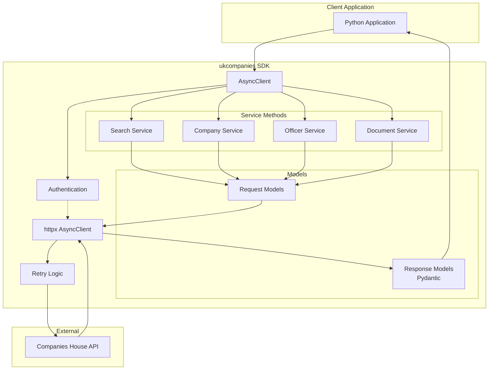
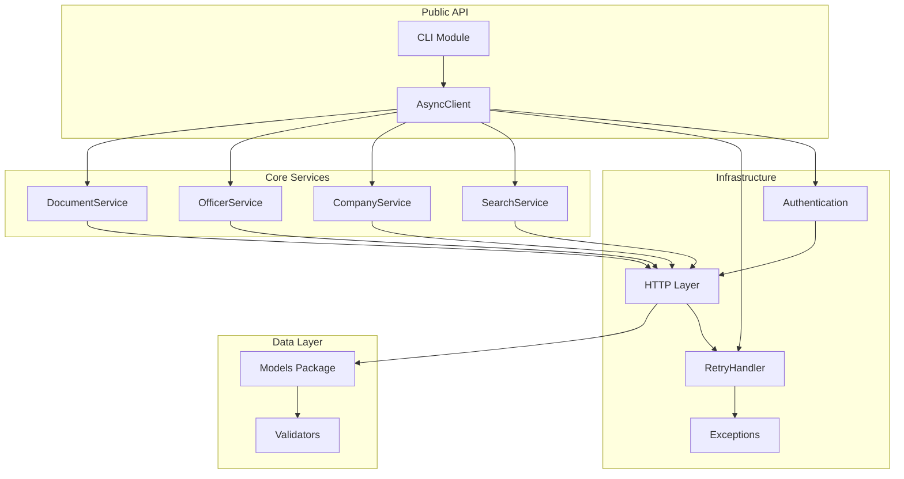
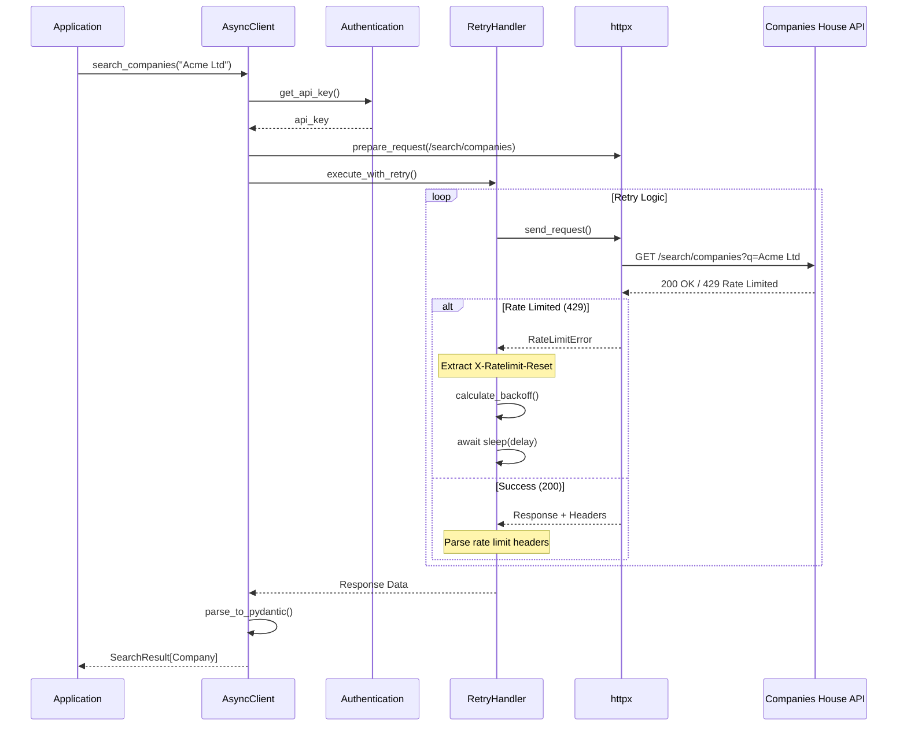
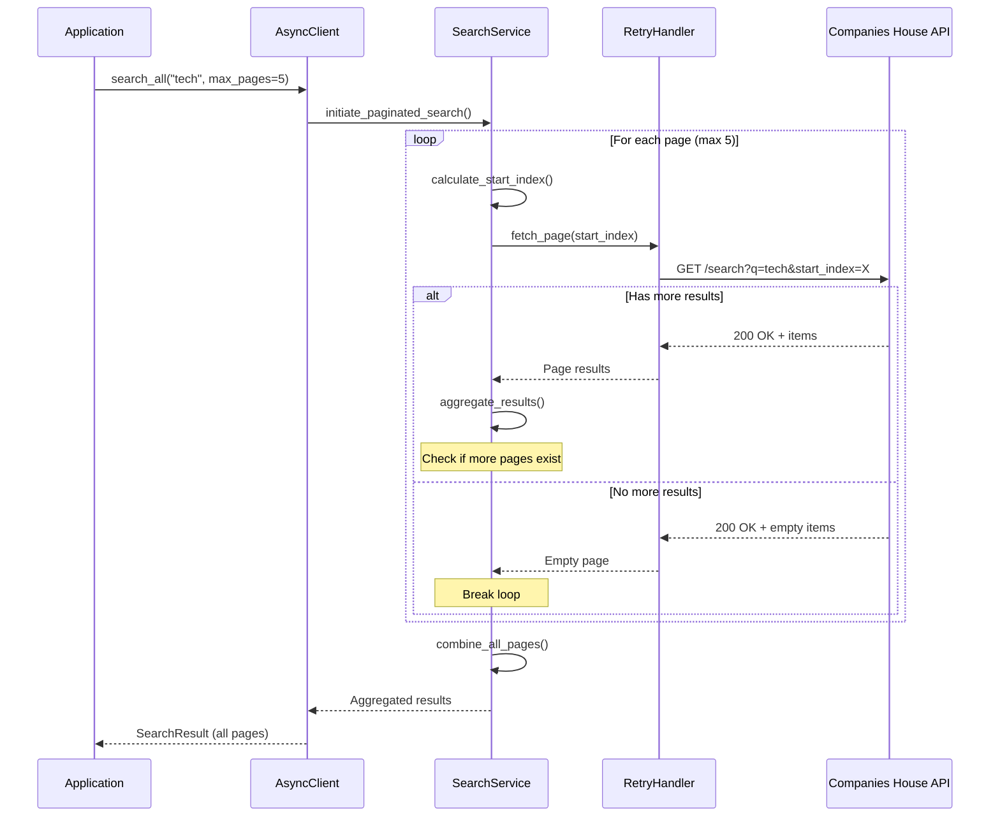
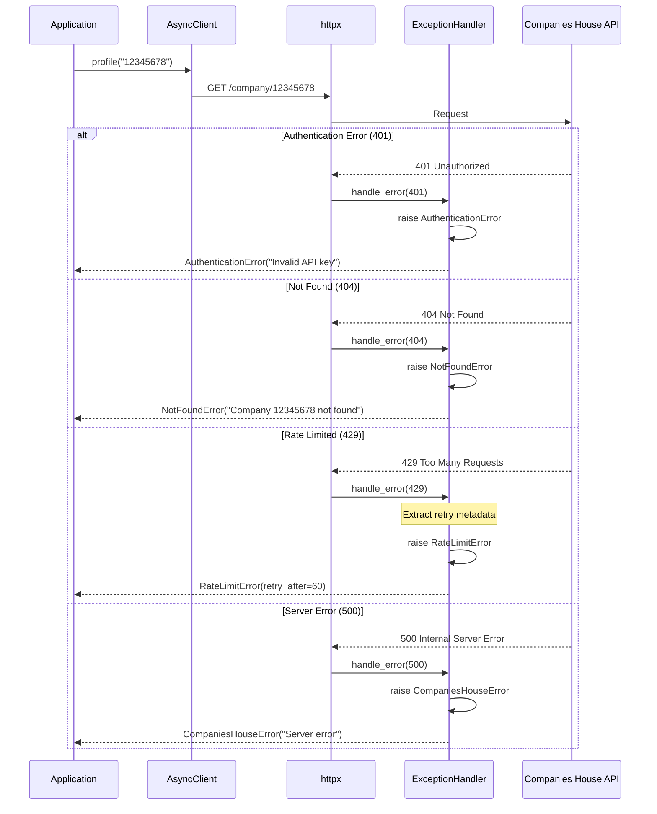
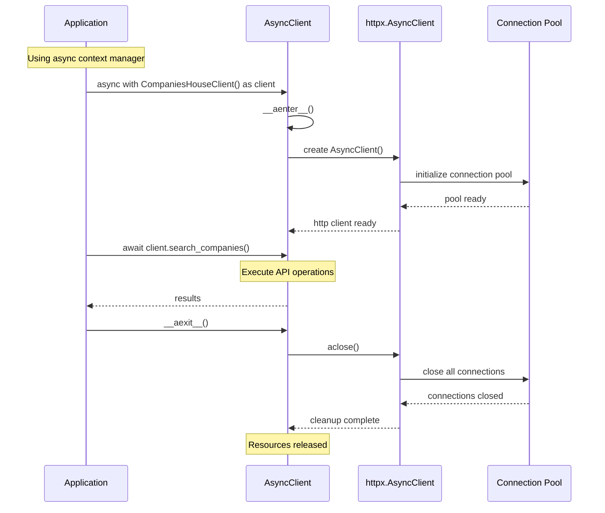

# ukcompanies Architecture Document

## Introduction

This document outlines the overall project architecture for ukcompanies, including backend systems, shared services, and non-UI specific concerns. Its primary goal is to serve as the guiding architectural blueprint for AI-driven development, ensuring consistency and adherence to chosen patterns and technologies.

**Relationship to Frontend Architecture:**
If the project includes a significant user interface, a separate Frontend Architecture Document will detail the frontend-specific design and MUST be used in conjunction with this document. Core technology stack choices documented herein (see "Tech Stack") are definitive for the entire project, including any frontend components.

### Starter Template or Existing Project

Based on my review of the PRD, this appears to be a greenfield Python SDK project. There's no mention of using a starter template, existing codebase, or boilerplate. The project will be built from scratch using modern Python tooling.

**Decision:** N/A - No starter template or existing project foundation.

### Change Log

| Date | Version | Description | Author |
|------|---------|-------------|--------|
| 2024-01-08 | 1.0 | Initial architecture document | AI Architect |

## High Level Architecture

### Technical Summary

`ukcompanies` is a modern async Python SDK following a clean architecture pattern with a single-client gateway design. The system centers around an `AsyncClient` class that provides typed, async access to the Companies House API through well-defined service methods and Pydantic models. Built on `httpx` for async HTTP operations and `pydantic` for data validation, the architecture emphasizes developer experience through type safety, comprehensive error handling, and automatic retry mechanisms. This design directly supports the PRD goals of providing a production-ready, developer-friendly SDK that matches or exceeds existing solutions while introducing modern async capabilities.

### High Level Overview

1. **Architectural Style**: Single-responsibility SDK with clean separation between client logic, models, and utilities
2. **Repository Structure**: Single package repository (not a monorepo) - standard Python package structure
3. **Service Architecture**: Modular service pattern within a single package - each endpoint group as a service module
4. **Primary Data Flow**: Application → AsyncClient → Service Methods → HTTP Layer (httpx) → Companies House API → Response Models (Pydantic) → Application
5. **Key Architectural Decisions**:
   - **Async-first**: All operations are async using Python's asyncio
   - **Type-safe**: Full type hints with Pydantic models for all responses
   - **Resilient**: Built-in retry logic with exponential backoff for rate limits
   - **Developer-friendly**: Zero-config with env vars, or explicit configuration
   - **Testable**: Dependency injection pattern for HTTP client allows easy mocking

### High Level Project Diagram



### Architectural and Design Patterns

- **Client Gateway Pattern:** Single AsyncClient class as the primary interface to all SDK functionality - _Rationale:_ Provides a clean, consistent API surface and centralizes configuration, authentication, and connection management
- **Service Module Pattern:** Logical grouping of related endpoints into service modules (search, company, officer, etc.) - _Rationale:_ Maintains single responsibility principle while keeping the SDK cohesive and easy to navigate
- **Repository Pattern (for HTTP):** Abstract HTTP operations behind service methods - _Rationale:_ Enables testing with mocked HTTP responses and potential future transport changes
- **Model-View Pattern:** Pydantic models separate data structure from client logic - _Rationale:_ Type safety, automatic validation, and IDE autocomplete support
- **Retry with Exponential Backoff:** Automatic retry for rate-limited requests - _Rationale:_ Handles transient failures gracefully per PRD requirements
- **Dependency Injection:** HTTP client injected into AsyncClient - _Rationale:_ Testability and flexibility for custom HTTP configurations

## Tech Stack

This is the **DEFINITIVE** technology selection for the project. These choices will guide all implementation decisions.

### Cloud Infrastructure
- **Provider:** N/A (SDK runs client-side)
- **Key Services:** N/A 
- **Deployment Regions:** PyPI (global distribution)

### Technology Stack Table

| Category | Technology | Version | Purpose | Rationale |
|----------|------------|---------|---------|-----------|
| **Language** | Python | 3.10+ | Primary development language | Modern Python features, type hints, async support |
| **Package Manager** | uv | 0.5.0+ | Dependency management & packaging | Fast, modern replacement for pip/poetry, PRD requirement |
| **HTTP Client** | httpx | 0.27.0 | Async HTTP operations | Best async HTTP client, connection pooling, HTTP/2 |
| **Data Validation** | pydantic | 2.9.0 | Response models & validation | Type safety, automatic validation, PRD requirement |
| **Testing Framework** | pytest | 8.3.0 | Unit & integration testing | Industry standard, great async support |
| **HTTP Mocking** | respx | 0.21.0 | Mock HTTP responses in tests | Works perfectly with httpx, PRD requirement |
| **Linting** | ruff | 0.7.0 | Code quality & formatting | Fast, comprehensive, replaces multiple tools |
| **Type Checking** | mypy | 1.11.0 | Static type checking | Ensures type safety across codebase |
| **Documentation** | mkdocs | 1.6.0 | API documentation | Clean docs with autodoc support |
| **Doc Theme** | mkdocs-material | 9.5.0 | Documentation theme | Professional, searchable docs |
| **Env Management** | python-dotenv | 1.0.1 | Environment variable loading | Zero-config experience for API keys |
| **CLI Framework** | click | 8.1.7 | Command-line interface | Powerful, user-friendly CLI creation |
| **Logging** | structlog | 24.4.0 | Structured logging | Better debugging, especially for async |
| **Date Handling** | python-dateutil | 2.9.0 | Parse API date responses | Robust date parsing from strings |

## Data Models

### Company
**Purpose:** Core entity representing a UK registered company

**Key Attributes:**
- `company_number`: str - Unique 8-character identifier
- `company_name`: str - Registered company name
- `company_status`: str - Active, dissolved, liquidation, etc.
- `date_of_creation`: date - Company incorporation date
- `jurisdiction`: str - Registration jurisdiction
- `sic_codes`: List[str] - Standard Industrial Classification codes
- `registered_office_address`: Address - Official company address
- `accounts`: AccountingReference - Accounting reference dates
- `confirmation_statement`: ConfirmationStatement - Annual confirmation info

**Relationships:**
- Has many Officers
- Has many FilingHistory entries
- Has many Charges
- Has many PersonsWithSignificantControl

### Officer
**Purpose:** Represents a company director, secretary, or other officer

**Key Attributes:**
- `officer_id`: str - Unique officer identifier
- `name`: str - Officer's full name
- `officer_role`: str - Director, secretary, etc.
- `appointed_on`: date - Appointment date
- `resigned_on`: Optional[date] - Resignation date if applicable
- `date_of_birth`: PartialDate - Month/year only for privacy
- `nationality`: str - Officer's nationality
- `occupation`: str - Stated occupation
- `address`: Address - Service address

**Relationships:**
- Belongs to Company (via appointments)
- Has many Appointments across companies
- May have Disqualifications

### SearchResult
**Purpose:** Container for search operation results

**Key Attributes:**
- `items`: List[Union[Company, Officer]] - Search result items
- `total_results`: int - Total matches found
- `items_per_page`: int - Pagination size
- `start_index`: int - Starting position
- `kind`: str - Type of search results

**Relationships:**
- Contains Companies or Officers depending on search type
- Used by search_all for pagination

### Address
**Purpose:** Standardized address representation

**Key Attributes:**
- `premises`: Optional[str] - Building name/number
- `address_line_1`: str - First line of address
- `address_line_2`: Optional[str] - Second line of address
- `locality`: Optional[str] - Town/city
- `region`: Optional[str] - County/state
- `postal_code`: Optional[str] - Postcode
- `country`: Optional[str] - Country name

**Relationships:**
- Used by Company (registered office)
- Used by Officer (service address)
- Embedded in many other models

### FilingHistory
**Purpose:** Record of documents filed with Companies House

**Key Attributes:**
- `transaction_id`: str - Unique filing identifier
- `category`: str - Filing category (accounts, confirmation-statement, etc.)
- `date`: date - Filing date
- `description`: str - Filing description
- `type`: str - Specific document type
- `links`: Dict - URLs to document resources

**Relationships:**
- Belongs to Company
- May link to Document

### PersonWithSignificantControl
**Purpose:** Individual or entity with significant control over company

**Key Attributes:**
- `psc_id`: str - Unique PSC identifier
- `name`: str - PSC name
- `kind`: str - Individual, corporate entity, etc.
- `natures_of_control`: List[str] - Types of control held
- `notified_on`: date - Date notified to Companies House
- `ceased_on`: Optional[date] - Date control ceased
- `address`: Address - PSC address

**Relationships:**
- Belongs to Company
- May be linked to Officer (if director)

### RateLimitInfo
**Purpose:** Track API rate limiting status

**Key Attributes:**
- `remain`: int - Remaining requests in window
- `limit`: int - Total requests allowed
- `reset`: datetime - When limit resets
- `retry_after`: Optional[int] - Seconds to wait if rate limited

**Relationships:**
- Used by AsyncClient for retry logic
- Extracted from HTTP response headers

## Components

### AsyncClient
**Responsibility:** Main entry point and orchestrator for all API operations, managing authentication, configuration, and HTTP client lifecycle

**Key Interfaces:**
- `__init__(api_key=None, base_url=None, **retry_config)` - Initialize client
- `search_companies(term: str) -> SearchResult` - Search for companies
- `search_officers(term: str) -> SearchResult` - Search for officers
- `profile(company_number: str) -> Company` - Get company profile
- `officers(company_number: str) -> List[Officer]` - List company officers
- Context manager support for proper resource cleanup

**Dependencies:** httpx.AsyncClient, AuthenticationHandler, RetryHandler, all service modules

**Technology Stack:** Python 3.10+, httpx for HTTP operations, python-dotenv for env vars

### Authentication Module
**Responsibility:** Manage API key authentication and request authorization headers

**Key Interfaces:**
- `get_api_key() -> str` - Retrieve API key from env or config
- `apply_auth(request: Request) -> Request` - Add auth headers to request
- `validate_api_key(key: str) -> bool` - Validate API key format

**Dependencies:** os.environ, python-dotenv

**Technology Stack:** Python stdlib, python-dotenv for environment management

### Retry Handler
**Responsibility:** Implement configurable retry logic with exponential backoff for rate-limited requests

**Key Interfaces:**
- `should_retry(response: Response) -> bool` - Determine if retry needed
- `calculate_delay(attempt: int, response: Response) -> float` - Calculate backoff delay
- `execute_with_retry(func: Callable) -> Any` - Wrap async calls with retry logic
- `on_retry_callback(attempt: int, delay: float)` - User-defined retry callback

**Dependencies:** RateLimitInfo model, httpx Response

**Technology Stack:** Python asyncio, structlog for retry logging

### Service Modules
**Responsibility:** Logical grouping of related API endpoints with request building and response parsing

**Key Interfaces:**
- `SearchService.search_companies(term, **params)` - Company search operations
- `CompanyService.get_profile(company_number)` - Company-specific operations  
- `OfficerService.get_appointments(officer_id)` - Officer-specific operations
- `DocumentService.get_document(document_id)` - Document operations

**Dependencies:** HTTP client from AsyncClient, Pydantic models for responses

**Technology Stack:** httpx for requests, pydantic for model validation

### Models Package
**Responsibility:** Pydantic models for request/response validation and type safety

**Key Interfaces:**
- Base models with common fields (timestamps, links)
- Specific response models for each endpoint
- Request parameter models with validation
- Error response models

**Dependencies:** pydantic BaseModel, python-dateutil for date parsing

**Technology Stack:** pydantic v2 for models, python-dateutil for date handling

### Exceptions Module  
**Responsibility:** Custom exception hierarchy for specific error scenarios

**Key Interfaces:**
- `CompaniesHouseError` - Base exception class
- `AuthenticationError` - API key issues
- `RateLimitError` - Rate limit exceeded with retry metadata
- `NotFoundError` - Resource not found
- `ValidationError` - Request validation failures

**Dependencies:** Base Python exceptions

**Technology Stack:** Python stdlib exceptions

### CLI Module
**Responsibility:** Command-line interface for basic SDK operations

**Key Interfaces:**
- `ukcompanies search <term>` - Search companies from CLI
- `ukcompanies company <number>` - Get company details
- `--format json|table` - Output formatting options
- `--api-key` - Override env var API key

**Dependencies:** AsyncClient, click framework

**Technology Stack:** click for CLI, rich for formatted output

### Test Suite
**Responsibility:** Comprehensive testing including unit, integration, and mock API tests

**Key Interfaces:**
- Unit tests for each component
- Integration tests with respx mocks
- End-to-end tests with real API (optional)
- Fixtures for common test data

**Dependencies:** All SDK components, respx for mocking

**Technology Stack:** pytest, pytest-asyncio, respx, pytest-cov

### Component Diagrams



## External APIs

### Companies House API
- **Purpose:** Official UK government API providing access to company registration data, officer information, filing history, and other corporate records
- **Documentation:** https://developer.company-information.service.gov.uk/
- **Base URL(s):** 
  - Production: `https://api.company-information.service.gov.uk`
  - Sandbox: `https://api-sandbox.company-information.service.gov.uk` (for testing)
- **Authentication:** HTTP Basic Auth with API key as username, empty password
- **Rate Limits:** 600 requests per 5-minute window (per API key)

**Key Endpoints Used:**
- `GET /search/companies` - Search for companies by name
- `GET /search/officers` - Search for officers by name  
- `GET /search` - Search all (companies, officers, disqualified officers)
- `GET /company/{company_number}` - Get company profile
- `GET /company/{company_number}/officers` - List company officers
- `GET /company/{company_number}/filing-history` - Get filing history
- `GET /company/{company_number}/charges` - Get charges
- `GET /company/{company_number}/insolvency` - Get insolvency details
- `GET /company/{company_number}/registered-office-address` - Get registered address
- `GET /company/{company_number}/persons-with-significant-control` - List PSCs
- `GET /officers/{officer_id}/appointments` - Get officer appointments
- `GET /disqualified-officers/natural/{officer_id}` - Check disqualification
- `GET /document/{document_id}` - Retrieve document metadata

**Integration Notes:** 
- API returns JSON responses that map directly to our Pydantic models
- Rate limit headers (`X-Ratelimit-Remain`, `X-Ratelimit-Limit`, `X-Ratelimit-Reset`) must be parsed for retry logic
- 429 responses trigger exponential backoff retry mechanism
- Some endpoints have different rate limits or require additional permissions
- Sandbox environment available for testing without affecting rate limits
- No webhook support - all interactions are request/response
- API is not versioned, must handle potential breaking changes gracefully

## Core Workflows

### Company Search Workflow


### Paginated Search All Workflow


### Error Handling Workflow


### Async Context Manager Workflow


## Source Tree

```plaintext
ukcompanies/
├── src/
│   └── ukcompanies/
│       ├── __init__.py              # Package initialization, version export
│       ├── client.py                # AsyncClient main class
│       ├── auth.py                  # Authentication handler
│       ├── retry.py                 # Retry logic and backoff strategies
│       ├── exceptions.py            # Custom exception classes
│       ├── config.py                # Configuration and constants
│       │
│       ├── models/                  # Pydantic models
│       │   ├── __init__.py
│       │   ├── base.py             # Base models with common fields
│       │   ├── company.py          # Company-related models
│       │   ├── officer.py          # Officer-related models
│       │   ├── search.py           # Search result models
│       │   ├── filing.py           # Filing history models
│       │   ├── address.py          # Address models
│       │   ├── psc.py              # Persons with significant control
│       │   └── rate_limit.py       # Rate limiting models
│       │
│       ├── services/                # Service modules for API endpoints
│       │   ├── __init__.py
│       │   ├── base.py             # Base service class
│       │   ├── search.py           # Search operations
│       │   ├── company.py          # Company operations
│       │   ├── officer.py          # Officer operations
│       │   └── document.py         # Document operations
│       │
│       └── cli/                     # CLI module
│           ├── __init__.py
│           ├── main.py             # CLI entry point
│           └── formatters.py       # Output formatting
│
├── tests/
│   ├── __init__.py
│   ├── conftest.py                 # Pytest fixtures and configuration
│   ├── fixtures/                    # Test data fixtures
│   │   ├── __init__.py
│   │   ├── companies.json          # Sample company responses
│   │   ├── officers.json           # Sample officer responses
│   │   └── errors.json             # Error response samples
│   │
│   ├── unit/                       # Unit tests
│   │   ├── __init__.py
│   │   ├── test_client.py         # Client tests
│   │   ├── test_auth.py           # Authentication tests
│   │   ├── test_retry.py          # Retry logic tests
│   │   ├── test_models.py         # Model validation tests
│   │   └── test_exceptions.py     # Exception handling tests
│   │
│   ├── integration/                # Integration tests with mocked API
│   │   ├── __init__.py
│   │   ├── test_search.py         # Search endpoint tests
│   │   ├── test_company.py        # Company endpoint tests
│   │   ├── test_officer.py        # Officer endpoint tests
│   │   └── test_pagination.py    # Pagination tests
│   │
│   └── e2e/                        # End-to-end tests (optional, real API)
│       ├── __init__.py
│       └── test_real_api.py       # Tests against sandbox API
│
├── docs/                           # Documentation
│   ├── index.md                   # Documentation home
│   ├── quickstart.md              # Getting started guide
│   ├── api-reference.md           # API documentation
│   ├── examples.md                # Usage examples
│   └── architecture.md            # This architecture document
│
├── scripts/                        # Development scripts
│   ├── generate_types.py          # Generate types from API responses
│   └── test_coverage.sh           # Run tests with coverage
│
├── .env.example                    # Example environment variables
├── .gitignore                      # Git ignore rules
├── pyproject.toml                  # Project configuration (uv, ruff, pytest)
├── README.md                       # Project readme
├── LICENSE                         # MIT license
├── CHANGELOG.md                    # Version history
└── mkdocs.yml                      # Documentation configuration
```

## Infrastructure and Deployment

### Infrastructure as Code
- **Tool:** N/A for library itself
- **Location:** N/A
- **Approach:** SDK is distributed via PyPI; users handle their own deployment

### Deployment Strategy
- **Strategy:** Package distribution via PyPI (Python Package Index)
- **CI/CD Platform:** GitHub Actions
- **Pipeline Configuration:** `.github/workflows/`

### Environments
- **Development:** Local development environment with `uv` for dependency management
- **Testing:** GitHub Actions runners for CI testing across Python versions (3.10, 3.11, 3.12)
- **Staging:** TestPyPI for pre-release validation - `https://test.pypi.org/project/ukcompanies/`
- **Production:** PyPI official repository - `https://pypi.org/project/ukcompanies/`

### Environment Promotion Flow
```text
Local Development
    ↓ (git push)
GitHub Branch
    ↓ (PR + tests)
Main Branch
    ↓ (tag release)
GitHub Release
    ↓ (automated)
TestPyPI (optional)
    ↓ (validation)
PyPI Production
    ↓ (pip/uv install)
End User Environment
```

### Rollback Strategy
- **Primary Method:** Version pinning - users can install previous versions via `pip install ukcompanies==1.0.0`
- **Trigger Conditions:** Critical bugs, security vulnerabilities, breaking API changes
- **Recovery Time Objective:** < 1 hour (yank broken version from PyPI, users automatically get previous version)

## Error Handling Strategy

### General Approach
- **Error Model:** Exception-based with custom exception hierarchy inheriting from base `CompaniesHouseError`
- **Exception Hierarchy:** CompaniesHouseError → AuthenticationError, RateLimitError, NotFoundError, ValidationError, ServerError, NetworkError
- **Error Propagation:** Errors bubble up with context preservation; retry logic intercepts retryable errors

### Logging Standards
- **Library:** structlog 24.4.0
- **Format:** JSON structured logging for production, colored console for development
- **Levels:** DEBUG (detailed traces), INFO (operations), WARNING (degraded behavior), ERROR (failures)
- **Required Context:**
  - Correlation ID: UUID per client session for tracing related requests
  - Service Context: Endpoint called, method, parameters (excluding sensitive data)
  - User Context: No PII logged; only company numbers and public identifiers

### Error Handling Patterns

#### External API Errors
- **Retry Policy:** Exponential backoff with jitter, max 3 retries by default, configurable via client
- **Circuit Breaker:** Not implemented in v1.0 (keeping it simple)
- **Timeout Configuration:** 30 seconds default per request, configurable on client init
- **Error Translation:** HTTP status codes mapped to specific exceptions; API error messages preserved in exception details; Rate limit headers extracted and included in `RateLimitError`

#### Business Logic Errors
- **Custom Exceptions:** InvalidCompanyNumberError, InvalidDateRangeError, PaginationError
- **User-Facing Errors:** Clear messages explaining what went wrong and how to fix it
- **Error Codes:** Use HTTP status codes as base, with sub-codes for specific scenarios

#### Data Consistency
- **Transaction Strategy:** N/A - SDK is stateless, no transactions needed
- **Compensation Logic:** N/A - Read-only API, no modifications to rollback
- **Idempotency:** All operations are idempotent (GET requests only)

## Coding Standards

### Core Standards
- **Languages & Runtimes:** Python 3.10+ with modern syntax (union types, match statements, async/await)
- **Style & Linting:** ruff with default configuration in pyproject.toml (line length 100, Black formatting)
- **Test Organization:** Tests mirror source structure in tests/ directory, test files prefixed with `test_`

### Naming Conventions

| Element | Convention | Example |
|---------|------------|---------|
| Classes | PascalCase | `CompaniesHouseClient` |
| Functions/Methods | snake_case | `search_companies()` |
| Constants | UPPER_SNAKE | `MAX_RETRIES` |
| Private Methods | Leading underscore | `_calculate_backoff()` |
| Type Aliases | PascalCase | `CompanyDict = Dict[str, Any]` |

### Critical Rules
- **Never use print() or console output in library code:** Use structlog logger exclusively for all output
- **All public methods must have type hints:** Both parameters and return types required
- **All API responses must use Pydantic models:** Never return raw dicts from public methods
- **Never hardcode API keys or secrets:** Must use environment variables or constructor parameters
- **All async functions must be prefixed with async:** No sync wrappers in v1.0
- **Rate limit headers must always be checked:** Every API response must extract and log rate limit status
- **Use httpx.AsyncClient as context manager:** Always use `async with` to ensure proper cleanup
- **Validate company numbers before API calls:** Use regex `^[0-9A-Z]{8}$` or `^[0-9]{7,8}$` for older companies

## Test Strategy and Standards

### Testing Philosophy
- **Approach:** Test-after development with comprehensive coverage (TDD optional for complex logic)
- **Coverage Goals:** 100% code coverage as specified in PRD
- **Test Pyramid:** 60% unit tests, 30% integration tests, 10% e2e tests

### Test Types and Organization

#### Unit Tests
- **Framework:** pytest 8.3.0 with pytest-asyncio
- **File Convention:** `test_[module_name].py` in tests/unit/
- **Location:** tests/unit/ mirroring src structure
- **Mocking Library:** unittest.mock for Python objects, respx for HTTP
- **Coverage Requirement:** 100% of business logic

**AI Agent Requirements:**
- Generate tests for all public methods
- Cover edge cases and error conditions
- Follow AAA pattern (Arrange, Act, Assert)
- Mock all external dependencies

#### Integration Tests
- **Scope:** Service methods with mocked HTTP responses
- **Location:** tests/integration/
- **Test Infrastructure:**
  - **Companies House API:** respx for complete HTTP mocking
  - **Rate Limiting:** Mock rate limit headers and 429 responses
  - **Authentication:** Test with valid/invalid API keys
  - **Pagination:** Test multi-page result handling

#### End-to-End Tests
- **Framework:** pytest with real API calls to sandbox
- **Scope:** Critical user journeys against Companies House sandbox API
- **Environment:** Optional, only run with `--e2e` flag
- **Test Data:** Use known test companies in sandbox environment

### Test Data Management
- **Strategy:** Fixture-based with JSON response samples
- **Fixtures:** tests/fixtures/ with real API response examples
- **Factories:** Pydantic model factories for generating test data
- **Cleanup:** Not needed - all tests use mocks or read-only sandbox API

### Continuous Testing
- **CI Integration:** Run on every push and PR via GitHub Actions; Test matrix: Python 3.10, 3.11, 3.12; Fail if coverage drops below 100%
- **Performance Tests:** Basic timing assertions for retry logic
- **Security Tests:** Ensure no API keys in logs, validate auth headers

## Security

### Input Validation
- **Validation Library:** pydantic for all model validation
- **Validation Location:** At SDK boundary before any API calls
- **Required Rules:**
  - All external inputs MUST be validated
  - Validation at API boundary before processing
  - Whitelist approach preferred over blacklist

### Authentication & Authorization
- **Auth Method:** HTTP Basic Auth with API key as username
- **Session Management:** No sessions - stateless API client
- **Required Patterns:**
  - API key must be provided via environment variable or constructor
  - Never expose API key in logs or error messages
  - Validate API key format before use

### Secrets Management
- **Development:** .env file with python-dotenv (never commit .env)
- **Production:** Environment variables or secure secrets manager
- **Code Requirements:**
  - NEVER hardcode secrets
  - Access via configuration service only
  - No secrets in logs or error messages

### API Security
- **Rate Limiting:** Honor X-Ratelimit headers, implement backoff
- **CORS Policy:** N/A - SDK is client-side
- **Security Headers:** User-Agent header with SDK version for tracking
- **HTTPS Enforcement:** Only connect to https:// URLs (except localhost for testing)

### Data Protection
- **Encryption at Rest:** N/A - SDK doesn't store data
- **Encryption in Transit:** HTTPS enforced for all API calls
- **PII Handling:** Never log personal data; Only log company numbers and public identifiers; Mask/redact any PII in error messages
- **Logging Restrictions:** No API keys, personal addresses, officer personal details, or authentication headers

### Dependency Security
- **Scanning Tool:** GitHub Dependabot + pip-audit in CI
- **Update Policy:** Monthly dependency updates, immediate for security patches
- **Approval Process:** All new dependencies require justification in PR

### Security Testing
- **SAST Tool:** Bandit for Python security scanning
- **DAST Tool:** N/A - Client library doesn't expose attack surface
- **Penetration Testing:** N/A - Client library, not a service

## Next Steps

1. **Review with stakeholders** to ensure alignment with business goals
2. **Begin implementation** using this architecture as the blueprint
3. **Set up project structure** as defined in the Source Tree section
4. **Configure CI/CD** pipelines as specified in Infrastructure section
5. **Start with core AsyncClient** and work outward to services

Since this is a backend SDK project without UI components, no Frontend Architecture document is needed.