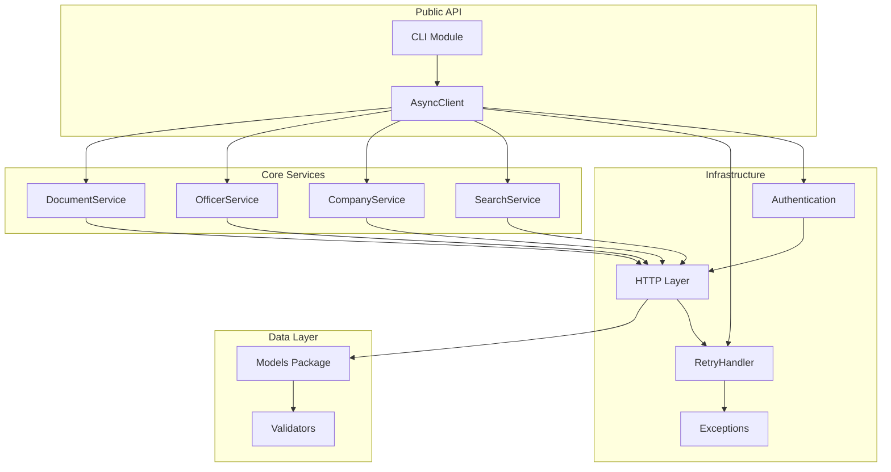

# Components

## AsyncClient
**Responsibility:** Main entry point and orchestrator for all API operations, managing authentication, configuration, and HTTP client lifecycle

**Key Interfaces:**
- `__init__(api_key=None, base_url=None, **retry_config)` - Initialize client
- `search_companies(term: str) -> SearchResult` - Search for companies
- `search_officers(term: str) -> SearchResult` - Search for officers
- `profile(company_number: str) -> Company` - Get company profile
- `officers(company_number: str) -> List[Officer]` - List company officers
- Context manager support for proper resource cleanup

**Dependencies:** httpx.AsyncClient, AuthenticationHandler, RetryHandler, all service modules

**Technology Stack:** Python 3.10+, httpx for HTTP operations, python-dotenv for env vars

## Authentication Module
**Responsibility:** Manage API key authentication and request authorization headers

**Key Interfaces:**
- `get_api_key() -> str` - Retrieve API key from env or config
- `apply_auth(request: Request) -> Request` - Add auth headers to request
- `validate_api_key(key: str) -> bool` - Validate API key format

**Dependencies:** os.environ, python-dotenv

**Technology Stack:** Python stdlib, python-dotenv for environment management

## Retry Handler
**Responsibility:** Implement configurable retry logic with exponential backoff for rate-limited requests

**Key Interfaces:**
- `should_retry(response: Response) -> bool` - Determine if retry needed
- `calculate_delay(attempt: int, response: Response) -> float` - Calculate backoff delay
- `execute_with_retry(func: Callable) -> Any` - Wrap async calls with retry logic
- `on_retry_callback(attempt: int, delay: float)` - User-defined retry callback

**Dependencies:** RateLimitInfo model, httpx Response

**Technology Stack:** Python asyncio, structlog for retry logging

## Service Modules
**Responsibility:** Logical grouping of related API endpoints with request building and response parsing

**Key Interfaces:**
- `SearchService.search_companies(term, **params)` - Company search operations
- `CompanyService.get_profile(company_number)` - Company-specific operations  
- `OfficerService.get_appointments(officer_id)` - Officer-specific operations
- `DocumentService.get_document(document_id)` - Document operations

**Dependencies:** HTTP client from AsyncClient, Pydantic models for responses

**Technology Stack:** httpx for requests, pydantic for model validation

## Models Package
**Responsibility:** Pydantic models for request/response validation and type safety

**Key Interfaces:**
- Base models with common fields (timestamps, links)
- Specific response models for each endpoint
- Request parameter models with validation
- Error response models

**Dependencies:** pydantic BaseModel, python-dateutil for date parsing

**Technology Stack:** pydantic v2 for models, python-dateutil for date handling

## Exceptions Module  
**Responsibility:** Custom exception hierarchy for specific error scenarios

**Key Interfaces:**
- `CompaniesHouseError` - Base exception class
- `AuthenticationError` - API key issues
- `RateLimitError` - Rate limit exceeded with retry metadata
- `NotFoundError` - Resource not found
- `ValidationError` - Request validation failures

**Dependencies:** Base Python exceptions

**Technology Stack:** Python stdlib exceptions

## CLI Module
**Responsibility:** Command-line interface for basic SDK operations

**Key Interfaces:**
- `ukcompanies search <term>` - Search companies from CLI
- `ukcompanies company <number>` - Get company details
- `--format json|table` - Output formatting options
- `--api-key` - Override env var API key

**Dependencies:** AsyncClient, click framework

**Technology Stack:** click for CLI, rich for formatted output

## Test Suite
**Responsibility:** Comprehensive testing including unit, integration, and mock API tests

**Key Interfaces:**
- Unit tests for each component
- Integration tests with respx mocks
- End-to-end tests with real API (optional)
- Fixtures for common test data

**Dependencies:** All SDK components, respx for mocking

**Technology Stack:** pytest, pytest-asyncio, respx, pytest-cov

## Component Diagrams

