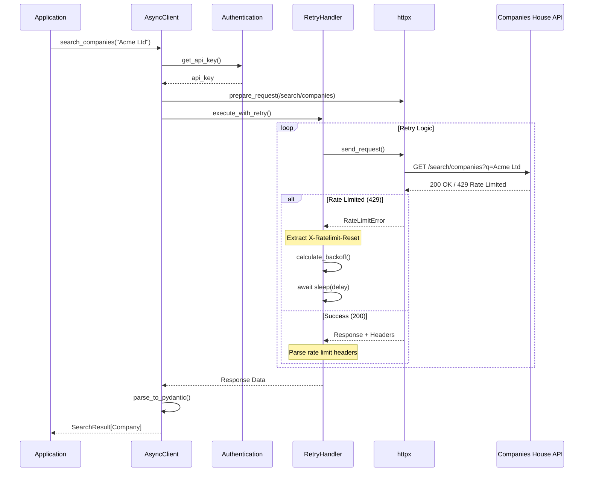
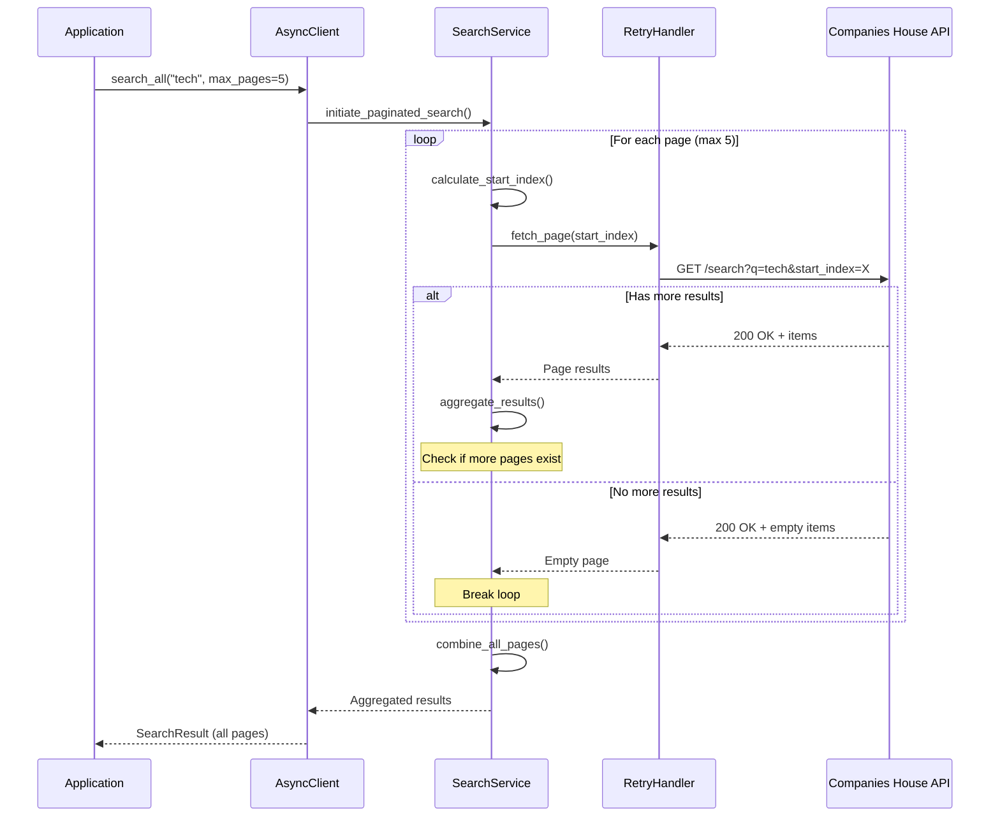
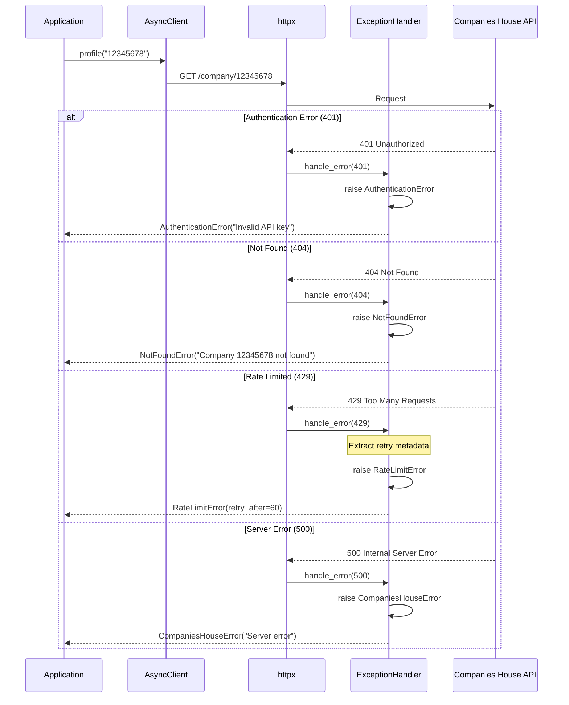
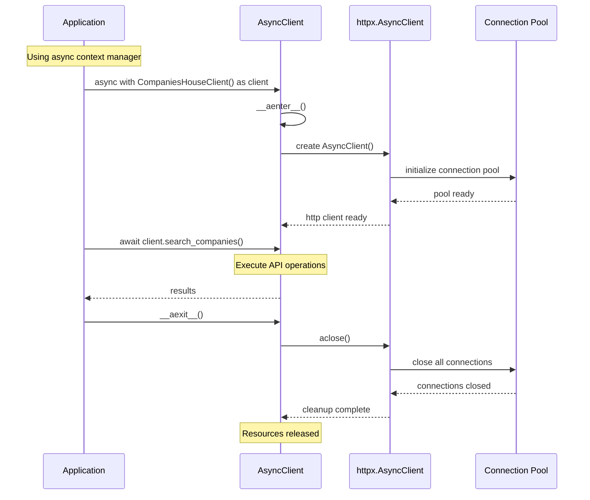

# Core Workflows

## Company Search Workflow

```mermaid
sequenceDiagram
    participant App as Application
    participant Client as AsyncClient
    participant Auth as Authentication
    participant Retry as RetryHandler
    participant HTTP as httpx
    participant API as Companies House API
    
    App->>Client: search_companies("Acme Ltd")
    Client->>Auth: get_api_key()
    Auth-->>Client: api_key
    
    Client->>HTTP: prepare_request(/search/companies)
    Client->>Retry: execute_with_retry()
    
    loop Retry Logic
        Retry->>HTTP: send_request()
        HTTP->>API: GET /search/companies?q=Acme Ltd
        API-->>HTTP: 200 OK / 429 Rate Limited
        
        alt Rate Limited (429)
            HTTP-->>Retry: RateLimitError
            Note over Retry: Extract X-Ratelimit-Reset
            Retry->>Retry: calculate_backoff()
            Retry->>Retry: await sleep(delay)
        else Success (200)
            HTTP-->>Retry: Response + Headers
            Note over Retry: Parse rate limit headers
        end
    end
    
    Retry-->>Client: Response Data
    Client->>Client: parse_to_pydantic()
    Client-->>App: SearchResult[Company]
```

## Paginated Search All Workflow

```mermaid
sequenceDiagram
    participant App as Application
    participant Client as AsyncClient
    participant Search as SearchService
    participant Retry as RetryHandler
    participant API as Companies House API
    
    App->>Client: search_all("tech", max_pages=5)
    Client->>Search: initiate_paginated_search()
    
    loop For each page (max 5)
        Search->>Search: calculate_start_index()
        Search->>Retry: fetch_page(start_index)
        Retry->>API: GET /search?q=tech&start_index=X
        
        alt Has more results
            API-->>Retry: 200 OK + items
            Retry-->>Search: Page results
            Search->>Search: aggregate_results()
            Note over Search: Check if more pages exist
        else No more results
            API-->>Retry: 200 OK + empty items
            Retry-->>Search: Empty page
            Note over Search: Break loop
        end
    end
    
    Search->>Search: combine_all_pages()
    Search-->>Client: Aggregated results
    Client-->>App: SearchResult (all pages)
```

## Error Handling Workflow

```mermaid
sequenceDiagram
    participant App as Application
    participant Client as AsyncClient
    participant HTTP as httpx
    participant Exc as ExceptionHandler
    participant API as Companies House API
    
    App->>Client: profile("12345678")
    Client->>HTTP: GET /company/12345678
    HTTP->>API: Request
    
    alt Authentication Error (401)
        API-->>HTTP: 401 Unauthorized
        HTTP->>Exc: handle_error(401)
        Exc->>Exc: raise AuthenticationError
        Exc-->>App: AuthenticationError("Invalid API key")
        
    else Not Found (404)
        API-->>HTTP: 404 Not Found
        HTTP->>Exc: handle_error(404)
        Exc->>Exc: raise NotFoundError
        Exc-->>App: NotFoundError("Company 12345678 not found")
        
    else Rate Limited (429)
        API-->>HTTP: 429 Too Many Requests
        HTTP->>Exc: handle_error(429)
        Note over Exc: Extract retry metadata
        Exc->>Exc: raise RateLimitError
        Exc-->>App: RateLimitError(retry_after=60)
        
    else Server Error (500)
        API-->>HTTP: 500 Internal Server Error
        HTTP->>Exc: handle_error(500)
        Exc->>Exc: raise CompaniesHouseError
        Exc-->>App: CompaniesHouseError("Server error")
    end
```

## Async Context Manager Workflow

```mermaid
sequenceDiagram
    participant App as Application
    participant Client as AsyncClient
    participant HTTP as httpx.AsyncClient
    participant Pool as Connection Pool
    
    Note over App: Using async context manager
    App->>Client: async with CompaniesHouseClient() as client
    Client->>Client: __aenter__()
    Client->>HTTP: create AsyncClient()
    HTTP->>Pool: initialize connection pool
    Pool-->>HTTP: pool ready
    HTTP-->>Client: http client ready
    
    App->>Client: await client.search_companies()
    Note over Client: Execute API operations
    Client-->>App: results
    
    App->>Client: __aexit__()
    Client->>HTTP: aclose()
    HTTP->>Pool: close all connections
    Pool-->>HTTP: connections closed
    HTTP-->>Client: cleanup complete
    Note over Client: Resources released
```