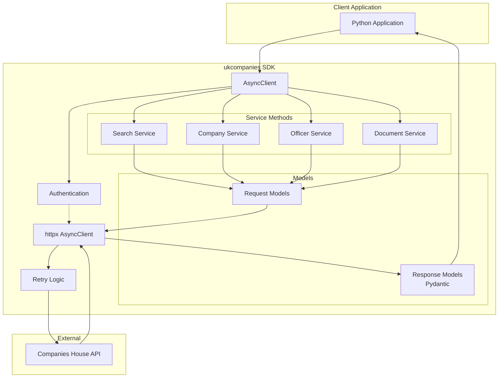

# High Level Architecture

## Technical Summary

`ukcompanies` is a modern async Python SDK following a clean architecture pattern with a single-client gateway design. The system centers around an `AsyncClient` class that provides typed, async access to the Companies House API through well-defined service methods and Pydantic models. Built on `httpx` for async HTTP operations and `pydantic` for data validation, the architecture emphasizes developer experience through type safety, comprehensive error handling, and automatic retry mechanisms. This design directly supports the PRD goals of providing a production-ready, developer-friendly SDK that matches or exceeds existing solutions while introducing modern async capabilities.

## High Level Overview

1. **Architectural Style**: Single-responsibility SDK with clean separation between client logic, models, and utilities
2. **Repository Structure**: Single package repository (not a monorepo) - standard Python package structure
3. **Service Architecture**: Modular service pattern within a single package - each endpoint group as a service module
4. **Primary Data Flow**: Application → AsyncClient → Service Methods → HTTP Layer (httpx) → Companies House API → Response Models (Pydantic) → Application
5. **Key Architectural Decisions**:
   - **Async-first**: All operations are async using Python's asyncio
   - **Type-safe**: Full type hints with Pydantic models for all responses
   - **Resilient**: Built-in retry logic with exponential backoff for rate limits
   - **Developer-friendly**: Zero-config with env vars, or explicit configuration
   - **Testable**: Dependency injection pattern for HTTP client allows easy mocking

## High Level Project Diagram

## Architectural and Design Patterns

- **Client Gateway Pattern:** Single AsyncClient class as the primary interface to all SDK functionality - _Rationale:_ Provides a clean, consistent API surface and centralizes configuration, authentication, and connection management
- **Service Module Pattern:** Logical grouping of related endpoints into service modules (search, company, officer, etc.) - _Rationale:_ Maintains single responsibility principle while keeping the SDK cohesive and easy to navigate
- **Repository Pattern (for HTTP):** Abstract HTTP operations behind service methods - _Rationale:_ Enables testing with mocked HTTP responses and potential future transport changes
- **Model-View Pattern:** Pydantic models separate data structure from client logic - _Rationale:_ Type safety, automatic validation, and IDE autocomplete support
- **Retry with Exponential Backoff:** Automatic retry for rate-limited requests - _Rationale:_ Handles transient failures gracefully per PRD requirements
- **Dependency Injection:** HTTP client injected into AsyncClient - _Rationale:_ Testability and flexibility for custom HTTP configurations